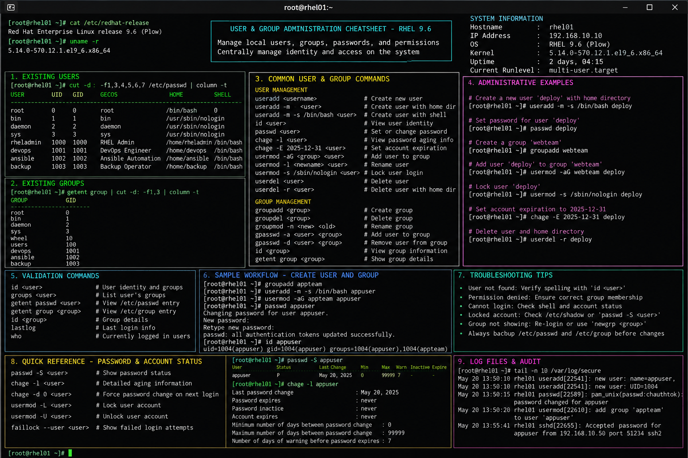

# user-group-admin

# User and Group Administration Commands Cheat Sheet

## Overview

This document provides a practical enterprise Linux administration cheat sheet for user and group management operations on Red Hat Enterprise Linux (RHEL) 9.6 systems.

The commands and workflows included are commonly used during enterprise infrastructure administration, access control management, operational onboarding, privilege delegation, compliance validation, and troubleshooting activities.

This reference is designed for fast operational lookup during production-style Linux administration tasks.

---

## Environment Information

| Component | Details |
|---|---|
| Operating System | RHEL 9.6 |
| Hostname | rhel01.lab.local |
| User Context | root / sudo administrator |
| Authentication Method | Local Linux Authentication |
| SELinux Mode | Enforcing |
| Lab Platform | VMware Enterprise Lab |
| Shell Environment | Bash |

---

## Common Commands

### Create New User

```bash
useradd devopsuser
```

### Create User with Home Directory

```bash
useradd -m backupadmin
```

### Set User Password

```bash
passwd devopsuser
```

### Create New Group

```bash
groupadd linuxadmins
```

### Add User to Supplementary Group

```bash
usermod -aG wheel devopsuser
```

### Display User ID Information

```bash
id devopsuser
```

### Display Group Memberships

```bash
groups devopsuser
```

### Lock User Account

```bash
usermod -L tempuser
```

### Unlock User Account

```bash
usermod -U tempuser
```

### Delete User Account

```bash
userdel obsoleteuser
```

### Delete User and Home Directory

```bash
userdel -r obsoleteuser
```

### Change User Shell

```bash
usermod -s /bin/bash devopsuser
```

### Display Last Login Information

```bash
lastlog
```

---

## Administrative Examples

### Create Infrastructure Operations User

```bash
useradd -m -c "Infrastructure Operations" infraops
passwd infraops
```

### Add Administrator to Wheel Group

```bash
usermod -aG wheel infraops
```

### Verify Sudo Administrative Membership

```bash
id infraops
```

Example output:

```text
uid=1002(infraops) gid=1002(infraops) groups=1002(infraops),10(wheel)
```

### Create Application Support Group

```bash
groupadd appsupport
```

### Assign Multiple Group Memberships

```bash
usermod -aG appsupport,webadmins infraops
```

### Expire Temporary Contractor Account

```bash
chage -E 2026-12-31 contractor01
```

### Force Password Reset at Next Login

```bash
chage -d 0 devopsuser
```

---

## Validation Commands

### Verify User Entry

```bash
grep devopsuser /etc/passwd
```

### Verify Group Membership

```bash
grep wheel /etc/group
```

### Display Account Aging Information

```bash
chage -l devopsuser
```

### Verify User Home Directory

```bash
ls -ld /home/devopsuser
```

### Verify SELinux Contexts

```bash
ls -Zd /home/devopsuser
```

### Validate Sudo Access

```bash
sudo -l -U infraops
```

### Review Authentication Logs

```bash
journalctl -u sshd
```

---

## Troubleshooting Tips

### User Cannot Log In

Possible causes:

- locked account
- expired password
- expired account
- invalid shell assignment
- incorrect group membership

Validation commands:

```bash
passwd -S devopsuser
chage -l devopsuser
cat /etc/passwd | grep devopsuser
```

### Home Directory Permission Issues

Verify ownership and permissions:

```bash
ls -ld /home/devopsuser
```

Correct ownership if necessary:

```bash
chown -R devopsuser:devopsuser /home/devopsuser
```

### Sudo Access Not Working

Verify wheel group membership:

```bash
id infraops
```

Verify sudoers configuration:

```bash
visudo
```

### SELinux Access Issues

Restore default SELinux contexts:

```bash
restorecon -Rv /home/devopsuser
```

### Authentication Failures

Review authentication logs:

```bash
journalctl -xe
journalctl -u sshd
```

---

## Operational Notes

- Follow least-privilege access principles for all enterprise accounts.
- Use centralized identity management where operationally required.
- Regularly review inactive and expired user accounts.
- Enforce password aging and rotation policies.
- Validate wheel group membership during security audits.
- Maintain proper documentation for privileged account access.
- Remove obsolete contractor and temporary accounts promptly.

Example operational audit commands:

```bash
awk -F: '$3 >= 1000 {print $1}' /etc/passwd
lastlog
```

---

## Screenshot Capture

Recommended screenshot content:

- useradd operations
- group administration commands
- wheel group membership validation
- account aging information
- SELinux home directory validation
- sudo validation output
- enterprise RHEL terminal prompt
- operational administration workflow

Example commands shown in screenshot:

```bash
useradd infraops
usermod -aG wheel infraops
id infraops
chage -l infraops
ls -Zd /home/infraops
sudo -l -U infraops
```

---

## Screenshot Reference



