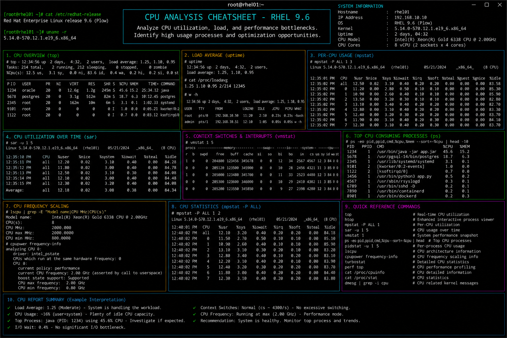

# cpu-analysis.md

# CPU Analysis and Performance Monitoring Cheat Sheet

## Overview

This document provides a practical enterprise Linux administration cheat sheet for CPU utilization analysis, process monitoring, load investigation, performance troubleshooting, and operational diagnostics on Red Hat Enterprise Linux (RHEL) 9.6 systems.

The commands and workflows included are commonly used during enterprise performance investigations, application bottleneck analysis, capacity planning, infrastructure monitoring, and incident response activities.

This reference is designed for fast operational lookup during production Linux administration tasks.

---

## Environment Information

| Component | Details |
|---|---|
| Operating System | RHEL 9.6 |
| Hostname | rhel01.lab.local |
| Kernel Version | 5.14.x |
| Monitoring Utilities | procps-ng / sysstat |
| CPU Architecture | x86_64 |
| SELinux Mode | Enforcing |
| User Context | root / sudo administrator |
| Lab Platform | VMware Enterprise Lab |

---

## Common Commands

### Display CPU Information

```bash
lscpu
```

### Display Real-Time CPU Usage

```bash
top
```

### Enhanced Interactive Process Monitoring

```bash
htop
```

### Display CPU Usage Statistics

```bash
mpstat
```

### Monitor CPU Usage Continuously

```bash
mpstat 2
```

### Display System Load Average

```bash
uptime
```

### Display Per-Core CPU Statistics

```bash
mpstat -P ALL
```

### Display Top CPU-Consuming Processes

```bash
ps aux --sort=-%cpu | head
```

### Monitor Running Processes

```bash
pidstat 2
```

### Display Hardware Information

```bash
cat /proc/cpuinfo
```

### Display System Activity Report

```bash
sar -u 2 5
```

### Display CPU Temperature Information

```bash
sensors
```

---

## Administrative Examples

### Identify High CPU Usage Processes

```bash
ps aux --sort=-%cpu | head
```

### Monitor CPU Usage Per Core

```bash
mpstat -P ALL 2
```

### Analyze System Load Average

```bash
uptime
```

Example output:

```text
15:22:10 up 4 days,  5:33,  2 users,  load average: 1.12, 0.95, 0.88
```

### Monitor CPU Usage by Process ID

```bash
pidstat -p 2451 2
```

### Display CPU Interrupt Statistics

```bash
mpstat -I ALL
```

### Review Historical CPU Utilization

```bash
sar -u
```

### Monitor Apache CPU Consumption

```bash
top -p $(pgrep -d',' httpd)
```

### Capture Performance Snapshot

```bash
top -b -n1 > cpu-report.txt
```

---

## Validation Commands

### Verify CPU Architecture

```bash
arch
```

### Validate Number of CPU Cores

```bash
nproc
```

### Verify CPU Frequency Information

```bash
lscpu | grep MHz
```

### Validate Current System Load

```bash
uptime
```

### Verify Running Processes

```bash
ps -ef
```

### Validate CPU Usage History

```bash
sar -u 1 5
```

### Verify Kernel CPU Information

```bash
cat /proc/stat
```

### Review System Performance Logs

```bash
journalctl -xe
```

---

## Troubleshooting Tips

### High CPU Utilization

Identify top resource-consuming processes:

```bash
ps aux --sort=-%cpu | head
```

Monitor in real time:

```bash
top
```

### Excessive Load Average

Verify load statistics:

```bash
uptime
```

Review process activity:

```bash
pidstat
```

### CPU Saturation Across Multiple Cores

Analyze per-core utilization:

```bash
mpstat -P ALL
```

### Runaway or Stuck Processes

Identify problematic processes:

```bash
top
```

Terminate process if necessary:

```bash
kill -9 PID
```

### Performance Degradation During Peak Hours

Capture historical performance data:

```bash
sar -u
```

### Hardware or Thermal Issues

Check CPU temperatures:

```bash
sensors
```

Review kernel messages:

```bash
dmesg | tail
```

---

## Operational Notes

- Monitor CPU utilization regularly during enterprise maintenance windows.
- Investigate abnormal load averages before production impact occurs.
- Use historical monitoring tools for trend analysis and capacity planning.
- Validate process behavior during application troubleshooting activities.
- Monitor CPU saturation across all available cores.
- Maintain performance baselines for enterprise infrastructure systems.
- Review system logs during CPU-related incident investigations.

Example operational audit commands:

```bash
mpstat -P ALL
sar -u 1 5
ps aux --sort=-%cpu | head
```

---

## Screenshot Reference



