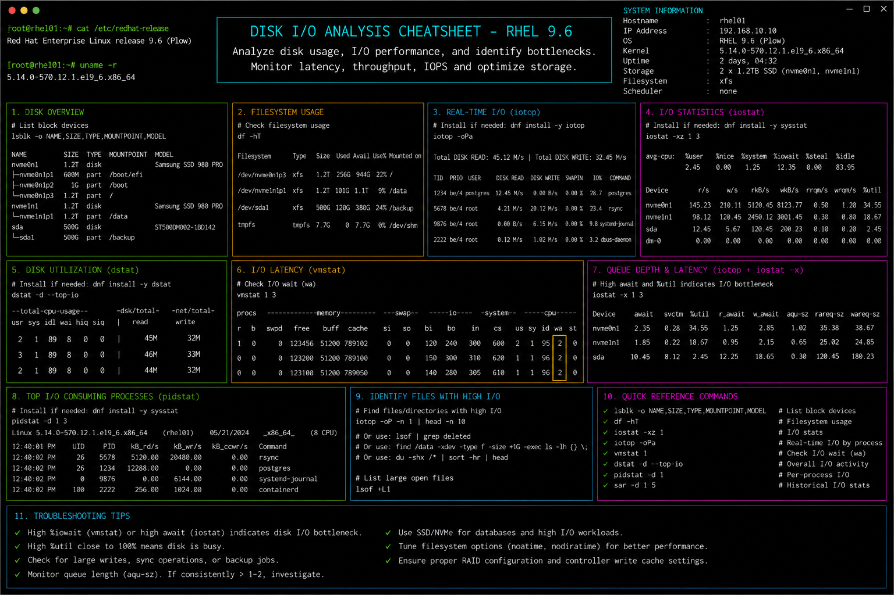

# disk-io-analysis.md

# Disk I/O Analysis and Performance Monitoring Cheat Sheet

## Overview

This document provides a practical enterprise Linux administration cheat sheet for disk I/O monitoring, storage performance analysis, throughput validation, latency troubleshooting, and operational diagnostics on Red Hat Enterprise Linux (RHEL) 9.6 systems.

The commands and workflows included are commonly used during enterprise storage investigations, application performance troubleshooting, infrastructure monitoring, capacity planning, and incident response activities.

This reference is designed for fast operational lookup during production Linux administration tasks.

---

## Environment Information

| Component | Details |
|---|---|
| Operating System | RHEL 9.6 |
| Hostname | rhel01.lab.local |
| Storage Platform | VMware Virtual Disk |
| Monitoring Utilities | sysstat / iotop |
| Filesystem Type | XFS |
| SELinux Mode | Enforcing |
| User Context | root / sudo administrator |
| Lab Platform | VMware Enterprise Lab |

---

## Common Commands

### Display Block Devices

```bash
lsblk
```

### Display Filesystem Usage

```bash
df -h
```

### Monitor Disk I/O Statistics

```bash
iostat -x 2
```

### Monitor Per-Process I/O Usage

```bash
iotop
```

### Display Disk Throughput Statistics

```bash
sar -d 2 5
```

### Display Mounted Filesystems

```bash
mount
```

### Display Filesystem Type Information

```bash
lsblk -f
```

### Display Open Files

```bash
lsof
```

### Monitor Kernel Disk Activity

```bash
dstat -d
```

### Display RAID or Device Statistics

```bash
cat /proc/diskstats
```

### Review Kernel Storage Logs

```bash
journalctl -k
```

### Display Disk Partition Information

```bash
fdisk -l
```

---

## Administrative Examples

### Identify High Disk Utilization

```bash
iostat -x 2
```

### Monitor Real-Time Disk Usage by Process

```bash
iotop
```

### Analyze Filesystem Capacity

```bash
df -Th
```

### Display Largest Directories

```bash
du -sh /*
```

### Capture Disk Performance Snapshot

```bash
iostat -x > io-report.txt
```

### Monitor Disk Throughput Trends

```bash
sar -d 1 5
```

### Review Open File Handles

```bash
lsof | head
```

### Validate Mounted Storage Devices

```bash
mount | grep xfs
```

---

## Validation Commands

### Verify Filesystem Usage

```bash
df -h
```

Example output:

```text
Filesystem      Size  Used Avail Use% Mounted on
/dev/sda2        50G   18G   30G  38% /
```

### Validate Block Device Layout

```bash
lsblk
```

### Verify Disk I/O Statistics

```bash
iostat -x
```

### Validate Mounted Filesystems

```bash
mount
```

### Verify Filesystem Types

```bash
lsblk -f
```

### Validate SELinux Contexts

```bash
ls -Zd /data
```

### Verify Open File Activity

```bash
lsof
```

### Review Kernel Storage Messages

```bash
dmesg | tail
```

---

## Troubleshooting Tips

### High Disk I/O Wait

Monitor extended disk statistics:

```bash
iostat -x 2
```

Review processes causing high I/O:

```bash
iotop
```

### Filesystem Space Exhaustion

Identify large directories:

```bash
du -sh /*
```

Review filesystem utilization:

```bash
df -h
```

### Slow Application Performance

Analyze disk latency:

```bash
iostat -x
```

Monitor active processes:

```bash
iotop
```

### Disk Device Errors

Review kernel storage logs:

```bash
journalctl -k
```

Display kernel messages:

```bash
dmesg | grep sd
```

### Mounted Filesystem Problems

Validate mount configuration:

```bash
mount
```

Review fstab entries:

```bash
cat /etc/fstab
```

### SELinux Access Problems

Review contexts:

```bash
ls -Z /data
```

Restore contexts:

```bash
restorecon -Rv /data
```

---

## Operational Notes

- Monitor disk utilization and I/O wait during enterprise maintenance windows.
- Investigate abnormal latency before production application impact occurs.
- Use historical performance tools for trend analysis and capacity planning.
- Validate filesystem health during troubleshooting activities.
- Monitor storage throughput during backup and replication operations.
- Maintain filesystem usage baselines for enterprise systems.
- Review storage-related kernel logs during incident investigations.

Example operational audit commands:

```bash
iostat -x 2
sar -d 1 5
df -Th
```

---

## Screenshot Reference


