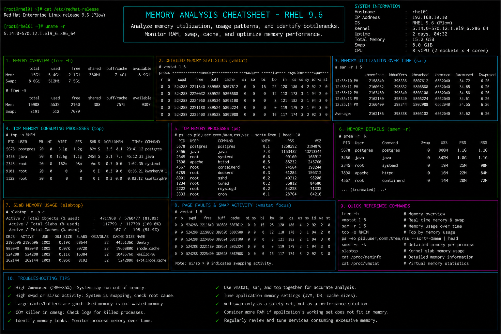

# memory-analysis.md

# Memory Analysis and Performance Monitoring Cheat Sheet

## Overview

This document provides a practical enterprise Linux administration cheat sheet for memory utilization analysis, swap monitoring, cache inspection, process memory tracking, and troubleshooting operations on Red Hat Enterprise Linux (RHEL) 9.6 systems.

The commands and workflows included are commonly used during enterprise performance investigations, application troubleshooting, resource optimization, infrastructure monitoring, and incident response activities.

This reference is designed for fast operational lookup during production Linux administration tasks.

---

## Environment Information

| Component | Details |
|---|---|
| Operating System | RHEL 9.6 |
| Hostname | rhel01.lab.local |
| Monitoring Utilities | procps-ng / sysstat |
| Swap Configuration | Enabled |
| Kernel Version | 5.14.x |
| SELinux Mode | Enforcing |
| User Context | root / sudo administrator |
| Lab Platform | VMware Enterprise Lab |

---

## Common Commands

### Display Memory Usage

```bash
free -h
```

### Monitor Memory Usage in Real Time

```bash
top
```

### Enhanced Interactive Monitoring

```bash
htop
```

### Display Virtual Memory Statistics

```bash
vmstat 2
```

### Display Memory Information

```bash
cat /proc/meminfo
```

### Display Top Memory-Consuming Processes

```bash
ps aux --sort=-%mem | head
```

### Monitor Process Memory Usage

```bash
pidstat -r 2
```

### Display Swap Usage

```bash
swapon --show
```

### Display Historical Memory Statistics

```bash
sar -r 2 5
```

### Display NUMA Memory Information

```bash
numactl --hardware
```

### Display Slab Cache Information

```bash
slabtop
```

### Review Kernel Memory Logs

```bash
journalctl -k
```

---

## Administrative Examples

### Identify High Memory Usage Processes

```bash
ps aux --sort=-%mem | head
```

### Monitor Swap Activity

```bash
vmstat 2
```

### Analyze Memory Pressure

```bash
free -h
```

Example output:

```text
              total        used        free      shared  buff/cache   available
Mem:           15Gi       4.2Gi       6.8Gi       512Mi       4.0Gi        10Gi
Swap:           4Gi       256Mi       3.7Gi
```

### Display Process Memory Allocation

```bash
pidstat -r
```

### Capture Memory Performance Snapshot

```bash
free -h > memory-report.txt
```

### Monitor Cache and Buffer Usage

```bash
cat /proc/meminfo | grep -E 'Buffers|Cached'
```

### Analyze Historical Memory Utilization

```bash
sar -r
```

### Monitor OOM Killer Activity

```bash
dmesg | grep -i oom
```

---

## Validation Commands

### Verify Total Memory

```bash
free -h
```

### Validate Swap Configuration

```bash
swapon --show
```

### Verify Memory Allocation Details

```bash
cat /proc/meminfo
```

### Validate Process Memory Usage

```bash
ps aux --sort=-%mem | head
```

### Verify Virtual Memory Statistics

```bash
vmstat
```

### Validate Historical Memory Trends

```bash
sar -r 1 5
```

### Verify Kernel Memory Messages

```bash
dmesg | tail
```

### Review System Performance Logs

```bash
journalctl -xe
```

---

## Troubleshooting Tips

### High Memory Utilization

Identify memory-intensive processes:

```bash
ps aux --sort=-%mem | head
```

Monitor in real time:

```bash
top
```

### Excessive Swap Usage

Review swap activity:

```bash
vmstat 2
```

Display swap usage:

```bash
swapon --show
```

### Application Memory Leaks

Monitor process memory growth:

```bash
pidstat -r 2
```

### Out of Memory (OOM) Events

Review kernel OOM logs:

```bash
dmesg | grep -i oom
```

Review journal logs:

```bash
journalctl -k
```

### Memory Fragmentation or Cache Issues

Review slab cache usage:

```bash
slabtop
```

Display cache information:

```bash
cat /proc/meminfo
```

### Performance Degradation During Peak Usage

Analyze historical memory trends:

```bash
sar -r
```

---

## Operational Notes

- Monitor memory utilization regularly during enterprise maintenance windows.
- Investigate abnormal swap usage before application performance degradation occurs.
- Use historical monitoring tools for trend analysis and capacity planning.
- Validate process memory behavior during troubleshooting investigations.
- Monitor OOM events during production incidents.
- Maintain memory utilization baselines for enterprise infrastructure systems.
- Review kernel logs during memory-related investigations.

Example operational audit commands:

```bash
free -h
vmstat 2
sar -r 1 5
```

---

## Screenshot Reference



