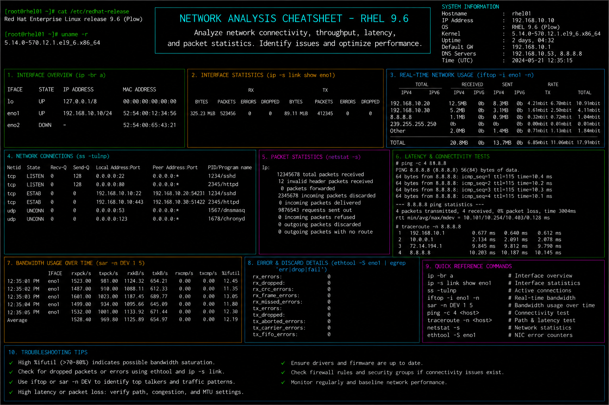

# network-analysis.md

# Network Analysis and Performance Monitoring Cheat Sheet

## Overview

This document provides a practical enterprise Linux administration cheat sheet for network traffic analysis, interface monitoring, throughput validation, latency troubleshooting, and operational diagnostics on Red Hat Enterprise Linux (RHEL) 9.6 systems.

The commands and workflows included are commonly used during enterprise connectivity investigations, application performance troubleshooting, infrastructure monitoring, packet analysis, and incident response activities.

This reference is designed for fast operational lookup during production Linux administration tasks.

---

## Environment Information

| Component | Details |
|---|---|
| Operating System | RHEL 9.6 |
| Hostname | rhel01.lab.local |
| Network Interface | ens160 |
| Monitoring Utilities | iproute2 / sysstat |
| SELinux Mode | Enforcing |
| User Context | root / sudo administrator |
| Lab Platform | VMware Enterprise Lab |

---

## Common Commands

### Display Network Interfaces

```bash
ip addr show
```

### Display Interface Statistics

```bash
ip -s link
```

### Monitor Network Traffic

```bash
iftop
```

### Display Socket Statistics

```bash
ss -tulpn
```

### Display Network Throughput Statistics

```bash
sar -n DEV 2 5
```

### Capture Network Packets

```bash
tcpdump -i ens160
```

### Test Network Connectivity

```bash
ping -c 4 8.8.8.8
```

### Trace Network Route

```bash
traceroute google.com
```

### Display Active Connections

```bash
netstat -tunap
```

### Monitor Interface Errors

```bash
ethtool -S ens160
```

### Display Routing Table

```bash
ip route
```

### Review Network Logs

```bash
journalctl -u NetworkManager
```

---

## Administrative Examples

### Monitor Real-Time Network Usage

```bash
iftop
```

### Analyze Interface Throughput

```bash
sar -n DEV 1 5
```

### Capture HTTP Traffic

```bash
tcpdump -i ens160 port 80
```

### Display Listening Services

```bash
ss -tulpn
```

### Verify DNS Resolution

```bash
dig redhat.com
```

### Analyze Packet Loss

```bash
ping -c 10 8.8.8.8
```

### Review Active Network Sessions

```bash
netstat -tunap
```

### Capture Network Performance Snapshot

```bash
sar -n DEV > network-report.txt
```

---

## Validation Commands

### Verify Interface State

```bash
ip link show
```

Example output:

```text
2: ens160: <BROADCAST,MULTICAST,UP,LOWER_UP>
```

### Validate IP Address Assignment

```bash
ip addr show ens160
```

### Verify Network Throughput

```bash
sar -n DEV 1 5
```

### Validate Open Network Ports

```bash
ss -tulpn
```

### Verify Routing Configuration

```bash
ip route
```

### Validate Interface Error Statistics

```bash
ethtool -S ens160
```

### Verify DNS Resolution

```bash
host redhat.com
```

### Review Kernel Network Messages

```bash
dmesg | grep -i eth
```

---

## Troubleshooting Tips

### High Network Latency

Test connectivity:

```bash
ping -c 10 8.8.8.8
```

Trace route path:

```bash
traceroute google.com
```

### Packet Loss or Connection Drops

Monitor interface statistics:

```bash
ip -s link
```

Review interface errors:

```bash
ethtool -S ens160
```

### Slow Application Connectivity

Monitor active traffic:

```bash
iftop
```

Capture packets for analysis:

```bash
tcpdump -i ens160
```

### DNS Resolution Problems

Verify DNS queries:

```bash
dig redhat.com
```

Review resolver configuration:

```bash
cat /etc/resolv.conf
```

### Network Interface Down

Verify interface state:

```bash
ip link show
```

Bring interface online:

```bash
nmcli connection up ens160
```

### Firewall or SELinux Blocking Traffic

Review firewall rules:

```bash
firewall-cmd --list-all
```

Review SELinux denials:

```bash
ausearch -m avc -ts recent
```

---

## Operational Notes

- Monitor network throughput regularly during enterprise maintenance windows.
- Investigate packet loss and interface errors before application impact occurs.
- Use packet captures during advanced troubleshooting investigations.
- Validate routing and DNS configuration during connectivity issues.
- Maintain baseline network performance metrics for enterprise systems.
- Monitor active listening services during security reviews.
- Review NetworkManager and kernel logs during network incidents.

Example operational audit commands:

```bash
sar -n DEV 1 5
ss -tulpn
ip -s link
```

---

## Screenshot Reference


