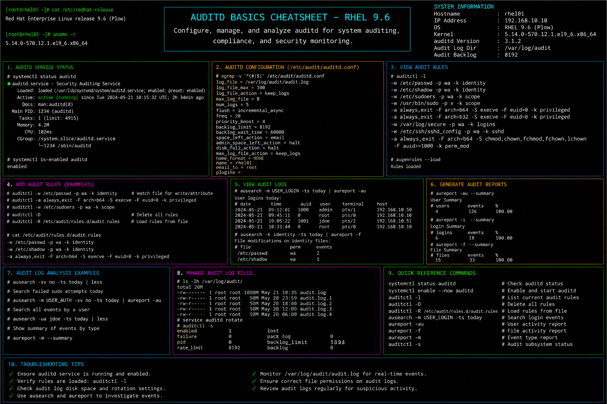

# auditd-basics.md

# Auditd Basics and Security Auditing Cheat Sheet

## Overview

This document provides a practical enterprise Linux administration cheat sheet for auditd configuration, security event auditing, rule management, log analysis, compliance validation, and troubleshooting operations on Red Hat Enterprise Linux (RHEL) 9.6 systems.

The commands and workflows included are commonly used during enterprise security monitoring, compliance auditing, incident investigations, privileged access tracking, and infrastructure hardening activities.

This reference is designed for fast operational lookup during production Linux administration tasks.

---

## Environment Information

| Component | Details |
|---|---|
| Operating System | RHEL 9.6 |
| Hostname | rhel01.lab.local |
| Audit Framework | auditd |
| Audit Log Path | /var/log/audit/audit.log |
| SELinux Mode | Enforcing |
| User Context | root / sudo administrator |
| Lab Platform | VMware Enterprise Lab |

---

## Common Commands

### Install Audit Framework

```bash
dnf install -y audit
```

### Start Audit Service

```bash
systemctl start auditd
```

### Enable Audit Service at Boot

```bash
systemctl enable auditd
```

### Verify Audit Service Status

```bash
systemctl status auditd
```

### Display Active Audit Rules

```bash
auditctl -l
```

### Search Audit Logs

```bash
ausearch -m USER_LOGIN
```

### Generate Audit Reports

```bash
aureport
```

### Monitor Audit Logs in Real Time

```bash
tail -f /var/log/audit/audit.log
```

### Add Temporary Audit Rule

```bash
auditctl -w /etc/passwd -p wa -k passwd_changes
```

### Remove All Audit Rules

```bash
auditctl -D
```

### Review Failed Login Attempts

```bash
aureport -au
```

### Review SELinux AVC Events

```bash
ausearch -m avc
```

---

## Administrative Examples

### Enable Auditd Service

```bash
systemctl enable --now auditd
```

### Monitor Changes to Critical Files

```bash
auditctl -w /etc/shadow -p wa -k shadow_changes
```

### Monitor Sudo Activity

```bash
auditctl -w /var/log/sudo.log -p wa -k sudo_activity
```

### Search for File Modification Events

```bash
ausearch -k passwd_changes
```

### Generate Failed Authentication Report

```bash
aureport -au
```

### Create Persistent Audit Rules

Edit audit rules:

```bash
vim /etc/audit/rules.d/audit.rules
```

Example rule:

```text
-w /etc/passwd -p wa -k passwd_changes
```

### Restart Audit Service After Changes

```bash
systemctl restart auditd
```

---

## Validation Commands

### Verify Audit Service State

```bash
systemctl is-active auditd
```

Example output:

```text
active
```

### Validate Active Audit Rules

```bash
auditctl -l
```

### Verify Audit Log Entries

```bash
tail /var/log/audit/audit.log
```

### Validate Authentication Audit Events

```bash
aureport -au
```

### Verify SELinux Audit Events

```bash
ausearch -m avc
```

### Review Failed System Calls

```bash
aureport -x
```

### Validate Audit Rule Persistence

```bash
cat /etc/audit/rules.d/audit.rules
```

### Review Service Logs

```bash
journalctl -u auditd
```

---

## Troubleshooting Tips

### Audit Service Fails to Start

Verify service status:

```bash
systemctl status auditd
```

Review logs:

```bash
journalctl -xe
```

### Audit Rules Not Applied

Reload audit rules:

```bash
augenrules --load
```

Verify active rules:

```bash
auditctl -l
```

### Excessive Audit Log Growth

Review audit log size:

```bash
du -sh /var/log/audit
```

Configure log rotation:

```bash
vim /etc/audit/auditd.conf
```

### Missing Audit Events

Verify audit daemon state:

```bash
systemctl status auditd
```

Check active rules:

```bash
auditctl -l
```

### SELinux Denial Investigations

Review AVC logs:

```bash
ausearch -m avc -ts recent
```

Generate SELinux analysis:

```bash
sealert -a /var/log/audit/audit.log
```

### Compliance Audit Validation

Generate summary reports:

```bash
aureport
```

---

## Operational Notes

- Use auditd for enterprise compliance and security monitoring.
- Monitor privileged command execution and authentication events.
- Configure persistent audit rules for critical system files.
- Review audit logs regularly during security investigations.
- Maintain audit log retention policies for compliance requirements.
- Monitor SELinux AVC denials during hardening activities.
- Validate auditd functionality after system upgrades and maintenance.

Example operational audit commands:

```bash
auditctl -l
aureport -au
ausearch -m avc
```

---

## Screenshot Reference


