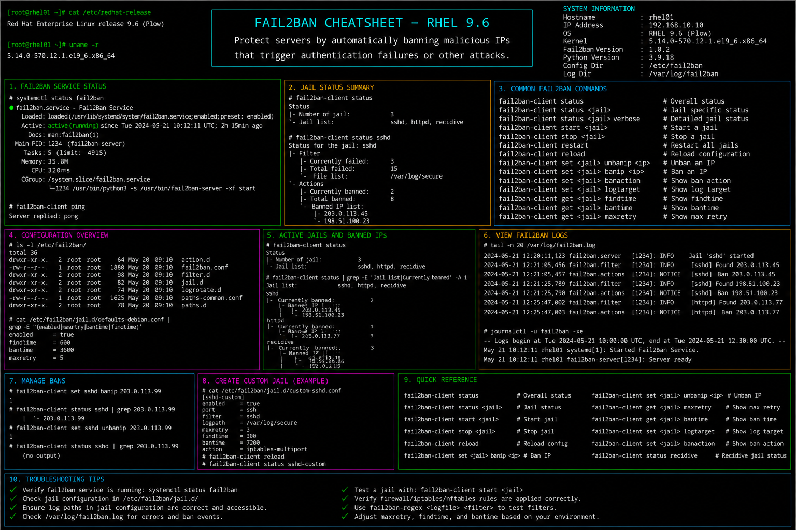

# fail2ban.md

# Fail2Ban Security Hardening Commands Cheat Sheet

## Overview

This document provides a practical enterprise Linux administration cheat sheet for Fail2Ban configuration, intrusion prevention, SSH brute-force protection, log monitoring, firewall integration, and troubleshooting operations on Red Hat Enterprise Linux (RHEL) 9.6 systems.

The commands and workflows included are commonly used during enterprise security hardening, automated threat mitigation, authentication protection, incident response, and infrastructure defense activities.

This reference is designed for fast operational lookup during production Linux administration tasks.

---

## Environment Information

| Component | Details |
|---|---|
| Operating System | RHEL 9.6 |
| Hostname | rhel01.lab.local |
| Intrusion Prevention | Fail2Ban |
| Default Jail | sshd |
| Firewall Backend | firewalld |
| SELinux Mode | Enforcing |
| User Context | root / sudo administrator |
| Lab Platform | VMware Enterprise Lab |

---

## Common Commands

### Install Fail2Ban

```bash
dnf install -y epel-release fail2ban
```

### Start Fail2Ban Service

```bash
systemctl start fail2ban
```

### Enable Fail2Ban at Boot

```bash
systemctl enable fail2ban
```

### Verify Fail2Ban Service Status

```bash
systemctl status fail2ban
```

### Display Active Jails

```bash
fail2ban-client status
```

### Display SSH Jail Status

```bash
fail2ban-client status sshd
```

### Unban IP Address

```bash
fail2ban-client set sshd unbanip 192.168.10.50
```

### View Fail2Ban Logs

```bash
journalctl -u fail2ban
```

### Edit Jail Configuration

```bash
vim /etc/fail2ban/jail.local
```

### Restart Fail2Ban Service

```bash
systemctl restart fail2ban
```

### Validate Firewall Rules

```bash
firewall-cmd --list-all
```

### Review Authentication Logs

```bash
journalctl -u sshd
```

---

## Administrative Examples

### Install and Enable Fail2Ban

```bash
dnf install -y epel-release fail2ban
systemctl enable --now fail2ban
```

### Configure SSH Protection Jail

Edit jail configuration:

```bash
vim /etc/fail2ban/jail.local
```

Example configuration:

```ini
[sshd]
enabled = true
port = ssh
maxretry = 5
findtime = 10m
bantime = 1h
```

### Restart Fail2Ban After Configuration Changes

```bash
systemctl restart fail2ban
```

### Verify Active Banned IPs

```bash
fail2ban-client status sshd
```

### Unban Trusted Administrative IP

```bash
fail2ban-client set sshd unbanip 192.168.10.50
```

### Monitor Failed SSH Attempts

```bash
journalctl -u sshd | grep Failed
```

### Review Fail2Ban Log Activity

```bash
tail -f /var/log/fail2ban.log
```

---

## Validation Commands

### Verify Fail2Ban Service State

```bash
systemctl is-active fail2ban
```

Example output:

```text
active
```

### Validate Active Jails

```bash
fail2ban-client status
```

### Verify SSH Jail Configuration

```bash
fail2ban-client status sshd
```

### Validate Authentication Failures

```bash
journalctl -u sshd
```

### Verify Firewall Ban Rules

```bash
firewall-cmd --list-all
```

### Review Fail2Ban Logs

```bash
journalctl -u fail2ban
```

### Validate SELinux Contexts

```bash
ls -Z /etc/fail2ban
```

### Verify Listening SSH Port

```bash
ss -tulpn | grep sshd
```

---

## Troubleshooting Tips

### Fail2Ban Service Fails to Start

Verify service status:

```bash
systemctl status fail2ban
```

Review logs:

```bash
journalctl -xe
```

### SSH Jail Not Detecting Failed Logins

Verify SSH logs:

```bash
journalctl -u sshd
```

Review jail configuration:

```bash
cat /etc/fail2ban/jail.local
```

### IP Address Not Being Banned

Verify jail activity:

```bash
fail2ban-client status sshd
```

Check firewall backend integration:

```bash
firewall-cmd --list-all
```

### Legitimate User Accidentally Banned

Unban IP address:

```bash
fail2ban-client set sshd unbanip 192.168.10.50
```

### SELinux Restricting Fail2Ban

Review SELinux denials:

```bash
ausearch -m avc -ts recent
```

Restore contexts:

```bash
restorecon -Rv /etc/fail2ban
```

### Excessive Authentication Failures

Monitor SSH activity:

```bash
journalctl -u sshd | grep Failed
```

---

## Operational Notes

- Use Fail2Ban for automated protection against brute-force attacks.
- Monitor authentication logs regularly during security reviews.
- Configure appropriate ban intervals for enterprise environments.
- Validate firewall integration after Fail2Ban deployments.
- Review active bans during incident investigations.
- Maintain backup copies of jail configurations before modifications.
- Monitor SELinux logs during security hardening activities.

Example operational audit commands:

```bash
fail2ban-client status
journalctl -u fail2ban
journalctl -u sshd | grep Failed
```

---

## Screenshot Reference


