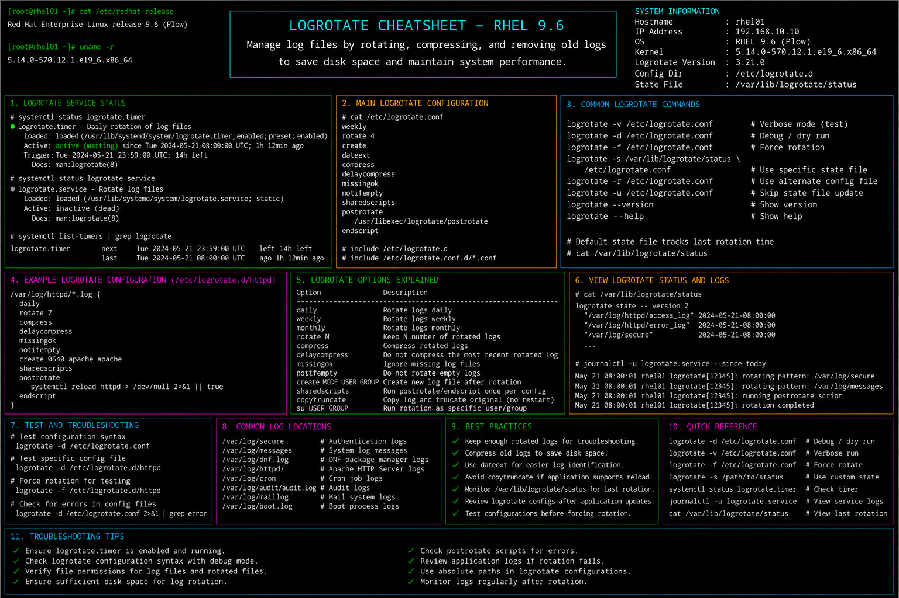

# logrotate.md

# Logrotate Administration and Log Management Cheat Sheet

## Overview

This document provides a practical enterprise Linux administration cheat sheet for logrotate configuration, automated log rotation, retention management, compression policies, troubleshooting operations, and enterprise log maintenance on Red Hat Enterprise Linux (RHEL) 9.6 systems.

The commands and workflows included are commonly used during enterprise log management, compliance retention, storage optimization, operational maintenance, and infrastructure monitoring activities.

This reference is designed for fast operational lookup during production Linux administration tasks.

---

## Environment Information

| Component | Details |
|---|---|
| Operating System | RHEL 9.6 |
| Hostname | rhel01.lab.local |
| Log Rotation Utility | logrotate |
| Default Configuration | /etc/logrotate.conf |
| Rotation Schedule | daily / weekly |
| SELinux Mode | Enforcing |
| User Context | root / sudo administrator |
| Lab Platform | VMware Enterprise Lab |

---

## Common Commands

### Verify Logrotate Package

```bash
rpm -q logrotate
```

### Display Main Logrotate Configuration

```bash
cat /etc/logrotate.conf
```

### Display Service-Specific Rotation Policies

```bash
ls -l /etc/logrotate.d/
```

### Test Logrotate Configuration

```bash
logrotate -d /etc/logrotate.conf
```

### Force Log Rotation

```bash
logrotate -f /etc/logrotate.conf
```

### Display Logrotate State File

```bash
cat /var/lib/logrotate/logrotate.status
```

### View Journal Logs for Logrotate

```bash
journalctl | grep logrotate
```

### Monitor Log Directory Usage

```bash
du -sh /var/log
```

### List Rotated Logs

```bash
ls -lh /var/log
```

### Compress Logs Manually

```bash
gzip /var/log/messages
```

### Review Cron or Timer Schedule

```bash
systemctl status logrotate.timer
```

### Verify Disk Space Usage

```bash
df -h
```

---

## Administrative Examples

### Create Custom Logrotate Policy

Create custom configuration:

```bash
vim /etc/logrotate.d/custom-app
```

Example configuration:

```conf
/var/log/custom-app/*.log {
    daily
    rotate 7
    compress
    missingok
    notifempty
    create 0640 root root
}
```

### Test Configuration Without Rotation

```bash
logrotate -d /etc/logrotate.conf
```

### Force Immediate Rotation

```bash
logrotate -f /etc/logrotate.conf
```

### Rotate Apache Logs

```bash
cat /etc/logrotate.d/httpd
```

### Verify Rotated and Compressed Logs

```bash
ls -lh /var/log/httpd
```

### Review Logrotate Execution History

```bash
journalctl | grep logrotate
```

### Configure Retention Policy

```conf
weekly
rotate 4
compress
```

---

## Validation Commands

### Verify Logrotate Installation

```bash
rpm -q logrotate
```

Example output:

```text
logrotate-3.18.0-8.el9.x86_64
```

### Validate Configuration Syntax

```bash
logrotate -d /etc/logrotate.conf
```

### Verify Rotation State File

```bash
cat /var/lib/logrotate/logrotate.status
```

### Validate Rotated Logs

```bash
ls -lh /var/log
```

### Verify Compression Status

```bash
ls /var/log/*.gz
```

### Validate Timer or Cron Execution

```bash
systemctl status logrotate.timer
```

### Verify Disk Utilization

```bash
df -h /var/log
```

### Validate SELinux Contexts

```bash
ls -Z /etc/logrotate.d
```

---

## Troubleshooting Tips

### Logrotate Configuration Errors

Validate configuration syntax:

```bash
logrotate -d /etc/logrotate.conf
```

Review configuration files:

```bash
cat /etc/logrotate.d/custom-app
```

### Logs Not Rotating

Force rotation manually:

```bash
logrotate -f /etc/logrotate.conf
```

Review state file:

```bash
cat /var/lib/logrotate/logrotate.status
```

### Excessive Disk Usage in /var/log

Review directory usage:

```bash
du -sh /var/log/*
```

Verify compression policies:

```bash
cat /etc/logrotate.conf
```

### Application Still Writing to Old Logs

Restart application service:

```bash
systemctl restart httpd
```

### SELinux Restricting Rotation Operations

Review SELinux denials:

```bash
ausearch -m avc -ts recent
```

Restore contexts:

```bash
restorecon -Rv /etc/logrotate.d
```

### Timer or Cron Execution Failures

Verify timer status:

```bash
systemctl status logrotate.timer
```

Review system logs:

```bash
journalctl -xe
```

---

## Operational Notes

- Configure log rotation policies for all enterprise applications.
- Use compression to reduce disk utilization for archived logs.
- Validate retention policies during compliance audits.
- Test logrotate configurations before production deployment.
- Monitor log growth during incident investigations.
- Maintain centralized logging alongside local rotation policies.
- Review SELinux contexts after deploying custom configurations.

Example operational audit commands:

```bash
logrotate -d /etc/logrotate.conf
du -sh /var/log
systemctl status logrotate.timer
```

---

## Screenshot Reference


