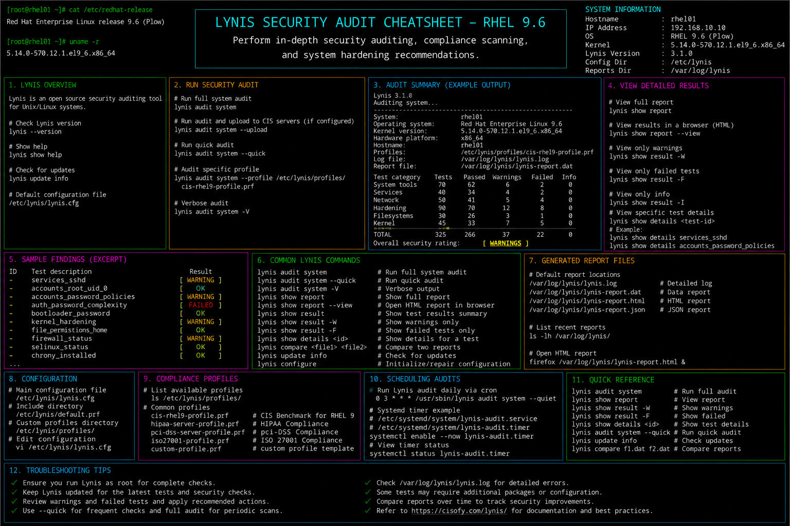

# lynis-security-audit.md

# Lynis Security Audit Commands Cheat Sheet

## Overview

This document provides a practical enterprise Linux administration cheat sheet for Lynis security auditing, compliance validation, vulnerability assessment, hardening analysis, and troubleshooting operations on Red Hat Enterprise Linux (RHEL) 9.6 systems.

The commands and workflows included are commonly used during enterprise security assessments, compliance reviews, hardening verification, infrastructure auditing, and operational maintenance activities.

This reference is designed for fast operational lookup during production Linux administration tasks.

---

## Environment Information

| Component | Details |
|---|---|
| Operating System | RHEL 9.6 |
| Hostname | rhel01.lab.local |
| Security Audit Tool | Lynis |
| Audit Report Path | /var/log/lynis-report.dat |
| Audit Log Path | /var/log/lynis.log |
| SELinux Mode | Enforcing |
| User Context | root / sudo administrator |
| Lab Platform | VMware Enterprise Lab |

---

## Common Commands

### Install Lynis

```bash
dnf install -y epel-release lynis
```

### Display Lynis Version

```bash
lynis show version
```

### Run Full System Audit

```bash
lynis audit system
```

### Run Quick Security Scan

```bash
lynis audit system --quick
```

### Display Available Tests

```bash
lynis show tests
```

### Display Audit Categories

```bash
lynis show groups
```

### Review Lynis Report

```bash
cat /var/log/lynis-report.dat
```

### Review Lynis Logs

```bash
less /var/log/lynis.log
```

### Display Hardening Suggestions

```bash
grep suggestion /var/log/lynis-report.dat
```

### Display Security Warnings

```bash
grep warning /var/log/lynis-report.dat
```

### Run Compliance-Oriented Audit

```bash
lynis audit system --tests-from-group security
```

### Review SELinux Status

```bash
sestatus
```

---

## Administrative Examples

### Install and Verify Lynis

```bash
dnf install -y epel-release lynis
lynis show version
```

### Execute Enterprise Security Audit

```bash
lynis audit system
```

### Generate Security Recommendations

```bash
grep suggestion /var/log/lynis-report.dat
```

### Review Security Warnings

```bash
grep warning /var/log/lynis-report.dat
```

### Audit SSH Hardening Configuration

```bash
lynis audit system --tests-from-group ssh
```

### Review Authentication Hardening Results

```bash
lynis audit system --tests-from-group authentication
```

### Review Firewall and Network Hardening

```bash
lynis audit system --tests-from-group networking
```

### Save Audit Results for Compliance Review

```bash
cp /var/log/lynis-report.dat /backup/security/
```

---

## Validation Commands

### Verify Lynis Installation

```bash
rpm -q lynis
```

Example output:

```text
lynis-3.0.8-1.el9.noarch
```

### Validate Lynis Version

```bash
lynis show version
```

### Verify Audit Report Generation

```bash
ls -l /var/log/lynis-report.dat
```

### Validate Security Suggestions

```bash
grep suggestion /var/log/lynis-report.dat
```

### Verify Security Warnings

```bash
grep warning /var/log/lynis-report.dat
```

### Validate SELinux Status

```bash
sestatus
```

### Verify Audit Log Entries

```bash
less /var/log/lynis.log
```

### Review System Hardening Score

```bash
grep hardening_index /var/log/lynis-report.dat
```

---

## Troubleshooting Tips

### Lynis Audit Fails to Start

Verify installation:

```bash
rpm -q lynis
```

Review execution logs:

```bash
less /var/log/lynis.log
```

### Missing Security Recommendations

Verify report generation:

```bash
cat /var/log/lynis-report.dat
```

Run full audit:

```bash
lynis audit system
```

### SELinux Restrictions During Audit

Review SELinux status:

```bash
sestatus
```

Review AVC denials:

```bash
ausearch -m avc -ts recent
```

### Compliance Audit Incomplete

Run group-specific checks:

```bash
lynis show groups
```

### Hardening Index Too Low

Review recommendations:

```bash
grep suggestion /var/log/lynis-report.dat
```

### Excessive Warnings During Audit

Review warnings carefully:

```bash
grep warning /var/log/lynis-report.dat
```

---

## Operational Notes

- Use Lynis regularly for enterprise hardening validation.
- Review hardening suggestions during compliance audits.
- Validate SSH, firewall, and authentication security settings.
- Archive audit reports for security review and documentation.
- Monitor SELinux and system hardening configurations regularly.
- Integrate Lynis checks into enterprise maintenance workflows.
- Review security warnings before production deployments.

Example operational audit commands:

```bash
lynis audit system
grep suggestion /var/log/lynis-report.dat
grep hardening_index /var/log/lynis-report.dat
```

---

## Screenshot Reference


