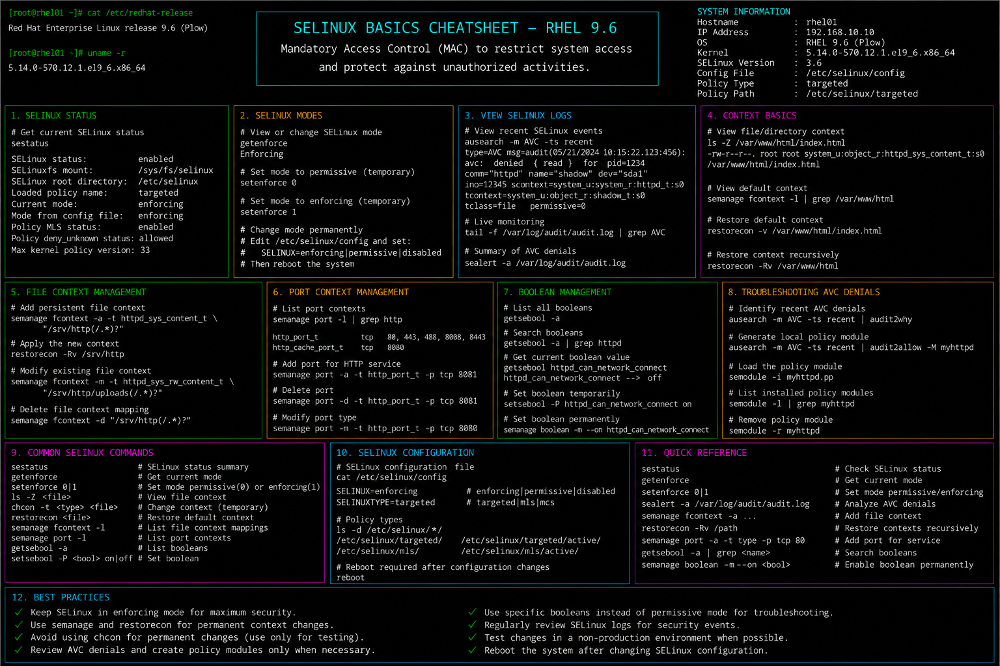

# selinux-basics.md

# SELinux Basics and Security Context Management Cheat Sheet

## Overview

This document provides a practical enterprise Linux administration cheat sheet for SELinux configuration, security context management, policy troubleshooting, access control validation, and operational hardening on Red Hat Enterprise Linux (RHEL) 9.6 systems.

The commands and workflows included are commonly used during enterprise security hardening, service troubleshooting, policy analysis, compliance validation, and infrastructure administration activities.

This reference is designed for fast operational lookup during production Linux administration tasks.

---

## Environment Information

| Component | Details |
|---|---|
| Operating System | RHEL 9.6 |
| Hostname | rhel01.lab.local |
| Security Framework | SELinux |
| Policy Mode | Enforcing |
| SELinux Policy | targeted |
| SELinux Config File | /etc/selinux/config |
| User Context | root / sudo administrator |
| Lab Platform | VMware Enterprise Lab |

---

## Common Commands

### Display Current SELinux Mode

```bash
getenforce
```

### Display Detailed SELinux Status

```bash
sestatus
```

### Temporarily Set SELinux to Permissive

```bash
setenforce 0
```

### Re-Enable Enforcing Mode

```bash
setenforce 1
```

### Display SELinux File Contexts

```bash
ls -Z /var/www/html
```

### Restore Default File Contexts

```bash
restorecon -Rv /var/www/html
```

### Display SELinux Port Contexts

```bash
semanage port -l
```

### Display SELinux Booleans

```bash
getsebool -a
```

### Enable HTTPD Network Connections

```bash
setsebool -P httpd_can_network_connect on
```

### Review SELinux AVC Denials

```bash
ausearch -m avc -ts recent
```

### Generate SELinux Troubleshooting Report

```bash
sealert -a /var/log/audit/audit.log
```

### Display SELinux Process Contexts

```bash
ps -eZ
```

---

## Administrative Examples

### Verify SELinux Operating Mode

```bash
getenforce
sestatus
```

### Configure Persistent SELinux Mode

Edit configuration:

```bash
vim /etc/selinux/config
```

Example configuration:

```conf
SELINUX=enforcing
SELINUXTYPE=targeted
```

### Restore Web Directory Contexts

```bash
restorecon -Rv /var/www/html
```

### Allow Apache Network Connectivity

```bash
setsebool -P httpd_can_network_connect on
```

### Configure Custom HTTP Port

```bash
semanage port -a -t http_port_t -p tcp 8080
```

### Review SELinux Access Denials

```bash
ausearch -m avc -ts recent
```

### Analyze Audit Log Denials

```bash
sealert -a /var/log/audit/audit.log
```

---

## Validation Commands

### Verify SELinux Enforcement State

```bash
getenforce
```

Example output:

```text
Enforcing
```

### Validate SELinux Configuration

```bash
sestatus
```

### Verify File Security Contexts

```bash
ls -Z /var/www/html
```

### Validate SELinux Booleans

```bash
getsebool httpd_can_network_connect
```

### Verify Port Context Assignments

```bash
semanage port -l | grep http
```

### Review SELinux AVC Logs

```bash
ausearch -m avc
```

### Validate Process Security Contexts

```bash
ps -eZ | grep httpd
```

### Verify Restored Contexts

```bash
restorecon -Rv /var/www/html
```

---

## Troubleshooting Tips

### Application Access Denied by SELinux

Review AVC denials:

```bash
ausearch -m avc -ts recent
```

Generate troubleshooting report:

```bash
sealert -a /var/log/audit/audit.log
```

### Incorrect File Contexts

Verify contexts:

```bash
ls -Z /var/www/html
```

Restore default contexts:

```bash
restorecon -Rv /var/www/html
```

### Service Cannot Bind to Port

Verify SELinux port mappings:

```bash
semanage port -l
```

Add custom port:

```bash
semanage port -a -t http_port_t -p tcp 8080
```

### Boolean Settings Not Applied

Verify current value:

```bash
getsebool httpd_can_network_connect
```

Apply persistent setting:

```bash
setsebool -P httpd_can_network_connect on
```

### Excessive AVC Denials

Review audit logs:

```bash
ausearch -m avc
```

Analyze policy suggestions:

```bash
sealert -a /var/log/audit/audit.log
```

### Temporary Troubleshooting Mode

Switch to permissive mode:

```bash
setenforce 0
```

Restore enforcing mode:

```bash
setenforce 1
```

---

## Operational Notes

- Keep SELinux enabled in enforcing mode for enterprise systems.
- Review AVC denials during application deployments and troubleshooting.
- Use restorecon after file migrations or manual permission changes.
- Configure custom ports using semanage instead of disabling SELinux.
- Monitor SELinux booleans during service hardening.
- Archive audit logs for security investigations and compliance reviews.
- Validate SELinux configurations after system upgrades and maintenance.

Example operational audit commands:

```bash
sestatus
ausearch -m avc
ps -eZ
```

---

## Screenshot Reference



