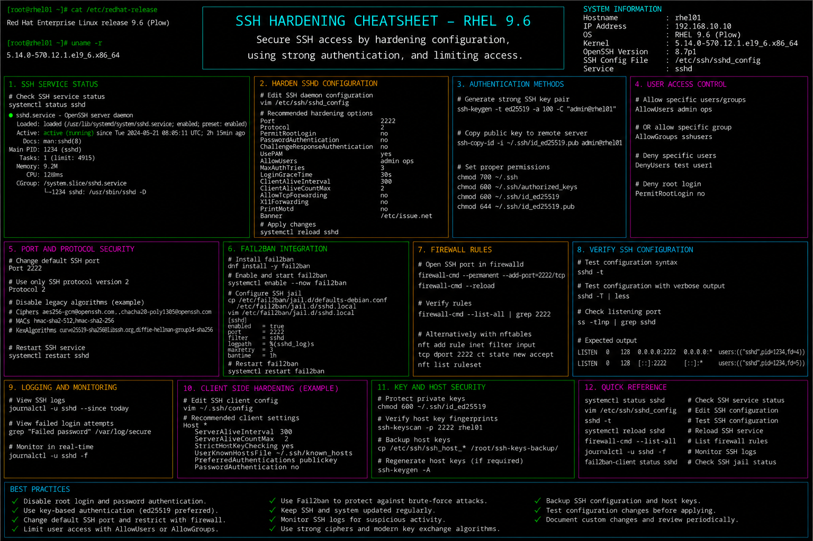

# ssh-hardening.md

# SSH Hardening and Secure Remote Access Cheat Sheet

## Overview

This document provides a practical enterprise Linux administration cheat sheet for SSH hardening, secure remote access configuration, authentication security, access restriction policies, and troubleshooting operations on Red Hat Enterprise Linux (RHEL) 9.6 systems.

The commands and workflows included are commonly used during enterprise security hardening, remote administration protection, compliance validation, infrastructure security reviews, and operational maintenance activities.

This reference is designed for fast operational lookup during production Linux administration tasks.

---

## Environment Information

| Component | Details |
|---|---|
| Operating System | RHEL 9.6 |
| Hostname | rhel01.lab.local |
| SSH Service | OpenSSH Server |
| SSH Configuration File | /etc/ssh/sshd_config |
| Default SSH Port | 22 |
| SELinux Mode | Enforcing |
| User Context | root / sudo administrator |
| Lab Platform | VMware Enterprise Lab |

---

## Common Commands

### Verify SSH Service Status

```bash
systemctl status sshd
```

### Enable SSH Service at Boot

```bash
systemctl enable sshd
```

### Restart SSH Service

```bash
systemctl restart sshd
```

### Validate SSH Configuration Syntax

```bash
sshd -t
```

### Review Active SSH Connections

```bash
ss -tnp | grep sshd
```

### Display SSH Listening Ports

```bash
ss -tulpn | grep ssh
```

### Review SSH Authentication Logs

```bash
journalctl -u sshd
```

### Edit SSH Configuration

```bash
vim /etc/ssh/sshd_config
```

### Generate SSH Key Pair

```bash
ssh-keygen -t ed25519
```

### Copy SSH Public Key to Remote Host

```bash
ssh-copy-id admin@192.168.10.20
```

### Verify SELinux SSH Port Contexts

```bash
semanage port -l | grep ssh
```

### Configure Firewall for SSH

```bash
firewall-cmd --permanent --add-service=ssh
```

---

## Administrative Examples

### Disable Root SSH Login

Edit SSH configuration:

```bash
vim /etc/ssh/sshd_config
```

Example configuration:

```conf
PermitRootLogin no
```

### Disable Password Authentication

```conf
PasswordAuthentication no
PubkeyAuthentication yes
```

### Configure Custom SSH Port

```conf
Port 2222
```

### Add SELinux Context for Custom SSH Port

```bash
semanage port -a -t ssh_port_t -p tcp 2222
```

### Allow Custom SSH Port in Firewall

```bash
firewall-cmd --permanent --add-port=2222/tcp
firewall-cmd --reload
```

### Validate SSH Configuration Before Restart

```bash
sshd -t
```

### Restart SSH Service Safely

```bash
systemctl restart sshd
```

### Monitor Failed SSH Login Attempts

```bash
journalctl -u sshd | grep Failed
```

---

## Validation Commands

### Verify SSH Service State

```bash
systemctl is-active sshd
```

Example output:

```text
active
```

### Validate SSH Configuration Syntax

```bash
sshd -t
```

### Verify SSH Listening Port

```bash
ss -tulpn | grep ssh
```

### Validate Firewall Rules

```bash
firewall-cmd --list-all
```

### Verify SELinux SSH Port Configuration

```bash
semanage port -l | grep ssh
```

### Review Authentication Attempts

```bash
journalctl -u sshd
```

### Validate Active SSH Sessions

```bash
who
```

### Verify SSH Key Authentication

```bash
ssh -i ~/.ssh/id_ed25519 admin@192.168.10.20
```

---

## Troubleshooting Tips

### SSH Service Fails to Start

Validate configuration syntax:

```bash
sshd -t
```

Review service logs:

```bash
journalctl -xe
```

### SSH Connection Refused

Verify listening ports:

```bash
ss -tulpn | grep ssh
```

Verify firewall rules:

```bash
firewall-cmd --list-all
```

### Authentication Failures

Review SSH logs:

```bash
journalctl -u sshd
```

Verify SSH key permissions:

```bash
chmod 600 ~/.ssh/authorized_keys
```

### SELinux Blocking Custom SSH Port

Verify SELinux port contexts:

```bash
semanage port -l | grep ssh
```

Add correct context:

```bash
semanage port -a -t ssh_port_t -p tcp 2222
```

### Firewall Blocking SSH Access

Allow SSH service:

```bash
firewall-cmd --permanent --add-service=ssh
firewall-cmd --reload
```

### Excessive Failed Login Attempts

Monitor authentication failures:

```bash
journalctl -u sshd | grep Failed
```

Review Fail2Ban integration:

```bash
fail2ban-client status sshd
```

---

## Operational Notes

- Disable root SSH login in enterprise environments.
- Use SSH key authentication instead of passwords whenever possible.
- Validate SSH configuration changes before restarting services.
- Monitor authentication logs regularly during security reviews.
- Configure firewall and SELinux rules consistently.
- Review active SSH sessions during incident investigations.
- Maintain backup access methods before modifying production SSH configurations.

Example operational audit commands:

```bash
sshd -t
journalctl -u sshd
ss -tulpn | grep ssh
```

---

## Screenshot Reference


