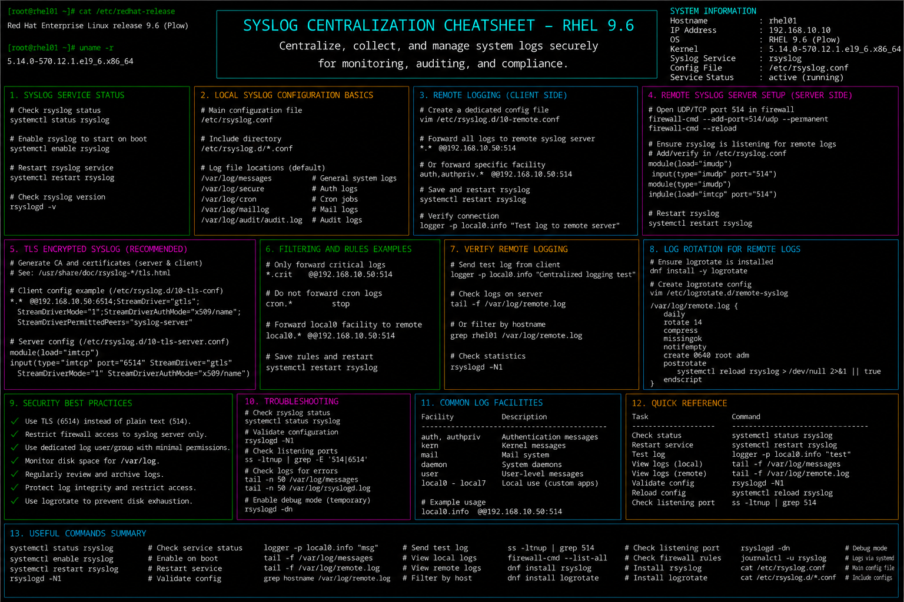

# syslog-centralization.md

# Syslog Centralization and Remote Logging Cheat Sheet

## Overview

This document provides a practical enterprise Linux administration cheat sheet for syslog centralization, remote log forwarding, rsyslog configuration, secure log aggregation, troubleshooting operations, and enterprise logging workflows on Red Hat Enterprise Linux (RHEL) 9.6 systems.

The commands and workflows included are commonly used during enterprise monitoring deployments, compliance logging, SIEM integration, centralized audit collection, and infrastructure troubleshooting activities.

This reference is designed for fast operational lookup during production Linux administration tasks.

---

## Environment Information

| Component | Details |
|---|---|
| Operating System | RHEL 9.6 |
| Hostname | rhel01.lab.local |
| Logging Service | rsyslog |
| Main Configuration | /etc/rsyslog.conf |
| Log Directory | /var/log |
| SELinux Mode | Enforcing |
| User Context | root / sudo administrator |
| Lab Platform | VMware Enterprise Lab |

---

## Common Commands

### Verify rsyslog Service Status

```bash
systemctl status rsyslog
```

### Enable rsyslog at Boot

```bash
systemctl enable rsyslog
```

### Restart rsyslog Service

```bash
systemctl restart rsyslog
```

### Validate rsyslog Configuration Syntax

```bash
rsyslogd -N1
```

### Monitor System Logs in Real Time

```bash
tail -f /var/log/messages
```

### Review Authentication Logs

```bash
tail -f /var/log/secure
```

### Display Listening Syslog Ports

```bash
ss -tulpn | grep rsyslog
```

### Edit rsyslog Configuration

```bash
vim /etc/rsyslog.conf
```

### Review rsyslog Service Logs

```bash
journalctl -u rsyslog
```

### Verify Firewall Rules

```bash
firewall-cmd --list-all
```

### Display SELinux Port Contexts

```bash
semanage port -l | grep syslog
```

### Send Test Syslog Message

```bash
logger "Test syslog forwarding"
```

---

## Administrative Examples

### Enable Remote UDP Syslog Reception

Edit rsyslog configuration:

```bash
vim /etc/rsyslog.conf
```

Example configuration:

```conf
module(load="imudp")
input(type="imudp" port="514")
```

### Enable Remote TCP Syslog Reception

```conf
module(load="imtcp")
input(type="imtcp" port="514")
```

### Configure Remote Log Forwarding

```conf
*.* @@192.168.10.50:514
```

### Restart rsyslog After Configuration Changes

```bash
systemctl restart rsyslog
```

### Validate Configuration Syntax

```bash
rsyslogd -N1
```

### Allow Syslog Traffic Through Firewall

```bash
firewall-cmd --permanent --add-port=514/tcp
firewall-cmd --permanent --add-port=514/udp
firewall-cmd --reload
```

### Configure SELinux for Syslog Ports

```bash
semanage port -a -t syslogd_port_t -p tcp 514
```

### Send Test Remote Log Entry

```bash
logger "Enterprise syslog test message"
```

---

## Validation Commands

### Verify rsyslog Service State

```bash
systemctl is-active rsyslog
```

Example output:

```text
active
```

### Validate rsyslog Syntax

```bash
rsyslogd -N1
```

### Verify Listening Syslog Ports

```bash
ss -tulpn | grep 514
```

### Validate Firewall Rules

```bash
firewall-cmd --list-all
```

### Verify SELinux Port Assignments

```bash
semanage port -l | grep syslog
```

### Review rsyslog Logs

```bash
journalctl -u rsyslog
```

### Validate Remote Log Forwarding

```bash
logger "Syslog forwarding validation"
```

### Monitor Incoming Log Messages

```bash
tail -f /var/log/messages
```

---

## Troubleshooting Tips

### rsyslog Service Fails to Start

Validate configuration syntax:

```bash
rsyslogd -N1
```

Review service logs:

```bash
journalctl -xe
```

### Remote Logs Not Received

Verify listening ports:

```bash
ss -tulpn | grep 514
```

Verify firewall rules:

```bash
firewall-cmd --list-all
```

### Log Forwarding Failures

Review rsyslog logs:

```bash
journalctl -u rsyslog
```

Test remote connectivity:

```bash
nc -vz 192.168.10.50 514
```

### SELinux Blocking Syslog Traffic

Review AVC denials:

```bash
ausearch -m avc -ts recent
```

Configure correct SELinux port context:

```bash
semanage port -a -t syslogd_port_t -p tcp 514
```

### Firewall Blocking Syslog Ports

Allow syslog traffic:

```bash
firewall-cmd --permanent --add-port=514/tcp
firewall-cmd --reload
```

### Excessive Log Growth

Review log directory usage:

```bash
du -sh /var/log
```

Verify logrotate integration:

```bash
logrotate -d /etc/logrotate.conf
```

---

## Operational Notes

- Centralize logs for enterprise monitoring and compliance visibility.
- Validate firewall and SELinux integration after rsyslog configuration changes.
- Use secure TCP forwarding for critical enterprise environments.
- Monitor log forwarding during maintenance and incident response activities.
- Integrate centralized logs with SIEM and security monitoring platforms.
- Review log retention and rotation policies regularly.
- Validate rsyslog syntax before restarting production services.

Example operational audit commands:

```bash
rsyslogd -N1
journalctl -u rsyslog
ss -tulpn | grep 514
```

---

## Screenshot Reference


