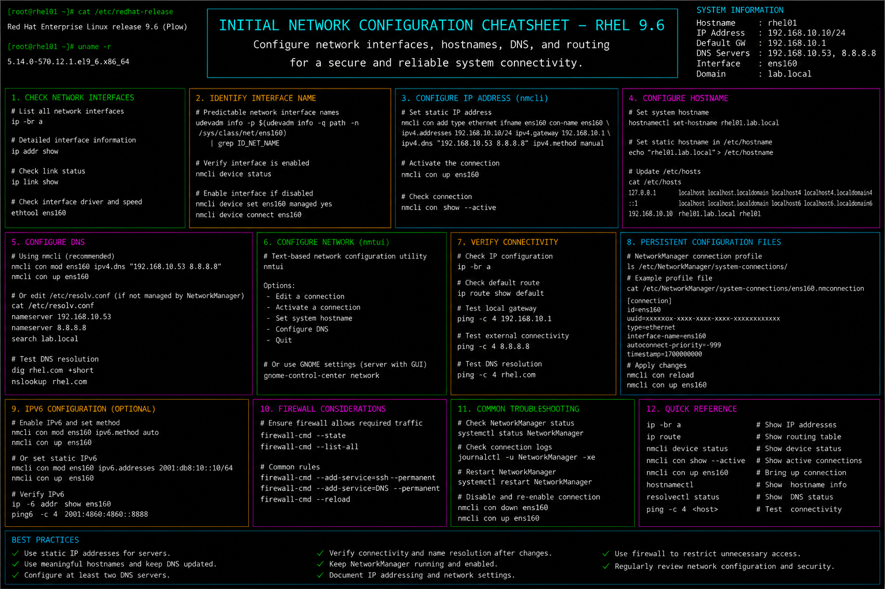

# initial-network-config.md

# Initial Network Configuration Cheat Sheet

## Overview

This document provides a practical enterprise Linux administration cheat sheet for initial network configuration, interface management, hostname configuration, DNS setup, routing validation, and troubleshooting operations on Red Hat Enterprise Linux (RHEL) 9.6 systems.

The commands and workflows included are commonly used during enterprise server deployments, infrastructure provisioning, VM onboarding, connectivity troubleshooting, and operational maintenance activities.

This reference is designed for fast operational lookup during production Linux administration tasks.

---

## Environment Information

| Component | Details |
|---|---|
| Operating System | RHEL 9.6 |
| Hostname | rhel01.lab.local |
| Primary Interface | ens160 |
| Network Manager | NetworkManager |
| DNS Service | systemd-resolved |
| SELinux Mode | Enforcing |
| User Context | root / sudo administrator |
| Lab Platform | VMware Enterprise Lab |

---

## Common Commands

### Display Network Interfaces

```bash
ip addr show
```

### Display Interface Status

```bash
nmcli device status
```

### Configure Static IP Address

```bash
nmcli connection modify ens160 ipv4.addresses 192.168.10.20/24
```

### Configure Default Gateway

```bash
nmcli connection modify ens160 ipv4.gateway 192.168.10.1
```

### Configure DNS Servers

```bash
nmcli connection modify ens160 ipv4.dns "8.8.8.8 1.1.1.1"
```

### Enable Manual IPv4 Configuration

```bash
nmcli connection modify ens160 ipv4.method manual
```

### Restart Network Connection

```bash
nmcli connection down ens160 && nmcli connection up ens160
```

### Display Routing Table

```bash
ip route
```

### Display Hostname Information

```bash
hostnamectl
```

### Set System Hostname

```bash
hostnamectl set-hostname rhel01.lab.local
```

### Test Network Connectivity

```bash
ping -c 4 8.8.8.8
```

### Verify DNS Resolution

```bash
host redhat.com
```

---

## Administrative Examples

### Configure Static Enterprise Network

```bash
nmcli connection modify ens160 \
ipv4.addresses 192.168.10.20/24 \
ipv4.gateway 192.168.10.1 \
ipv4.dns "8.8.8.8 1.1.1.1" \
ipv4.method manual
```

### Apply Network Configuration

```bash
nmcli connection down ens160
nmcli connection up ens160
```

### Configure Hostname

```bash
hostnamectl set-hostname rhel01.lab.local
```

### Verify Active Network Configuration

```bash
ip addr show ens160
```

### Validate Default Gateway

```bash
ip route
```

### Configure Secondary DNS Server

```bash
nmcli connection modify ens160 +ipv4.dns 9.9.9.9
```

### Display Active NetworkManager Connections

```bash
nmcli connection show
```

### Test Internet Connectivity

```bash
ping -c 4 google.com
```

---

## Validation Commands

### Verify Interface IP Address

```bash
ip addr show ens160
```

Example output:

```text
inet 192.168.10.20/24 brd 192.168.10.255 scope global ens160
```

### Validate Routing Table

```bash
ip route
```

### Verify DNS Configuration

```bash
cat /etc/resolv.conf
```

### Validate Hostname Configuration

```bash
hostnamectl
```

### Verify Interface Connectivity

```bash
ping -c 4 192.168.10.1
```

### Validate Internet Connectivity

```bash
ping -c 4 8.8.8.8
```

### Verify DNS Resolution

```bash
host redhat.com
```

### Review NetworkManager Logs

```bash
journalctl -u NetworkManager
```

---

## Troubleshooting Tips

### Interface Not Receiving IP Address

Verify interface state:

```bash
nmcli device status
```

Restart connection:

```bash
nmcli connection up ens160
```

### Network Connectivity Failure

Verify routing table:

```bash
ip route
```

Ping default gateway:

```bash
ping -c 4 192.168.10.1
```

### DNS Resolution Problems

Verify resolver configuration:

```bash
cat /etc/resolv.conf
```

Test DNS queries:

```bash
host redhat.com
```

### Incorrect Hostname Configuration

Review hostname settings:

```bash
hostnamectl
```

Reapply hostname:

```bash
hostnamectl set-hostname rhel01.lab.local
```

### NetworkManager Service Issues

Verify service status:

```bash
systemctl status NetworkManager
```

Restart service:

```bash
systemctl restart NetworkManager
```

### Firewall Blocking Connectivity

Review firewall rules:

```bash
firewall-cmd --list-all
```

---

## Operational Notes

- Configure static IP addresses for enterprise infrastructure servers.
- Validate DNS and routing configuration after deployment.
- Use descriptive hostnames aligned with enterprise naming standards.
- Verify connectivity before joining systems to enterprise services.
- Maintain documented network assignments for operational tracking.
- Review NetworkManager logs during troubleshooting activities.
- Validate firewall and SELinux integration after network changes.

Example operational audit commands:

```bash
nmcli device status
ip route
hostnamectl
```

---

## Screenshot Reference


