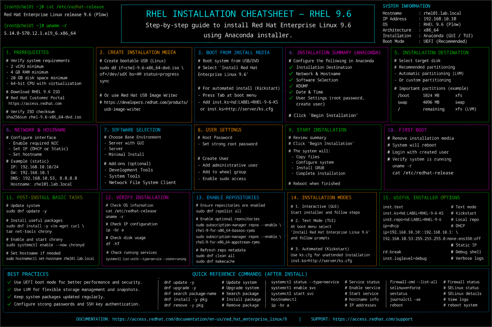

# rhel-installation.md

# RHEL Installation and Deployment Cheat Sheet

## Overview

This document provides a practical enterprise Linux administration cheat sheet for Red Hat Enterprise Linux (RHEL) 9.6 installation, deployment preparation, storage configuration, subscription registration, and initial system setup operations.

The commands and workflows included are commonly used during enterprise server provisioning, virtual machine deployments, infrastructure onboarding, installation validation, and operational readiness activities.

This reference is designed for fast operational lookup during production Linux administration tasks.

---

## Environment Information

| Component | Details |
|---|---|
| Operating System | RHEL 9.6 |
| Installation Method | ISO / PXE |
| Hostname | rhel01.lab.local |
| Boot Mode | UEFI |
| Filesystem Type | XFS |
| SELinux Mode | Enforcing |
| User Context | root / sudo administrator |
| Lab Platform | VMware Enterprise Lab |

---

## Common Commands

### Verify Operating System Release

```bash
cat /etc/redhat-release
```

### Display Kernel Information

```bash
uname -r
```

### Display Hostname Information

```bash
hostnamectl
```

### Verify Disk Layout

```bash
lsblk
```

### Display Mounted Filesystems

```bash
df -Th
```

### Verify Network Connectivity

```bash
ping -c 4 8.8.8.8
```

### Register System with Red Hat Subscription

```bash
subscription-manager register
```

### Attach Subscription Automatically

```bash
subscription-manager attach --auto
```

### Enable RHEL Repositories

```bash
subscription-manager repos --enable=rhel-9-for-x86_64-baseos-rpms
```

### Update Installed Packages

```bash
dnf update -y
```

### Verify SELinux Status

```bash
sestatus
```

### Display Active Services

```bash
systemctl --type=service --state=running
```

---

## Administrative Examples

### Validate Enterprise Installation

```bash
cat /etc/redhat-release
uname -r
hostnamectl
```

### Configure Hostname

```bash
hostnamectl set-hostname rhel01.lab.local
```

### Register System to Red Hat Subscription

```bash
subscription-manager register
subscription-manager attach --auto
```

### Enable Required Enterprise Repositories

```bash
subscription-manager repos \
--enable=rhel-9-for-x86_64-baseos-rpms \
--enable=rhel-9-for-x86_64-appstream-rpms
```

### Apply Initial System Updates

```bash
dnf update -y
```

### Verify Filesystem and Storage Layout

```bash
lsblk
df -Th
```

### Configure Time Synchronization

```bash
systemctl enable --now chronyd
```

### Verify Network Connectivity

```bash
ping -c 4 google.com
```

---

## Validation Commands

### Verify Installed RHEL Version

```bash
cat /etc/redhat-release
```

Example output:

```text
Red Hat Enterprise Linux release 9.6 (Plow)
```

### Validate Kernel Version

```bash
uname -r
```

### Verify Hostname Configuration

```bash
hostnamectl
```

### Validate Filesystem Mounts

```bash
df -Th
```

### Verify Active Repositories

```bash
dnf repolist
```

### Validate Subscription Status

```bash
subscription-manager status
```

### Verify SELinux Enforcement

```bash
getenforce
```

### Review Boot Logs

```bash
journalctl -b
```

---

## Troubleshooting Tips

### Subscription Registration Failure

Verify network connectivity:

```bash
ping -c 4 cdn.redhat.com
```

Review subscription status:

```bash
subscription-manager status
```

### Package Repository Access Problems

Verify enabled repositories:

```bash
dnf repolist
```

Clean metadata cache:

```bash
dnf clean all
```

### Missing Network Connectivity

Verify interface configuration:

```bash
ip addr
```

Review routing:

```bash
ip route
```

### Filesystem Mount Issues

Verify mounted filesystems:

```bash
mount
```

Review fstab configuration:

```bash
cat /etc/fstab
```

### SELinux Access Problems

Review SELinux status:

```bash
sestatus
```

Review AVC denials:

```bash
ausearch -m avc -ts recent
```

### System Boot Problems

Review boot logs:

```bash
journalctl -b
```

---

## Operational Notes

- Validate installation settings before onboarding systems into enterprise environments.
- Register systems with Red Hat subscriptions immediately after deployment.
- Apply system updates before production use.
- Verify SELinux, firewall, and networking configurations after installation.
- Maintain consistent hostname and repository configuration standards.
- Review storage layouts and filesystem configurations during provisioning.
- Document deployed infrastructure for operational tracking and compliance.

Example operational audit commands:

```bash
subscription-manager status
dnf repolist
hostnamectl
```

---

## Screenshot Reference


