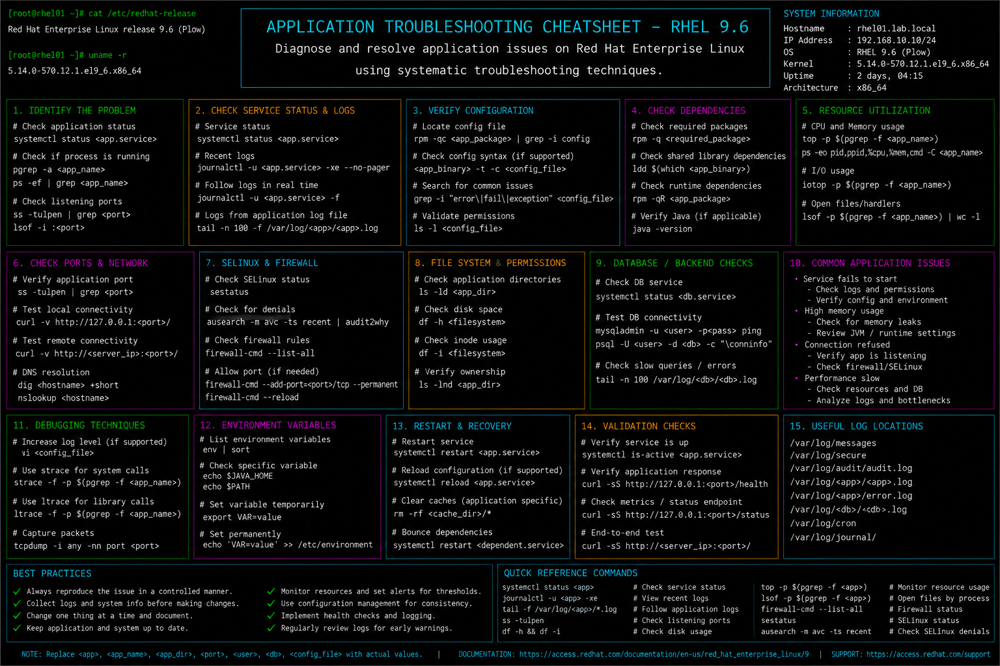

# application-troubleshooting.md

# Application Troubleshooting Cheat Sheet

## Overview

This document provides a practical enterprise Linux administration cheat sheet for application troubleshooting, service diagnostics, dependency validation, log investigation, process analysis, and operational recovery on Red Hat Enterprise Linux (RHEL) 9.6 systems.

The commands and workflows included are commonly used during enterprise incident response, production outage investigations, service restoration, infrastructure troubleshooting, and application performance analysis activities.

This reference is designed for fast operational lookup during production Linux administration tasks.

---

## Environment Information

| Component | Details |
|---|---|
| Operating System | RHEL 9.6 |
| Hostname | rhel01.lab.local |
| Init System | systemd |
| Logging Service | rsyslog / journald |
| SELinux Mode | Enforcing |
| Monitoring Utilities | procps-ng / sysstat |
| User Context | root / sudo administrator |
| Lab Platform | VMware Enterprise Lab |

---

## Common Commands

### Verify Service Status

```bash
systemctl status httpd
```

### Restart Application Service

```bash
systemctl restart httpd
```

### Review Service Logs

```bash
journalctl -u httpd
```

### Display Running Processes

```bash
ps aux
```

### Monitor Processes in Real Time

```bash
top
```

### Verify Listening Ports

```bash
ss -tulpn
```

### Review Recent System Errors

```bash
journalctl -p err -b
```

### Verify File Permissions

```bash
ls -l /var/www/html
```

### Review SELinux Denials

```bash
ausearch -m avc -ts recent
```

### Monitor Resource Usage

```bash
vmstat 2
```

### Check Application Binary Dependencies

```bash
ldd /usr/sbin/httpd
```

### Review Open Files

```bash
lsof -p <PID>
```

---

## Administrative Examples

### Investigate Failed Application Startup

```bash
systemctl status httpd
journalctl -u httpd
```

### Verify Service Port Availability

```bash
ss -tulpn | grep 80
```

### Restart Application After Configuration Changes

```bash
systemctl restart httpd
```

### Review Real-Time Application Logs

```bash
tail -f /var/log/httpd/error_log
```

### Analyze High CPU Usage Process

```bash
top
ps aux --sort=-%cpu | head
```

### Review Application Memory Usage

```bash
ps aux --sort=-%mem | head
```

### Verify SELinux Contexts for Web Files

```bash
ls -Z /var/www/html
```

### Validate Shared Library Dependencies

```bash
ldd /usr/sbin/httpd
```

---

## Validation Commands

### Verify Service Active State

```bash
systemctl is-active httpd
```

Example output:

```text
active
```

### Validate Listening Network Ports

```bash
ss -tulpn
```

### Verify Application Logs

```bash
journalctl -u httpd
```

### Validate Process Resource Usage

```bash
top
```

### Verify Disk Space Availability

```bash
df -h
```

### Validate File Permissions

```bash
ls -l /var/www/html
```

### Verify SELinux Status

```bash
sestatus
```

### Review Kernel Error Messages

```bash
dmesg | tail
```

---

## Troubleshooting Tips

### Service Fails to Start

Review service status:

```bash
systemctl status httpd
```

Review logs:

```bash
journalctl -xe
```

### Application Port Already in Use

Verify listening ports:

```bash
ss -tulpn
```

Identify process using port:

```bash
lsof -i :80
```

### High CPU Utilization

Monitor active processes:

```bash
top
```

Review CPU-intensive processes:

```bash
ps aux --sort=-%cpu | head
```

### Memory Exhaustion

Review memory utilization:

```bash
free -h
```

Check OOM activity:

```bash
dmesg | grep -i oom
```

### SELinux Blocking Application Access

Review AVC denials:

```bash
ausearch -m avc -ts recent
```

Restore contexts:

```bash
restorecon -Rv /var/www/html
```

### Missing Library Dependencies

Validate binary dependencies:

```bash
ldd /usr/sbin/httpd
```

Install missing package:

```bash
dnf provides */libexample.so
```

---

## Operational Notes

- Review logs before restarting production services.
- Validate application dependencies after updates and deployments.
- Monitor resource utilization during troubleshooting activities.
- Use SELinux audit logs during access-related investigations.
- Validate firewall and network connectivity during service outages.
- Document recurring incidents for operational analysis.
- Maintain baseline performance metrics for enterprise applications.

Example operational audit commands:

```bash
systemctl status httpd
journalctl -p err -b
ss -tulpn
```

---

## Screenshot Reference


