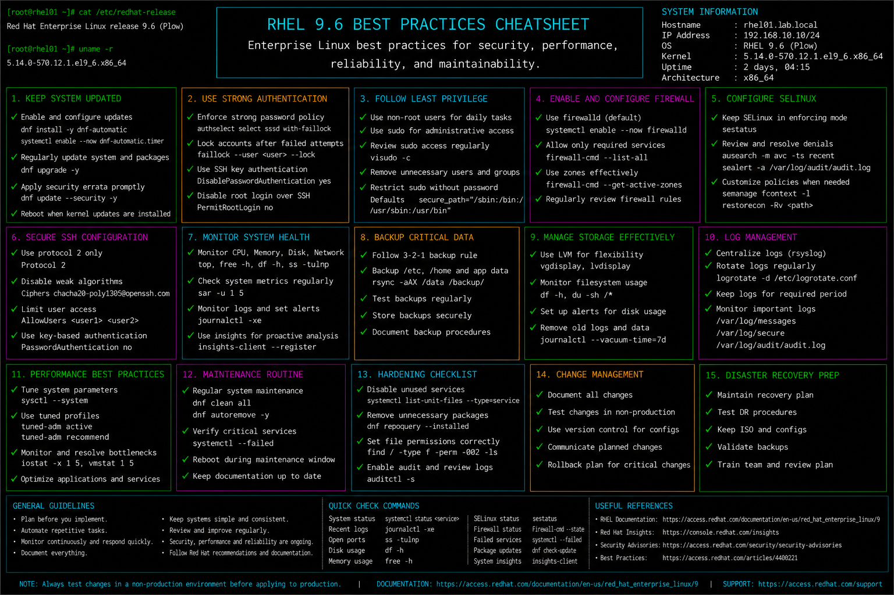

# best-practices.md

# Enterprise Linux Administration Best Practices Cheat Sheet

## Overview

This document provides a practical enterprise Linux administration cheat sheet for operational best practices, security standards, maintenance procedures, monitoring strategies, backup validation, and infrastructure management on Red Hat Enterprise Linux (RHEL) 9.6 systems.

The commands and workflows included are commonly used during enterprise operations, production maintenance, compliance preparation, infrastructure hardening, troubleshooting activities, and long-term platform management.

This reference is designed for fast operational lookup during production Linux administration tasks.

---

## Environment Information

| Component | Details |
|---|---|
| Operating System | RHEL 9.6 |
| Hostname | rhel01.lab.local |
| Security Framework | SELinux + firewalld |
| Logging Platform | rsyslog / journald |
| Monitoring Utilities | sysstat / procps-ng |
| Backup Strategy | Snapshot + Offsite Backup |
| User Context | root / sudo administrator |
| Lab Platform | VMware Enterprise Lab |

---

## Common Commands

### Verify System Health

```bash
uptime
```

### Display Failed Services

```bash
systemctl --failed
```

### Review System Logs

```bash
journalctl -p err -b
```

### Verify Disk Utilization

```bash
df -h
```

### Monitor Memory Usage

```bash
free -h
```

### Review Active Network Ports

```bash
ss -tulpn
```

### Verify SELinux Status

```bash
sestatus
```

### Display Firewall Rules

```bash
firewall-cmd --list-all
```

### Review Installed Updates

```bash
dnf check-update
```

### Verify Time Synchronization

```bash
timedatectl
```

### Review Authentication Logs

```bash
journalctl -u sshd
```

### Validate Backup Mounts

```bash
mount | grep backup
```

---

## Administrative Examples

### Apply System Updates

```bash
dnf update -y
```

### Validate System Before Maintenance

```bash
systemctl --failed
journalctl -p err -b
```

### Review Resource Utilization

```bash
top
vmstat 2
```

### Verify Security Baseline

```bash
sestatus
firewall-cmd --list-all
```

### Validate Running Services

```bash
systemctl list-units --type=service --state=running
```

### Review Open Network Ports

```bash
ss -tulpn
```

### Verify Backup Accessibility

```bash
mount | grep backup
ls -lh /backup
```

### Review Recent Login Activity

```bash
last
```

---

## Validation Commands

### Verify System Uptime

```bash
uptime
```

Example output:

```text
10:35:12 up 15 days, 4:22, 2 users, load average: 0.10, 0.08, 0.05
```

### Validate Filesystem Usage

```bash
df -Th
```

### Verify Memory Availability

```bash
free -h
```

### Validate SELinux Enforcement

```bash
getenforce
```

### Verify Firewall State

```bash
systemctl status firewalld
```

### Validate Active Services

```bash
systemctl --failed
```

### Review System Errors

```bash
journalctl -p err -b
```

### Verify Network Connectivity

```bash
ping -c 4 8.8.8.8
```

---

## Troubleshooting Tips

### High System Load

Review CPU usage:

```bash
top
```

Review running processes:

```bash
ps aux --sort=-%cpu | head
```

### Disk Space Exhaustion

Review filesystem usage:

```bash
df -h
```

Identify large directories:

```bash
du -sh /*
```

### Memory Pressure

Verify memory utilization:

```bash
free -h
```

Check OOM activity:

```bash
dmesg | grep -i oom
```

### Network Connectivity Problems

Review interfaces:

```bash
ip addr
```

Review routing:

```bash
ip route
```

### SELinux Access Denials

Review AVC logs:

```bash
ausearch -m avc -ts recent
```

### Failed Services After Updates

Review failed services:

```bash
systemctl --failed
```

Review detailed logs:

```bash
journalctl -xe
```

---

## Operational Notes

- Apply updates regularly during approved maintenance windows.
- Keep SELinux enabled and firewalld properly configured.
- Monitor logs and failed services proactively.
- Maintain tested backup and recovery procedures.
- Document infrastructure changes and operational incidents.
- Validate monitoring and alerting after deployments.
- Review authentication logs and open ports during security audits.
- Maintain baseline performance and capacity metrics.

Example operational audit commands:

```bash
systemctl --failed
sestatus
journalctl -p err -b
```

---

## Screenshot Reference


