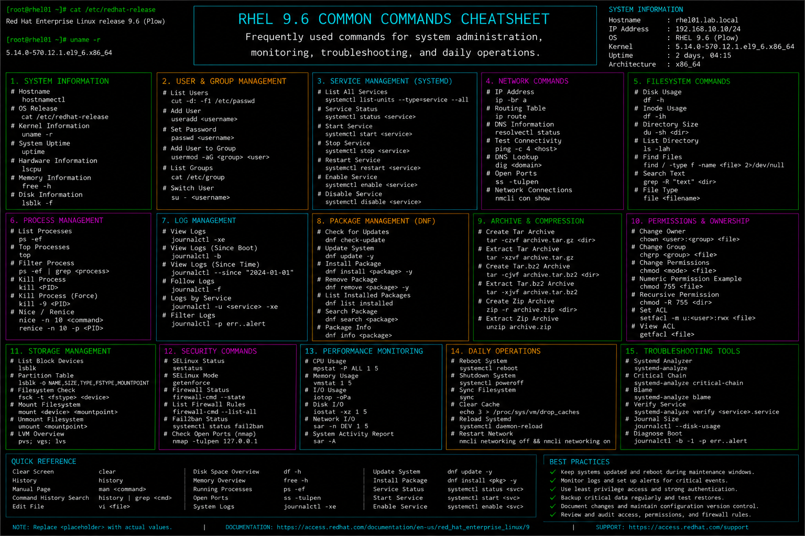

# common-commands.md

# Common Linux Administration Commands Cheat Sheet

## Overview

This document provides a practical enterprise Linux administration cheat sheet for commonly used operational commands, system inspection utilities, troubleshooting workflows, monitoring tasks, and administrative activities on Red Hat Enterprise Linux (RHEL) 9.6 systems.

The commands and workflows included are commonly used during enterprise operations, production support, infrastructure troubleshooting, performance investigations, and routine system administration activities.

This reference is designed for fast operational lookup during production Linux administration tasks.

---

## Environment Information

| Component | Details |
|---|---|
| Operating System | RHEL 9.6 |
| Hostname | rhel01.lab.local |
| Shell Environment | bash |
| Init System | systemd |
| Logging Platform | journald / rsyslog |
| SELinux Mode | Enforcing |
| User Context | root / sudo administrator |
| Lab Platform | VMware Enterprise Lab |

---

## Common Commands

### Display System Information

```bash
hostnamectl
```

### Display Kernel Version

```bash
uname -r
```

### Display Uptime Information

```bash
uptime
```

### Display Running Processes

```bash
ps aux
```

### Real-Time Process Monitoring

```bash
top
```

### Display Filesystem Usage

```bash
df -h
```

### Display Disk Layout

```bash
lsblk
```

### Display Memory Usage

```bash
free -h
```

### Display Active Network Connections

```bash
ss -tulpn
```

### Display IP Address Information

```bash
ip addr show
```

### Display Routing Table

```bash
ip route
```

### Review System Logs

```bash
journalctl -xe
```

---

## Administrative Examples

### Review Failed Services

```bash
systemctl --failed
```

### Restart a Service

```bash
systemctl restart httpd
```

### Verify Service Status

```bash
systemctl status sshd
```

### Search for Large Files

```bash
find / -type f -size +1G
```

### Monitor Network Connectivity

```bash
ping -c 4 8.8.8.8
```

### Review Recent Login Activity

```bash
last
```

### Search System Logs for Errors

```bash
journalctl -p err -b
```

### Display Open Files for Process

```bash
lsof -p <PID>
```

### Monitor CPU and Memory Usage

```bash
vmstat 2
```

### Verify SELinux Status

```bash
sestatus
```

---

## Validation Commands

### Verify System Uptime

```bash
uptime
```

Example output:

```text
10:20:11 up 12 days, 3:15, 2 users, load average: 0.08, 0.05, 0.02
```

### Validate Mounted Filesystems

```bash
df -Th
```

### Verify Active Processes

```bash
ps aux | head
```

### Validate Active Listening Ports

```bash
ss -tulpn
```

### Verify Network Configuration

```bash
ip addr
```

### Validate Memory Utilization

```bash
free -h
```

### Verify SELinux Enforcement

```bash
getenforce
```

### Review System Error Logs

```bash
journalctl -p err -b
```

---

## Troubleshooting Tips

### High CPU Usage

Review running processes:

```bash
top
```

Identify CPU-intensive tasks:

```bash
ps aux --sort=-%cpu | head
```

### Disk Space Problems

Review filesystem usage:

```bash
df -h
```

Identify large directories:

```bash
du -sh /*
```

### Memory Pressure

Review memory usage:

```bash
free -h
```

Check swap activity:

```bash
vmstat 2
```

### Service Startup Failures

Review service status:

```bash
systemctl status httpd
```

Review logs:

```bash
journalctl -xe
```

### Network Connectivity Problems

Verify interfaces:

```bash
ip addr
```

Verify routing:

```bash
ip route
```

### SELinux Access Denials

Review AVC logs:

```bash
ausearch -m avc -ts recent
```

---

## Operational Notes

- Use system monitoring commands regularly during enterprise maintenance.
- Review logs before restarting production services.
- Validate storage and memory usage proactively.
- Monitor failed services and kernel logs during incidents.
- Maintain operational baselines for performance analysis.
- Verify firewall, SELinux, and network settings after configuration changes.
- Document recurring troubleshooting procedures for operational consistency.

Example operational audit commands:

```bash
uptime
df -h
systemctl --failed
```

---

## Screenshot Reference



