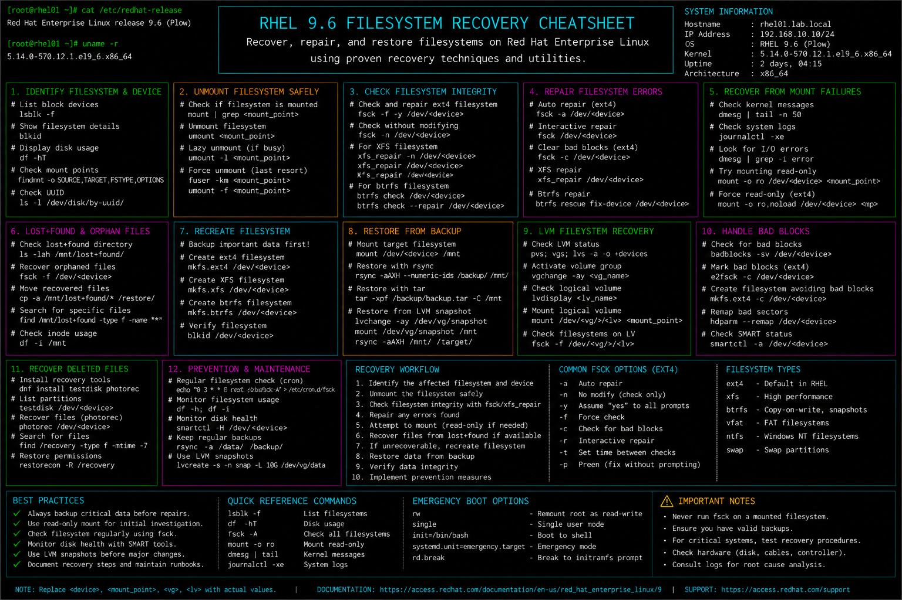

# filesystem-recovery.md

# Filesystem Recovery and Repair Cheat Sheet

## Overview

This document provides a practical enterprise Linux administration cheat sheet for filesystem recovery, disk repair, boot recovery, corruption analysis, mount troubleshooting, and operational restoration procedures on Red Hat Enterprise Linux (RHEL) 9.6 systems.

The commands and workflows included are commonly used during enterprise outage recovery, storage corruption incidents, emergency maintenance, filesystem validation, and infrastructure troubleshooting activities.

This reference is designed for fast operational lookup during production Linux administration tasks.

---

## Environment Information

| Component | Details |
|---|---|
| Operating System | RHEL 9.6 |
| Hostname | rhel01.lab.local |
| Filesystem Type | XFS / ext4 |
| Boot Mode | UEFI |
| Storage Management | LVM |
| SELinux Mode | Enforcing |
| User Context | root / rescue administrator |
| Lab Platform | VMware Enterprise Lab |

---

## Common Commands

### Display Block Devices

```bash
lsblk
```

### Display Filesystem Usage

```bash
df -Th
```

### Display UUID Information

```bash
blkid
```

### Verify Mounted Filesystems

```bash
mount
```

### Check XFS Filesystem Metadata

```bash
xfs_repair -n /dev/mapper/rhel-root
```

### Repair XFS Filesystem

```bash
xfs_repair /dev/mapper/rhel-root
```

### Check ext4 Filesystem

```bash
fsck.ext4 /dev/sdb1
```

### Mount Filesystem Manually

```bash
mount /dev/sdb1 /mnt
```

### Review Boot Logs

```bash
journalctl -b
```

### Review Kernel Disk Errors

```bash
dmesg | grep -i error
```

### Display LVM Volumes

```bash
lvs
```

### Verify fstab Configuration

```bash
cat /etc/fstab
```

---

## Administrative Examples

### Identify Failed Filesystem

```bash
lsblk
blkid
```

### Run Read-Only XFS Validation

```bash
xfs_repair -n /dev/mapper/rhel-root
```

### Repair Corrupted ext4 Filesystem

Unmount filesystem first:

```bash
umount /dev/sdb1
fsck.ext4 -y /dev/sdb1
```

### Repair XFS Filesystem from Rescue Mode

```bash
xfs_repair /dev/mapper/rhel-root
```

### Mount Recovered Filesystem

```bash
mount /dev/sdb1 /mnt
```

### Verify LVM Storage State

```bash
pvs
vgs
lvs
```

### Restore Missing Mount Entry

Edit filesystem table:

```bash
vim /etc/fstab
```

### Validate Boot Recovery Logs

```bash
journalctl -xb
```

---

## Validation Commands

### Verify Filesystem Mount State

```bash
mount
```

Example output:

```text
/dev/mapper/rhel-root on / type xfs (rw,relatime)
```

### Validate Filesystem Health

```bash
xfs_repair -n /dev/mapper/rhel-root
```

### Verify Disk Layout

```bash
lsblk
```

### Validate UUID Configuration

```bash
blkid
```

### Verify fstab Entries

```bash
cat /etc/fstab
```

### Validate LVM Volumes

```bash
lvs
```

### Verify Mounted Filesystems

```bash
df -Th
```

### Review Disk Error Logs

```bash
dmesg | grep -i error
```

---

## Troubleshooting Tips

### Filesystem Fails to Mount

Verify UUID mappings:

```bash
blkid
```

Review fstab configuration:

```bash
cat /etc/fstab
```

### XFS Corruption Detected

Run validation check:

```bash
xfs_repair -n /dev/mapper/rhel-root
```

Run repair from rescue mode:

```bash
xfs_repair /dev/mapper/rhel-root
```

### ext4 Journal Recovery Problems

Run forced filesystem check:

```bash
fsck.ext4 -fy /dev/sdb1
```

### Boot Failure Due to Invalid Mount

Boot into rescue mode.

Comment invalid entry:

```bash
vim /etc/fstab
```

### Missing LVM Volumes

Scan and activate volume groups:

```bash
vgscan
vgchange -ay
```

### Disk Hardware Errors

Review kernel logs:

```bash
dmesg | grep -i error
```

Review SMART health:

```bash
smartctl -a /dev/sda
```

---

## Operational Notes

- Always validate filesystem health before performing repairs.
- Use rescue mode for root filesystem recovery operations.
- Maintain tested backup and snapshot strategies before recovery tasks.
- Review fstab changes carefully to prevent boot failures.
- Monitor storage and SMART health proactively.
- Validate LVM activation after storage recovery procedures.
- Document recovery activities for enterprise incident tracking.

Example operational audit commands:

```bash
lsblk
xfs_repair -n /dev/mapper/rhel-root
journalctl -xb
```

---

## Screenshot Reference


