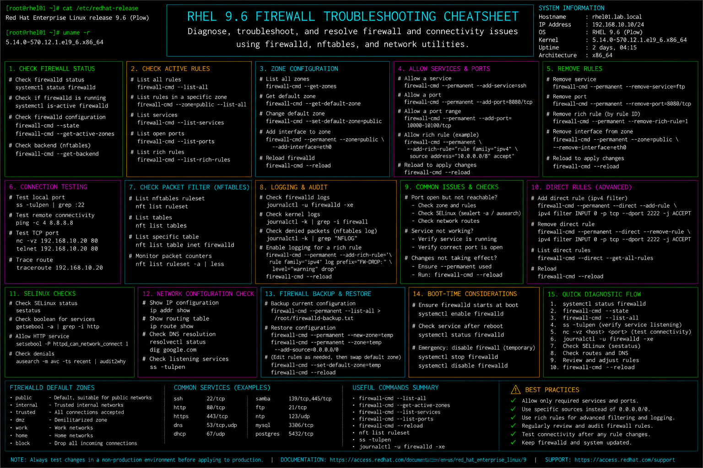

# firewall-troubleshooting.md

# Firewall Troubleshooting Cheat Sheet

## Overview

This document provides a practical enterprise Linux administration cheat sheet for firewall troubleshooting, firewalld diagnostics, network filtering validation, service accessibility testing, and operational recovery on Red Hat Enterprise Linux (RHEL) 9.6 systems.

The commands and workflows included are commonly used during enterprise connectivity incidents, service outage investigations, security validation, firewall auditing, and infrastructure troubleshooting activities.

This reference is designed for fast operational lookup during production Linux administration tasks.

---

## Environment Information

| Component | Details |
|---|---|
| Operating System | RHEL 9.6 |
| Hostname | rhel01.lab.local |
| Firewall Platform | firewalld |
| Firewall Backend | nftables |
| SELinux Mode | Enforcing |
| Network Manager | NetworkManager |
| User Context | root / sudo administrator |
| Lab Platform | VMware Enterprise Lab |

---

## Common Commands

### Verify Firewall Service Status

```bash
systemctl status firewalld
```

### Display Active Firewall Zones

```bash
firewall-cmd --get-active-zones
```

### Display Current Firewall Rules

```bash
firewall-cmd --list-all
```

### Display Allowed Services

```bash
firewall-cmd --list-services
```

### Display Allowed Ports

```bash
firewall-cmd --list-ports
```

### Open HTTP Service Permanently

```bash
firewall-cmd --permanent --add-service=http
```

### Open Custom Port

```bash
firewall-cmd --permanent --add-port=8080/tcp
```

### Reload Firewall Rules

```bash
firewall-cmd --reload
```

### Verify Listening Network Ports

```bash
ss -tulpn
```

### Test Port Connectivity

```bash
nc -vz 192.168.10.20 80
```

### Review Firewall Logs

```bash
journalctl -u firewalld
```

### Verify SELinux Port Contexts

```bash
semanage port -l
```

---

## Administrative Examples

### Verify Firewall Status and Zones

```bash
systemctl status firewalld
firewall-cmd --get-active-zones
```

### Allow HTTP and HTTPS Services

```bash
firewall-cmd --permanent --add-service=http
firewall-cmd --permanent --add-service=https
firewall-cmd --reload
```

### Open Custom Application Port

```bash
firewall-cmd --permanent --add-port=8080/tcp
firewall-cmd --reload
```

### Remove Unused Port Rule

```bash
firewall-cmd --permanent --remove-port=8080/tcp
firewall-cmd --reload
```

### Verify Active Listening Services

```bash
ss -tulpn
```

### Test Remote Connectivity

```bash
nc -vz 192.168.10.20 22
```

### Review Firewall Runtime Configuration

```bash
firewall-cmd --runtime-to-permanent
```

### Verify SELinux Port Labeling

```bash
semanage port -l | grep http
```

---

## Validation Commands

### Verify Firewall Service State

```bash
systemctl is-active firewalld
```

Example output:

```text
active
```

### Validate Active Firewall Rules

```bash
firewall-cmd --list-all
```

### Verify Allowed Services

```bash
firewall-cmd --list-services
```

### Validate Open Ports

```bash
firewall-cmd --list-ports
```

### Verify Listening Ports

```bash
ss -tulpn
```

### Validate SELinux Port Assignments

```bash
semanage port -l
```

### Review Firewall Logs

```bash
journalctl -u firewalld
```

### Test Connectivity to Service Port

```bash
nc -vz 192.168.10.20 443
```

---

## Troubleshooting Tips

### Service Not Reachable

Verify listening ports:

```bash
ss -tulpn
```

Verify firewall rules:

```bash
firewall-cmd --list-all
```

### Firewall Service Fails to Start

Review service status:

```bash
systemctl status firewalld
```

Review logs:

```bash
journalctl -xe
```

### Port Open but Traffic Blocked

Verify SELinux context:

```bash
semanage port -l
```

Review AVC denials:

```bash
ausearch -m avc -ts recent
```

### Incorrect Zone Assignment

Display active zones:

```bash
firewall-cmd --get-active-zones
```

Assign interface to correct zone:

```bash
firewall-cmd --zone=public --change-interface=ens160
```

### Runtime Rules Lost After Reboot

Save runtime configuration:

```bash
firewall-cmd --runtime-to-permanent
```

### Connectivity Testing Failure

Verify network connectivity:

```bash
ping -c 4 192.168.10.1
```

Test application port:

```bash
nc -vz 192.168.10.20 8080
```

---

## Operational Notes

- Validate firewall rules after application deployments.
- Keep only required ports and services exposed.
- Review firewall and SELinux integration during troubleshooting.
- Use permanent rules for production configurations.
- Monitor firewall logs during connectivity investigations.
- Validate zone assignments after network changes.
- Document firewall changes during maintenance activities.

Example operational audit commands:

```bash
firewall-cmd --list-all
ss -tulpn
journalctl -u firewalld
```

---

## Screenshot Reference


