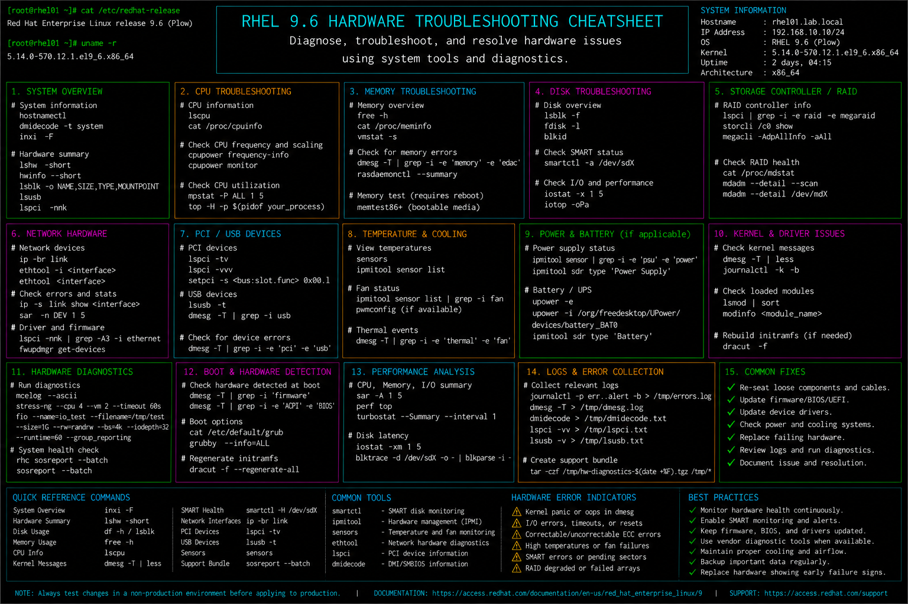

# hardware-troubleshooting.md

# Hardware Troubleshooting Cheat Sheet

## Overview

This document provides a practical enterprise Linux administration cheat sheet for hardware troubleshooting, system diagnostics, storage validation, CPU and memory analysis, device inspection, and operational recovery procedures on Red Hat Enterprise Linux (RHEL) 9.6 systems.

The commands and workflows included are commonly used during enterprise infrastructure incidents, hardware failure investigations, performance troubleshooting, server maintenance, and operational diagnostics activities.

This reference is designed for fast operational lookup during production Linux administration tasks.

---

## Environment Information

| Component | Details |
|---|---|
| Operating System | RHEL 9.6 |
| Hostname | rhel01.lab.local |
| Hardware Platform | VMware / Physical Server |
| Filesystem Type | XFS |
| Storage Management | LVM |
| SELinux Mode | Enforcing |
| Monitoring Utilities | lm_sensors / smartmontools |
| User Context | root / sudo administrator |

---

## Common Commands

### Display CPU Information

```bash
lscpu
```

### Display Memory Information

```bash
free -h
```

### Display PCI Devices

```bash
lspci
```

### Display USB Devices

```bash
lsusb
```

### Display Block Devices

```bash
lsblk
```

### Review Kernel Hardware Messages

```bash
dmesg | less
```

### Review Hardware Errors

```bash
journalctl -k -p err
```

### Verify SMART Disk Health

```bash
smartctl -a /dev/sda
```

### Display Temperature Sensors

```bash
sensors
```

### Review Memory Usage Statistics

```bash
vmstat 2
```

### Verify Loaded Kernel Modules

```bash
lsmod
```

### Review Disk I/O Statistics

```bash
iostat -xz 1 5
```

---

## Administrative Examples

### Review CPU and Hardware Information

```bash
lscpu
lspci
```

### Analyze Memory Utilization

```bash
free -h
vmstat 2
```

### Review Disk and Storage Health

```bash
lsblk
smartctl -a /dev/sda
```

### Monitor Real-Time Disk Activity

```bash
iostat -xz 1 5
```

### Inspect Hardware Detection Logs

```bash
dmesg | grep -i error
```

### Review Thermal Sensor Information

```bash
sensors
```

### Validate USB and Peripheral Devices

```bash
lsusb
```

### Review Kernel Module State

```bash
lsmod
```

---

## Validation Commands

### Verify CPU Architecture

```bash
lscpu
```

Example output:

```text
Architecture: x86_64
CPU(s): 4
```

### Validate Memory Availability

```bash
free -h
```

### Verify Storage Devices

```bash
lsblk
```

### Validate SMART Disk Status

```bash
smartctl -H /dev/sda
```

### Verify Hardware Error Logs

```bash
journalctl -k -p err
```

### Validate Temperature Readings

```bash
sensors
```

### Verify Loaded Device Drivers

```bash
lsmod
```

### Review I/O Performance Statistics

```bash
iostat -xz 1 5
```

---

## Troubleshooting Tips

### High CPU Utilization

Review active processes:

```bash
top
```

Review CPU statistics:

```bash
mpstat -P ALL 1 5
```

### Memory Pressure or Swapping

Review memory usage:

```bash
free -h
```

Check swap activity:

```bash
vmstat 2
```

### Disk I/O Bottlenecks

Review disk performance:

```bash
iostat -xz 1 5
```

Review kernel storage errors:

```bash
dmesg | grep -i error
```

### SMART Disk Failures

Review SMART health:

```bash
smartctl -a /dev/sda
```

Run SMART self-test:

```bash
smartctl -t short /dev/sda
```

### Hardware Not Detected

Review PCI devices:

```bash
lspci
```

Review kernel logs:

```bash
dmesg | less
```

### Thermal or Fan Issues

Review sensor output:

```bash
sensors
```

Monitor temperatures during load:

```bash
watch sensors
```

---

## Operational Notes

- Monitor SMART and hardware health proactively.
- Review kernel logs during hardware-related incidents.
- Validate storage performance during enterprise maintenance windows.
- Monitor CPU temperature and memory pressure under production workloads.
- Maintain updated firmware and virtualization integration tools.
- Document recurring hardware failures and replacement history.
- Validate hardware state after infrastructure upgrades and migrations.

Example operational audit commands:

```bash
lscpu
smartctl -a /dev/sda
journalctl -k -p err
```

---

## Screenshot Reference


