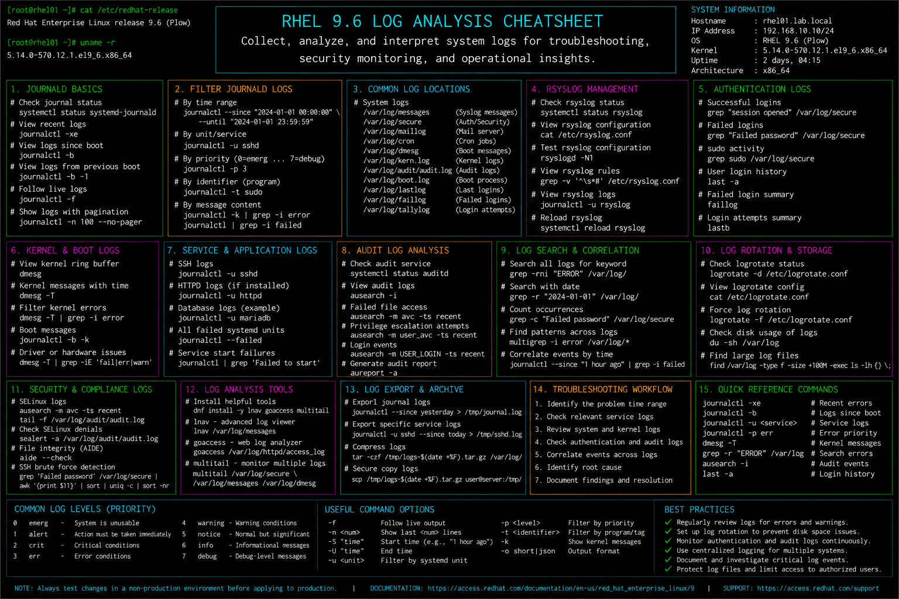

# log-analysis.md

# Log Analysis and Troubleshooting Cheat Sheet

## Overview

This document provides a practical enterprise Linux administration cheat sheet for log analysis, journal inspection, security event investigation, service diagnostics, and troubleshooting workflows on Red Hat Enterprise Linux (RHEL) 9.6 systems.

The commands and workflows included are commonly used during enterprise incident response, outage investigations, audit reviews, operational monitoring, and infrastructure troubleshooting activities.

This reference is designed for fast operational lookup during production Linux administration tasks.

---

## Environment Information

| Component | Details |
|---|---|
| Operating System | RHEL 9.6 |
| Hostname | rhel01.lab.local |
| Logging Framework | journald / rsyslog |
| Log Directory | /var/log |
| Security Framework | SELinux |
| Audit Platform | auditd |
| User Context | root / sudo administrator |
| Lab Platform | VMware Enterprise Lab |

---

## Common Commands

### Review System Journal Logs

```bash
journalctl
```

### Display Boot Logs

```bash
journalctl -b
```

### Review Error-Level Messages

```bash
journalctl -p err
```

### Follow Logs in Real Time

```bash
journalctl -f
```

### Review Service-Specific Logs

```bash
journalctl -u sshd
```

### Display Authentication Logs

```bash
cat /var/log/secure
```

### Display Kernel Messages

```bash
dmesg
```

### Search Logs for Keywords

```bash
grep -i error /var/log/messages
```

### Review Audit Logs

```bash
ausearch -m avc
```

### Display Failed Login Attempts

```bash
lastb
```

### Monitor Active Log File

```bash
tail -f /var/log/messages
```

### Display Log File Disk Usage

```bash
du -sh /var/log
```

---

## Administrative Examples

### Investigate Failed Service Startup

```bash
systemctl status httpd
journalctl -u httpd
```

### Review Recent System Errors

```bash
journalctl -p err -b
```

### Analyze Authentication Failures

```bash
cat /var/log/secure | grep Failed
```

### Monitor Logs During Live Troubleshooting

```bash
journalctl -f
```

### Investigate SELinux Denials

```bash
ausearch -m avc -ts recent
```

### Review Kernel Panic or Hardware Errors

```bash
dmesg | grep -i error
```

### Analyze Auditd Events

```bash
ausearch -m USER_LOGIN
```

### Search for Critical Warnings

```bash
grep -Ei "error|warning|critical" /var/log/messages
```

---

## Validation Commands

### Verify Journal Service State

```bash
systemctl status systemd-journald
```

Example output:

```text
active (running)
```

### Validate Recent Boot Logs

```bash
journalctl -b
```

### Verify Authentication Log Entries

```bash
cat /var/log/secure
```

### Validate Kernel Error Messages

```bash
dmesg
```

### Verify Audit Log Availability

```bash
ls -lh /var/log/audit
```

### Validate SELinux Audit Events

```bash
ausearch -m avc
```

### Verify Log Rotation Status

```bash
logrotate -d /etc/logrotate.conf
```

### Review Log Disk Utilization

```bash
du -sh /var/log
```

---

## Troubleshooting Tips

### Missing Service Logs

Verify journald status:

```bash
systemctl status systemd-journald
```

Review service logs:

```bash
journalctl -u httpd
```

### Excessive Log Growth

Review log usage:

```bash
du -sh /var/log
```

Validate logrotate configuration:

```bash
logrotate -d /etc/logrotate.conf
```

### Authentication Failures

Review SSH authentication logs:

```bash
cat /var/log/secure | grep Failed
```

Review failed login history:

```bash
lastb
```

### SELinux Blocking Services

Review AVC denials:

```bash
ausearch -m avc -ts recent
```

Generate SELinux report:

```bash
sealert -a /var/log/audit/audit.log
```

### Kernel or Hardware Errors

Review kernel logs:

```bash
dmesg | grep -i error
```

Review boot errors:

```bash
journalctl -p err -b
```

### Logs Missing After Reboot

Verify persistent journaling:

```bash
ls /var/log/journal
```

---

## Operational Notes

- Review logs before restarting production services.
- Monitor authentication and SELinux audit events regularly.
- Use centralized logging for enterprise visibility and compliance.
- Validate log rotation policies during maintenance operations.
- Monitor disk utilization caused by excessive logging.
- Archive audit logs for compliance and incident investigations.
- Maintain baseline operational logs for troubleshooting comparisons.

Example operational audit commands:

```bash
journalctl -p err -b
ausearch -m avc
tail -f /var/log/messages
```

---

## Screenshot Reference


