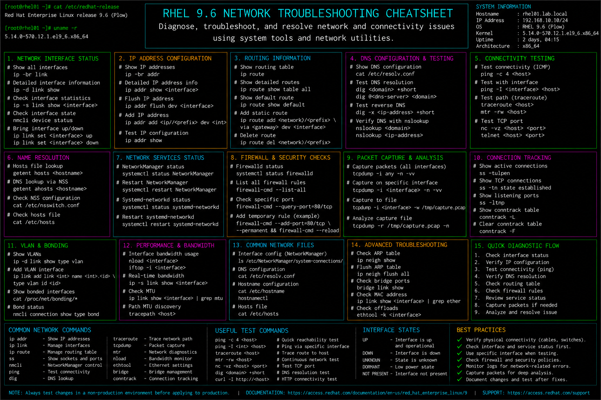

# network-troubleshooting.md

# Network Troubleshooting Cheat Sheet

## Overview

This document provides a practical enterprise Linux administration cheat sheet for network troubleshooting, interface diagnostics, DNS validation, routing analysis, connectivity testing, and operational recovery on Red Hat Enterprise Linux (RHEL) 9.6 systems.

The commands and workflows included are commonly used during enterprise connectivity incidents, service outages, infrastructure troubleshooting, network performance analysis, and operational maintenance activities.

This reference is designed for fast operational lookup during production Linux administration tasks.

---

## Environment Information

| Component | Details |
|---|---|
| Operating System | RHEL 9.6 |
| Hostname | rhel01.lab.local |
| Network Interface | ens160 |
| Network Manager | NetworkManager |
| DNS Resolver | systemd-resolved |
| Firewall Platform | firewalld |
| SELinux Mode | Enforcing |
| User Context | root / sudo administrator |

---

## Common Commands

### Display Network Interfaces

```bash
ip addr show
```

### Display Interface Link Status

```bash
ip link show
```

### Verify Routing Table

```bash
ip route
```

### Display Active Connections

```bash
nmcli connection show
```

### Verify DNS Resolution

```bash
host redhat.com
```

### Test Network Connectivity

```bash
ping -c 4 8.8.8.8
```

### Trace Network Path

```bash
traceroute 8.8.8.8
```

### Verify Listening Ports

```bash
ss -tulpn
```

### Capture Network Packets

```bash
tcpdump -i ens160
```

### Display Interface Statistics

```bash
ip -s link
```

### Review NetworkManager Logs

```bash
journalctl -u NetworkManager
```

### Verify Firewall Rules

```bash
firewall-cmd --list-all
```

---

## Administrative Examples

### Verify Interface Configuration

```bash
ip addr show ens160
```

### Restart Network Connection

```bash
nmcli connection down ens160
nmcli connection up ens160
```

### Validate Default Gateway

```bash
ip route
```

### Test Internal Connectivity

```bash
ping -c 4 192.168.10.1
```

### Validate DNS Resolution

```bash
host google.com
```

### Verify Open Application Ports

```bash
ss -tulpn
```

### Capture Traffic for Analysis

```bash
tcpdump -i ens160 port 80
```

### Review Network Service Logs

```bash
journalctl -u NetworkManager
```

---

## Validation Commands

### Verify Interface IP Address

```bash
ip addr show ens160
```

Example output:

```text
inet 192.168.10.20/24 brd 192.168.10.255 scope global ens160
```

### Validate Routing Table

```bash
ip route
```

### Verify DNS Resolution

```bash
host redhat.com
```

### Validate Network Connectivity

```bash
ping -c 4 8.8.8.8
```

### Verify Listening Services

```bash
ss -tulpn
```

### Validate Interface Statistics

```bash
ip -s link
```

### Verify Firewall Configuration

```bash
firewall-cmd --list-all
```

### Review Network Logs

```bash
journalctl -u NetworkManager
```

---

## Troubleshooting Tips

### Interface Down or Missing IP

Review interface state:

```bash
ip link show
```

Restart network connection:

```bash
nmcli connection up ens160
```

### No Internet Connectivity

Verify routing table:

```bash
ip route
```

Ping gateway:

```bash
ping -c 4 192.168.10.1
```

### DNS Resolution Failure

Review DNS settings:

```bash
cat /etc/resolv.conf
```

Test DNS queries:

```bash
host redhat.com
```

### Port Not Reachable

Verify listening ports:

```bash
ss -tulpn
```

Verify firewall rules:

```bash
firewall-cmd --list-all
```

### Packet Loss or High Latency

Run connectivity tests:

```bash
ping -c 10 8.8.8.8
```

Trace route path:

```bash
traceroute 8.8.8.8
```

### SELinux or Firewall Blocking Traffic

Review firewall configuration:

```bash
firewall-cmd --list-all
```

Review SELinux denials:

```bash
ausearch -m avc -ts recent
```

---

## Operational Notes

- Validate network connectivity after configuration changes.
- Monitor interface statistics during performance investigations.
- Use packet captures during advanced troubleshooting activities.
- Review DNS and routing settings during outage analysis.
- Validate firewall and SELinux integration after deployments.
- Maintain documented network configurations for enterprise systems.
- Monitor network logs and failed services proactively.

Example operational audit commands:

```bash
ip addr show
ip route
ss -tulpn
```

---

## Screenshot Reference


