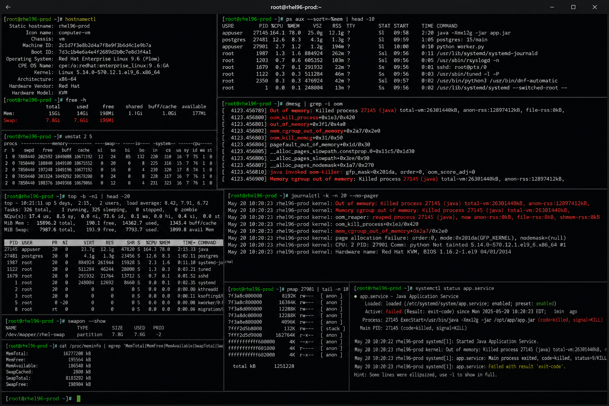

# oom-killer.md

# OOM Killer and Memory Exhaustion Troubleshooting Cheat Sheet

## Overview

This document provides a practical enterprise Linux administration cheat sheet for OOM killer analysis, memory exhaustion troubleshooting, process investigation, swap monitoring, and operational recovery procedures on Red Hat Enterprise Linux (RHEL) 9.6 systems.

The commands and workflows included are commonly used during enterprise outages, application crashes, performance incidents, memory leak investigations, and infrastructure troubleshooting activities.

This reference is designed for fast operational lookup during production Linux administration tasks.

---

## Environment Information

| Component | Details |
|---|---|
| Operating System | RHEL 9.6 |
| Hostname | rhel01.lab.local |
| Memory Management | Linux Kernel OOM Killer |
| Swap Configuration | LVM Swap Partition |
| Monitoring Utilities | procps-ng / sysstat |
| SELinux Mode | Enforcing |
| User Context | root / sudo administrator |
| Lab Platform | VMware Enterprise Lab |

---

## Common Commands

### Display Memory Usage

```bash
free -h
```

### Monitor Real-Time Memory Consumption

```bash
top
```

### Display Memory Statistics

```bash
vmstat 2
```

### Review OOM Killer Messages

```bash
dmesg | grep -i oom
```

### Review Kernel Logs

```bash
journalctl -k
```

### Display Top Memory Processes

```bash
ps aux --sort=-%mem | head
```

### Display Swap Usage

```bash
swapon --show
```

### Display Process Memory Map

```bash
pmap <PID>
```

### Review cgroup Memory Limits

```bash
systemctl status
```

### Review System Memory Information

```bash
cat /proc/meminfo
```

### Display Active Processes

```bash
ps aux
```

### Review Kernel OOM Score

```bash
cat /proc/<PID>/oom_score
```

---

## Administrative Examples

### Identify High Memory Usage Processes

```bash
ps aux --sort=-%mem | head
```

### Monitor Memory During Incident

```bash
vmstat 2
```

### Review OOM Killer Activity

```bash
dmesg | grep -i oom
```

### Investigate Process Memory Allocation

```bash
pmap <PID>
```

### Verify Swap Utilization

```bash
swapon --show
free -h
```

### Review Kernel Memory Logs

```bash
journalctl -k | grep -i memory
```

### Terminate Runaway Process

```bash
kill -9 <PID>
```

### Add Temporary Swap File

```bash
fallocate -l 2G /swapfile
chmod 600 /swapfile
mkswap /swapfile
swapon /swapfile
```

---

## Validation Commands

### Verify Memory Availability

```bash
free -h
```

Example output:

```text
Mem: 7.8Gi 2.1Gi 3.5Gi 512Mi 2.2Gi 5.2Gi
```

### Validate Swap Configuration

```bash
swapon --show
```

### Verify OOM Events

```bash
dmesg | grep -i oom
```

### Validate Memory Statistics

```bash
vmstat 2
```

### Verify High Memory Consumers

```bash
ps aux --sort=-%mem | head
```

### Review Kernel Logs

```bash
journalctl -k
```

### Validate Process OOM Score

```bash
cat /proc/<PID>/oom_score
```

### Review Memory Information

```bash
cat /proc/meminfo
```

---

## Troubleshooting Tips

### System Running Out of Memory

Review memory usage:

```bash
free -h
```

Identify memory-intensive processes:

```bash
ps aux --sort=-%mem | head
```

### OOM Killer Terminating Applications

Review OOM logs:

```bash
dmesg | grep -i oom
```

Review kernel logs:

```bash
journalctl -k
```

### Swap Space Exhausted

Verify swap usage:

```bash
swapon --show
```

Create temporary swap:

```bash
fallocate -l 2G /swapfile
```

### Memory Leak Investigation

Monitor process memory growth:

```bash
watch -n 2 'ps aux --sort=-%mem | head'
```

Inspect memory maps:

```bash
pmap <PID>
```

### Excessive Cache Usage

Review memory details:

```bash
cat /proc/meminfo
```

Clear page cache cautiously:

```bash
sync; echo 3 > /proc/sys/vm/drop_caches
```

### Container or cgroup Memory Limits

Review cgroup settings:

```bash
systemctl status
```

Inspect memory restrictions:

```bash
cat /sys/fs/cgroup/memory.max
```

---

## Operational Notes

- Monitor memory usage proactively during enterprise operations.
- Investigate recurring OOM events immediately.
- Maintain appropriate swap allocation for production workloads.
- Review application memory consumption after deployments.
- Use monitoring tools to identify long-term memory leaks.
- Validate container and cgroup memory limits during troubleshooting.
- Document OOM incidents for operational analysis and capacity planning.

Example operational audit commands:

```bash
free -h
ps aux --sort=-%mem | head
dmesg | grep -i oom
```

---

## Screenshot Reference


