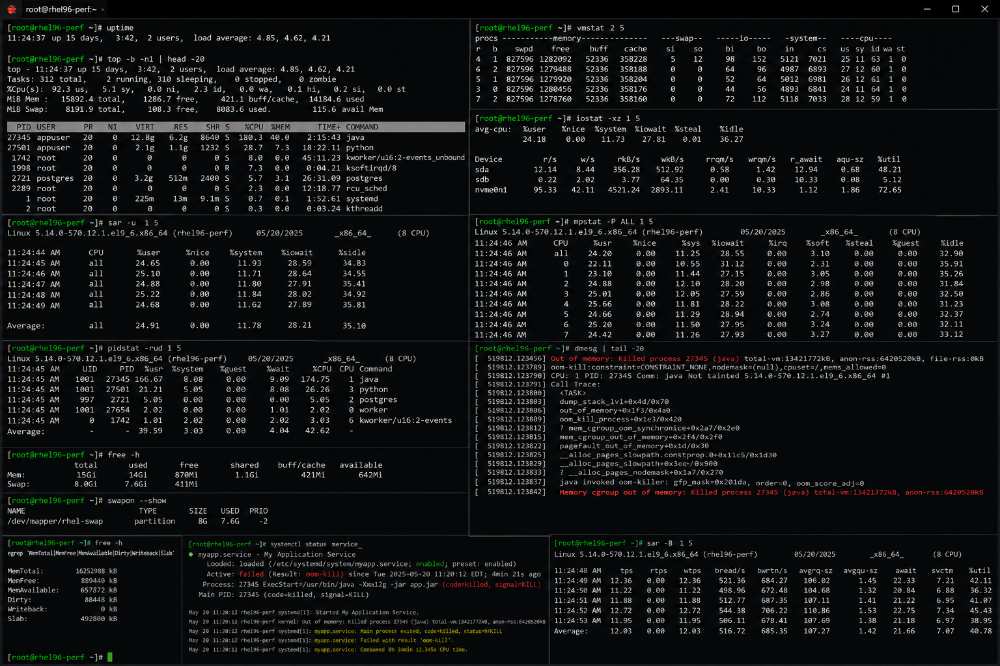

# performance-troubleshooting.md

# Performance Troubleshooting Cheat Sheet

## Overview

This document provides a practical enterprise Linux administration cheat sheet for performance troubleshooting, CPU analysis, memory diagnostics, disk I/O investigation, network performance validation, and operational optimization on Red Hat Enterprise Linux (RHEL) 9.6 systems.

The commands and workflows included are commonly used during enterprise slowdowns, application latency investigations, infrastructure bottleneck analysis, capacity planning, and operational troubleshooting activities.

This reference is designed for fast operational lookup during production Linux administration tasks.

---

## Environment Information

| Component | Details |
|---|---|
| Operating System | RHEL 9.6 |
| Hostname | rhel01.lab.local |
| Monitoring Utilities | sysstat / procps-ng |
| Filesystem Type | XFS |
| Network Platform | NetworkManager |
| SELinux Mode | Enforcing |
| User Context | root / sudo administrator |
| Lab Platform | VMware Enterprise Lab |

---

## Common Commands

### Display System Load

```bash
uptime
```

### Monitor Processes in Real Time

```bash
top
```

### Display CPU Statistics

```bash
mpstat -P ALL 1 5
```

### Display Memory Usage

```bash
free -h
```

### Monitor Virtual Memory Statistics

```bash
vmstat 2
```

### Display Disk I/O Statistics

```bash
iostat -xz 1 5
```

### Display Network Statistics

```bash
sar -n DEV 1 5
```

### Display Disk Usage

```bash
df -h
```

### Review Active Processes by CPU Usage

```bash
ps aux --sort=-%cpu | head
```

### Review Active Processes by Memory Usage

```bash
ps aux --sort=-%mem | head
```

### Review Kernel Logs

```bash
journalctl -k
```

### Verify Listening Ports

```bash
ss -tulpn
```

---

## Administrative Examples

### Analyze High CPU Usage

```bash
top
mpstat -P ALL 1 5
```

### Investigate Memory Pressure

```bash
free -h
vmstat 2
```

### Analyze Disk I/O Bottlenecks

```bash
iostat -xz 1 5
```

### Review High Resource Processes

```bash
ps aux --sort=-%cpu | head
ps aux --sort=-%mem | head
```

### Monitor Network Throughput

```bash
sar -n DEV 1 5
```

### Validate Disk Capacity

```bash
df -h
```

### Investigate Kernel-Level Errors

```bash
journalctl -k -p err
```

### Review Service Performance Logs

```bash
journalctl -u httpd
```

---

## Validation Commands

### Verify System Load

```bash
uptime
```

Example output:

```text
10:15:42 up 20 days, 5:33, 3 users, load average: 2.11, 1.95, 1.72
```

### Validate CPU Utilization

```bash
mpstat -P ALL 1 5
```

### Verify Memory Availability

```bash
free -h
```

### Validate Virtual Memory Statistics

```bash
vmstat 2
```

### Verify Disk I/O Performance

```bash
iostat -xz 1 5
```

### Validate Network Statistics

```bash
sar -n DEV 1 5
```

### Review Disk Capacity

```bash
df -h
```

### Verify Top Resource Consumers

```bash
ps aux --sort=-%cpu | head
```

---

## Troubleshooting Tips

### High CPU Utilization

Review CPU-intensive processes:

```bash
ps aux --sort=-%cpu | head
```

Monitor per-core usage:

```bash
mpstat -P ALL 1 5
```

### Memory Pressure or Swapping

Review memory availability:

```bash
free -h
```

Monitor swap activity:

```bash
vmstat 2
```

### Disk I/O Latency

Review I/O wait metrics:

```bash
iostat -xz 1 5
```

Review disk usage:

```bash
df -h
```

### Application Slowdowns

Review service logs:

```bash
journalctl -u httpd
```

Review top resource consumers:

```bash
top
```

### Network Performance Issues

Monitor interface statistics:

```bash
sar -n DEV 1 5
```

Verify connectivity:

```bash
ping -c 4 8.8.8.8
```

### Kernel or Hardware Bottlenecks

Review kernel logs:

```bash
journalctl -k
```

Review hardware errors:

```bash
dmesg | grep -i error
```

---

## Operational Notes

- Monitor performance metrics proactively during enterprise operations.
- Establish baseline CPU, memory, disk, and network utilization.
- Investigate recurring bottlenecks immediately.
- Review service logs during application slowdowns.
- Validate system performance after updates and deployments.
- Monitor swap usage and disk latency regularly.
- Document recurring incidents for operational analysis and capacity planning.

Example operational audit commands:

```bash
uptime
iostat -xz 1 5
ps aux --sort=-%cpu | head
```

---

## Screenshot Reference


