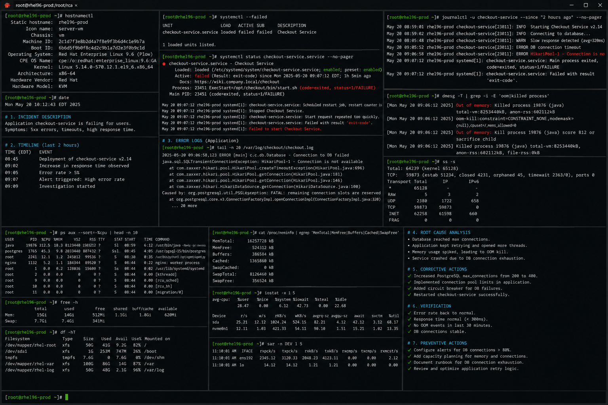

# root-cause-analysis.md

# Root Cause Analysis (RCA) Cheat Sheet

## Overview

This document provides a practical enterprise Linux administration cheat sheet for root cause analysis (RCA), incident investigation, log correlation, service failure analysis, infrastructure diagnostics, and operational recovery on Red Hat Enterprise Linux (RHEL) 9.6 systems.

The commands and workflows included are commonly used during enterprise outages, production incidents, recurring failures, postmortem investigations, and operational troubleshooting activities.

This reference is designed for fast operational lookup during production Linux administration tasks.

---

## Environment Information

| Component | Details |
|---|---|
| Operating System | RHEL 9.6 |
| Hostname | rhel01.lab.local |
| Logging Platform | journald / rsyslog |
| Monitoring Utilities | sysstat / procps-ng |
| Security Framework | SELinux |
| Service Management | systemd |
| User Context | root / sudo administrator |
| Lab Platform | VMware Enterprise Lab |

---

## Common Commands

### Review Recent System Errors

```bash
journalctl -p err -b
```

### Review Service Failure Logs

```bash
journalctl -u httpd
```

### Verify Failed Services

```bash
systemctl --failed
```

### Review Kernel Logs

```bash
journalctl -k
```

### Display System Load

```bash
uptime
```

### Display Top Resource Consumers

```bash
top
```

### Review OOM Events

```bash
dmesg | grep -i oom
```

### Review Authentication Failures

```bash
cat /var/log/secure | grep Failed
```

### Verify Listening Ports

```bash
ss -tulpn
```

### Verify Network Connectivity

```bash
ping -c 4 8.8.8.8
```

### Review SELinux Denials

```bash
ausearch -m avc -ts recent
```

### Review Disk Usage

```bash
df -h
```

---

## Administrative Examples

### Investigate Service Outage

```bash
systemctl status httpd
journalctl -u httpd
```

### Analyze System Resource Exhaustion

```bash
top
free -h
vmstat 2
```

### Review Recent Critical Errors

```bash
journalctl -p err -b
```

### Correlate Kernel and Application Logs

```bash
journalctl -k
journalctl -u httpd
```

### Investigate Authentication Incidents

```bash
cat /var/log/secure | grep Failed
```

### Verify Disk Capacity Issues

```bash
df -h
```

### Analyze SELinux Access Problems

```bash
ausearch -m avc -ts recent
```

### Review Failed Services

```bash
systemctl --failed
```

---

## Validation Commands

### Verify Failed Services

```bash
systemctl --failed
```

Example output:

```text
UNIT         LOAD   ACTIVE SUB    DESCRIPTION
httpd.service loaded failed failed Apache HTTP Server
```

### Validate Recent Errors

```bash
journalctl -p err -b
```

### Verify Service Logs

```bash
journalctl -u httpd
```

### Validate Kernel Messages

```bash
journalctl -k
```

### Verify Resource Utilization

```bash
top
```

### Validate Disk Capacity

```bash
df -h
```

### Verify Authentication Logs

```bash
cat /var/log/secure
```

### Review SELinux Audit Events

```bash
ausearch -m avc -ts recent
```

---

## Troubleshooting Tips

### Service Failure Investigation

Review failed services:

```bash
systemctl --failed
```

Review detailed logs:

```bash
journalctl -xe
```

### Resource Exhaustion Incidents

Review CPU and memory usage:

```bash
top
free -h
```

Review OOM events:

```bash
dmesg | grep -i oom
```

### Disk Capacity Problems

Review filesystem usage:

```bash
df -h
```

Identify large directories:

```bash
du -sh /*
```

### SELinux Access Denials

Review AVC logs:

```bash
ausearch -m avc -ts recent
```

Generate SELinux report:

```bash
sealert -a /var/log/audit/audit.log
```

### Authentication and Security Incidents

Review authentication failures:

```bash
cat /var/log/secure | grep Failed
```

Review login history:

```bash
lastb
```

### Network and Connectivity Failures

Verify routing and ports:

```bash
ip route
ss -tulpn
```

---

## Operational Notes

- Correlate logs across services, kernel events, and infrastructure layers.
- Document findings during enterprise incident investigations.
- Review recurring incidents for long-term corrective actions.
- Validate infrastructure changes after outage recovery.
- Maintain centralized logging and monitoring integrations.
- Preserve audit trails during production incidents.
- Perform postmortem analysis after critical outages.

Example operational audit commands:

```bash
journalctl -p err -b
systemctl --failed
dmesg | grep -i oom
```

---

## Screenshot Reference


