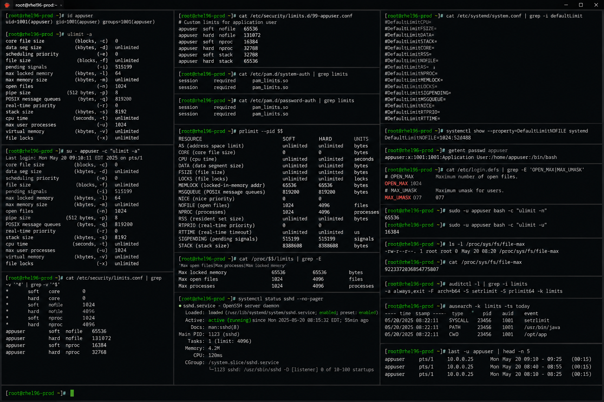

# user-limits.md

# User Limits and Resource Control Cheat Sheet

## Overview

This document provides a practical enterprise Linux administration cheat sheet for user limits management, PAM resource controls, process restrictions, file descriptor tuning, memory constraints, and operational troubleshooting on Red Hat Enterprise Linux (RHEL) 9.6 systems.

The commands and workflows included are commonly used during enterprise performance tuning, application scaling, login troubleshooting, resource exhaustion analysis, and infrastructure optimization activities.

This reference is designed for fast operational lookup during production Linux administration tasks.

---

## Environment Information

| Component | Details |
|---|---|
| Operating System | RHEL 9.6 |
| Hostname | rhel01.lab.local |
| Authentication Framework | PAM |
| Resource Control | limits.conf / systemd |
| Shell Environment | bash |
| SELinux Mode | Enforcing |
| User Context | root / sudo administrator |
| Lab Platform | VMware Enterprise Lab |

---

## Common Commands

### Display Current User Limits

```bash
ulimit -a
```

### Display Open File Limit

```bash
ulimit -n
```

### Display Maximum User Processes

```bash
ulimit -u
```

### Review limits.conf Configuration

```bash
cat /etc/security/limits.conf
```

### Review Limits Directory

```bash
ls -lh /etc/security/limits.d/
```

### Display Process Limits

```bash
cat /proc/<PID>/limits
```

### Verify Active User Sessions

```bash
who
```

### Display Process Resource Usage

```bash
ps aux
```

### Verify File Descriptor Usage

```bash
lsof | wc -l
```

### Review PAM Configuration

```bash
cat /etc/pam.d/system-auth
```

### Display Systemd Limits

```bash
systemctl show | grep Limit
```

### Review Login Failures

```bash
journalctl -u sshd
```

---

## Administrative Examples

### Display Current Resource Limits

```bash
ulimit -a
```

### Increase Open File Limits Temporarily

```bash
ulimit -n 65535
```

### Configure Permanent User Limits

Edit limits configuration:

```bash
vim /etc/security/limits.conf
```

Example configuration:

```text
appuser soft nofile 65535
appuser hard nofile 65535
```

### Verify Process Limits for Running Service

```bash
cat /proc/<PID>/limits
```

### Review Systemd Service Limits

```bash
systemctl show httpd | grep Limit
```

### Validate File Descriptor Consumption

```bash
lsof | wc -l
```

### Monitor Running Processes Per User

```bash
ps -u appuser
```

### Reload Service After Limit Changes

```bash
systemctl daemon-reexec
systemctl restart httpd
```

---

## Validation Commands

### Verify Open File Limit

```bash
ulimit -n
```

Example output:

```text
65535
```

### Validate Maximum User Processes

```bash
ulimit -u
```

### Verify limits.conf Entries

```bash
cat /etc/security/limits.conf
```

### Validate Process Limits

```bash
cat /proc/<PID>/limits
```

### Verify Systemd Resource Limits

```bash
systemctl show httpd | grep Limit
```

### Validate File Descriptor Usage

```bash
lsof | wc -l
```

### Review User Sessions

```bash
who
```

### Verify PAM Configuration

```bash
cat /etc/pam.d/system-auth
```

---

## Troubleshooting Tips

### Too Many Open Files Errors

Review open file limits:

```bash
ulimit -n
```

Review active file descriptors:

```bash
lsof | wc -l
```

### User Cannot Start Additional Processes

Review process limits:

```bash
ulimit -u
```

Review active processes:

```bash
ps -u appuser
```

### Service Ignores limits.conf Values

Verify PAM configuration:

```bash
cat /etc/pam.d/system-auth
```

Review systemd limits:

```bash
systemctl show httpd | grep Limit
```

### SSH Login Fails Due to Resource Limits

Review authentication logs:

```bash
journalctl -u sshd
```

Verify user session limits:

```bash
ulimit -a
```

### High File Descriptor Consumption

Identify resource-heavy processes:

```bash
lsof | head
```

Review process limits:

```bash
cat /proc/<PID>/limits
```

### System Resource Exhaustion

Review CPU and memory usage:

```bash
top
free -h
```

---

## Operational Notes

- Configure appropriate file descriptor and process limits for enterprise applications.
- Validate limits after service restarts and deployments.
- Monitor resource exhaustion proactively.
- Use systemd overrides for production service limits.
- Review PAM integration when troubleshooting login issues.
- Maintain baseline resource configurations for operational consistency.
- Document tuning changes during maintenance activities.

Example operational audit commands:

```bash
ulimit -a
cat /proc/<PID>/limits
systemctl show httpd | grep Limit
```

---

## Screenshot Reference


