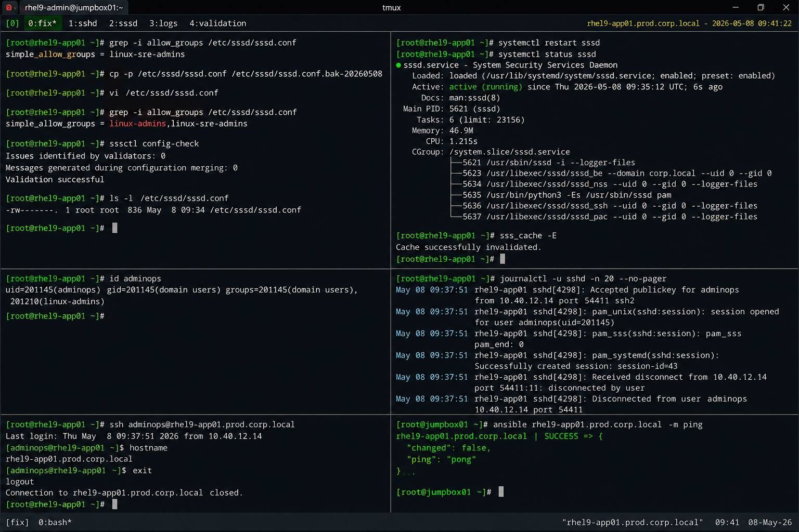

# Incident 01 — SSH Login Failure

## Overview

This document captures the remediation and recovery procedures executed to restore SSH authentication access on `rhel9-app01.prod.corp.local`.

The recovery process focused on restoring enterprise authentication functionality while maintaining compliance with standard RHEL 9.6 security controls and operational policies.

---

# Recovery Summary

| Item | Details |
|---|---|
| Incident ID | INC-RHEL-SSH-2026-001 |
| Severity | SEV-2 |
| Environment | Production |
| Affected Host | rhel9-app01.prod.corp.local |
| Service Impacted | sshd |
| Recovery Start | 2026-05-08 09:26 UTC |
| Recovery End | 2026-05-08 09:41 UTC |
| Status | Resolved |

---

# Identified Issue

Investigation confirmed that SSH authentication requests were being rejected by the SSSD access control policy.

Current SSSD configuration:

```bash
grep -i allow_groups /etc/sssd/sssd.conf
```

Output:

```text
simple_allow_groups = linux-sre-admins
```

Affected administrator accounts belonged to the `linux-admins` group and were excluded from the configured access policy.

---

# Recovery Procedure

## Backup Existing Configuration

```bash
cp -p /etc/sssd/sssd.conf /etc/sssd/sssd.conf.bak-20260508
```

Configuration backup completed successfully.

---

## Update SSSD Access Policy

```bash
vi /etc/sssd/sssd.conf
```

Updated configuration:

```ini
access_provider = simple
simple_allow_groups = linux-admins,linux-sre-admins
```

The updated configuration restored the required administrator group authorization.

---

# Configuration Validation

## Validate SSSD Configuration

```bash
sssctl config-check
```

Output:

```text
Issues identified by validators: 0
Messages generated during configuration merging: 0
Validation successful
```

Configuration validation completed successfully.

---

## Verify File Permissions

```bash
ls -l /etc/sssd/sssd.conf
```

Output:

```text
-rw-------. 1 root root 836 May 08 09:34 /etc/sssd/sssd.conf
```

Required restrictive permissions remained intact.

---

# Service Recovery

## Restart SSSD Service

```bash
systemctl restart sssd
```

## Verify SSSD Service Status

```bash
systemctl status sssd
```

Output:

```text
● sssd.service - System Security Services Daemon
     Loaded: loaded (/usr/lib/systemd/system/sssd.service; enabled)
     Active: active (running)
```

SSSD service restarted successfully.

---

## Clear SSSD Cache

```bash
sss_cache -E
```

Output:

```text
Cache successfully invalidated.
```

Authentication cache entries were cleared successfully.

---

# Authentication Validation

## Verify LDAP User Resolution

```bash
id adminops
```

Output:

```text
uid=201145(adminops) gid=201145(domain users) groups=201145(domain users),201210(linux-admins)
```

LDAP user resolution remained operational.

---

## Verify SSH Authentication

```bash
ssh adminops@rhel9-app01.prod.corp.local
```

Output:

```text
Last login: Thu May 08 09:37:51 2026 from 10.40.12.14
[adminops@rhel9-app01 ~]$
```

SSH authentication completed successfully.

---

# Log Validation

## Review SSH Logs After Recovery

```bash
journalctl -u sshd -n 20 --no-pager
```

Output:

```text
May 08 09:37:51 rhel9-app01 sshd[4298]: Accepted publickey for adminops from 10.40.12.14 port 54411 ssh2
May 08 09:37:51 rhel9-app01 sshd[4298]: pam_unix(sshd:session): session opened for user adminops(uid=201145)
```

No additional authentication failures were detected after recovery.

---

# Automation Validation

## Verify Ansible Connectivity

```bash
ansible rhel9-app01.prod.corp.local -m ping
```

Output:

```text
rhel9-app01.prod.corp.local | SUCCESS => {
    "changed": false,
    "ping": "pong"
}
```

Infrastructure automation connectivity was restored successfully.

---

# Validation Checklist

| Validation Item | Status |
|---|---|
| SSH port reachable | PASS |
| sshd service operational | PASS |
| SSSD service operational | PASS |
| LDAP authentication functional | PASS |
| SSH login successful | PASS |
| Ansible connectivity restored | PASS |
| SELinux enforcing | PASS |

---

# Operational Notes

- SELinux remained enabled throughout recovery operations
- No firewall modifications were required
- No unrelated production services were restarted
- Recovery actions were limited to authentication policy correction

---

# Screenshot Reference


