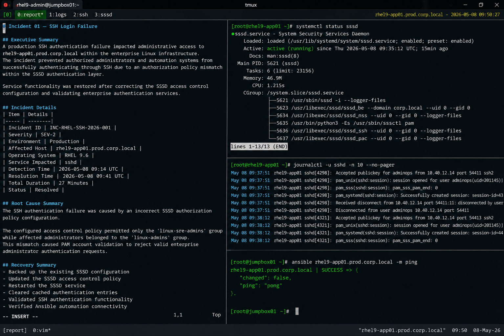

# Incident 01 — SSH Login Failure

## Executive Summary

A production SSH authentication failure impacted administrative access to `rhel9-app01.prod.corp.local` within the enterprise Linux infrastructure.

The incident prevented authorized administrators and automation systems from successfully authenticating through SSH due to an authorization policy mismatch within the SSSD authentication layer.

Service functionality was restored after correcting the SSSD access control configuration and validating enterprise authentication services.

---

# Incident Details

| Item | Details |
|---|---|
| Incident ID | INC-RHEL-SSH-2026-001 |
| Severity | SEV-2 |
| Environment | Production |
| Affected Host | rhel9-app01.prod.corp.local |
| Operating System | RHEL 9.6 |
| Service Impacted | sshd |
| Detection Time | 2026-05-08 09:14 UTC |
| Resolution Time | 2026-05-08 09:41 UTC |
| Total Duration | 27 Minutes |
| Status | Resolved |

---

# Affected Services

The following services and operational functions were impacted during the incident:

- Administrative SSH access
- Infrastructure automation workflows
- Ansible remote task execution
- Scheduled operational maintenance activities

No customer-facing application downtime was reported during the incident window.

---

# Detection Method

The incident was detected through multiple operational monitoring channels:

- Failed Ansible job alerts
- Elevated SSH authentication failure metrics
- Linux operations team escalation
- Authentication-related journald log alerts

Monitoring alert example:

```text
ALERT: SSHAuthenticationFailureRate
Host: rhel9-app01.prod.corp.local
Current Value: 83 failed logins within 5 minutes
Severity: warning
```

---

# User Impact

Operational impact included:

- Inability for Linux administrators to establish SSH sessions
- Failed infrastructure automation tasks
- Delayed maintenance and operational activities
- Increased manual intervention requirements

The incident was limited to administrative authentication workflows and did not affect application availability.

---

# Timeline

| Time (UTC) | Event |
|---|---|
| 09:14 | Monitoring alerts triggered for SSH authentication failures |
| 09:16 | Linux operations team acknowledged incident |
| 09:19 | Initial SSH and network diagnostics completed |
| 09:24 | PAM/SSSD authorization failures identified |
| 09:31 | SSSD access policy correction initiated |
| 09:35 | SSSD service restarted and cache cleared |
| 09:37 | SSH authentication validated successfully |
| 09:41 | Incident resolved and monitoring stabilized |

---

# Technical Findings

Investigation identified the following conditions:

- SSH daemon remained operational
- Network connectivity to the host was healthy
- LDAP identity resolution succeeded successfully
- PAM account validation denied authorized administrator accounts
- SSSD authorization policy excluded the required administrator group

Relevant log entries:

```text
pam_sss(sshd:account): Access denied for user adminops
fatal: Access denied for user adminops by PAM account configuration
```

---

# Root Cause Summary

The SSH authentication failure was caused by an incorrect SSSD authorization policy configuration.

The configured access control policy permitted only the `linux-sre-admins` group while affected administrators belonged to the `linux-admins` group.

This mismatch caused PAM account validation to reject valid enterprise administrator authentication requests.

---

# Recovery Actions

The following recovery actions were completed:

- Backed up the existing SSSD configuration
- Updated the SSSD access control policy
- Restarted the SSSD service
- Cleared cached authentication entries
- Validated SSH authentication functionality
- Verified Ansible automation connectivity

---

# Validation Results

| Validation Item | Result |
|---|---|
| SSH authentication restored | PASS |
| SSSD service operational | PASS |
| LDAP resolution functional | PASS |
| Ansible connectivity restored | PASS |
| Authentication errors cleared | PASS |

---

# Operational Notes

- SELinux remained enabled throughout recovery activities
- No firewall modifications were required
- No production application downtime occurred
- Recovery actions were limited to authentication policy remediation

---

# Screenshot Reference


