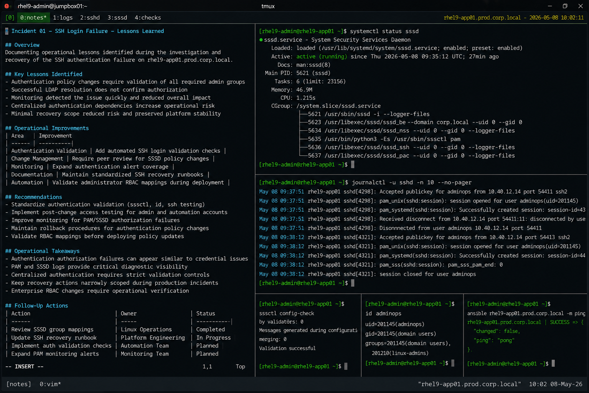

# Incident 01 — SSH Login Failure

## Overview

This document captures the operational lessons identified during the investigation and recovery of the SSH authentication failure on `rhel9-app01.prod.corp.local`.

The objective is to improve authentication management, operational visibility, and recovery readiness across the enterprise Linux infrastructure.

---

# Incident Summary

| Item | Details |
|---|---|
| Incident ID | INC-RHEL-SSH-2026-001 |
| Environment | Production |
| Affected Service | sshd |
| Platform | RHEL 9.6 |
| Duration | 27 Minutes |
| Status | Resolved |

---

# Key Lessons Identified

## Authentication Policy Changes Require Validation

The incident highlighted the operational risk associated with modifying SSSD authorization policies without validating all required administrator groups.

Access policy updates must always include:

- verification of enterprise RBAC mappings
- administrator access validation
- automation account testing
- rollback verification procedures

---

## Successful LDAP Resolution Does Not Confirm Authorization

The investigation confirmed that successful LDAP identity resolution alone does not guarantee successful SSH authentication.

The following components must all function correctly:

- LDAP identity resolution
- PAM account validation
- SSSD authorization policies
- SSH access controls

Operational validation must include both authentication and authorization testing.

---

## Monitoring Detected the Issue Quickly

Existing monitoring controls successfully identified abnormal SSH authentication failure rates.

The following monitoring systems proved effective:

- journald authentication alerts
- Ansible job failure notifications
- SSH authentication failure metrics
- Linux operations escalation procedures

Early detection reduced overall recovery duration.

---

## Centralized Authentication Dependencies Increase Operational Risk

Production servers dependent on centralized authentication services require additional validation controls.

Operational teams should ensure:

- RBAC policy consistency
- staged authentication testing
- access control auditing
- documented recovery procedures

Authentication infrastructure changes should follow formal change validation workflows.

---

## Minimal Recovery Scope Reduced Risk

The recovery process focused strictly on correcting the authorization policy configuration.

The following high-risk actions were intentionally avoided:

- disabling SELinux
- bypassing PAM authentication
- modifying firewall policies
- restarting unrelated services

Limiting operational changes reduced recovery risk and preserved platform stability.

---

# Operational Improvements

The following operational improvements were identified after the incident:

| Improvement Area | Action |
|---|---|
| Authentication Validation | Add automated SSH login validation checks |
| Change Management | Require peer review for SSSD policy modifications |
| Monitoring | Expand authentication alert coverage |
| Documentation | Maintain standardized SSH recovery procedures |
| Automation | Validate administrator RBAC mappings during deployment |

---

# Recommendations

## Standardize Authentication Validation

All authentication-related changes should include:

```bash
sssctl config-check
id <username>
ssh <user>@<host>
```

Validation procedures must confirm both identity resolution and successful SSH access.

---

## Implement Post-Change Access Testing

Operational teams should perform post-change validation immediately after modifying:

- SSSD configuration
- PAM configuration
- SSH access policies
- LDAP group mappings

Testing should include administrator and automation accounts.

---

## Improve Authentication Monitoring

Additional monitoring should be implemented for:

- repeated PAM authorization failures
- SSSD access denial events
- failed automation authentication attempts
- abnormal SSH rejection rates

Early visibility reduces operational impact during authentication incidents.

---

# Operational Takeaways

- Authentication authorization failures can appear similar to standard credential issues
- PAM and SSSD logs provide critical diagnostic visibility
- Centralized authentication dependencies require strict validation controls
- Recovery actions should remain narrowly scoped during production incidents
- Enterprise RBAC changes require operational verification before deployment

---

# Follow-Up Actions

| Action | Owner | Status |
|---|---|---|
| Review SSSD group mappings | Linux Operations | Completed |
| Update SSH recovery runbook | Platform Engineering | In Progress |
| Implement authentication validation checks | Automation Team | Planned |
| Expand PAM monitoring alerts | Monitoring Team | Planned |

---

# Screenshot Reference


