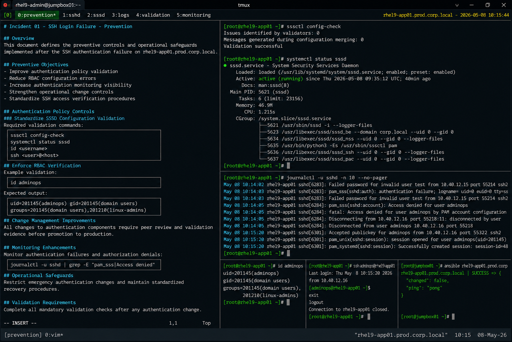

# Incident 01 — SSH Login Failure

## Overview

This document defines the preventive controls and operational safeguards implemented after the SSH authentication failure on `rhel9-app01.prod.corp.local`.

The objective is to reduce the likelihood of future authentication authorization failures within the enterprise Linux environment.

---

# Incident Summary

| Item | Details |
|---|---|
| Incident ID | INC-RHEL-SSH-2026-001 |
| Environment | Production |
| Affected Service | sshd |
| Platform | RHEL 9.6 |
| Root Cause Category | Authentication Policy Misconfiguration |
| Status | Preventive Actions Implemented |

---

# Preventive Objectives

The following objectives were established after the incident:

- Improve authentication policy validation
- Reduce RBAC configuration errors
- Increase authentication monitoring visibility
- Strengthen operational change controls
- Standardize SSH access verification procedures

---

# Authentication Policy Controls

## Standardize SSSD Configuration Validation

All SSSD configuration changes must include mandatory validation before deployment.

Required validation commands:

```bash
sssctl config-check
```

```bash
systemctl status sssd
```

```bash
id <username>
```

```bash
ssh <user>@<host>
```

Changes must not be promoted into production without successful validation results.

---

## Enforce RBAC Verification

Operational teams must verify enterprise group mappings before implementing authentication policy changes.

Required verification steps:

- confirm administrator group membership
- validate automation service accounts
- review PAM authorization rules
- verify Active Directory synchronization

Example validation:

```bash
id adminops
```

Output:

```text
uid=201145(adminops) gid=201145(domain users) groups=201145(domain users),201210(linux-admins)
```

---

# Change Management Improvements

## Peer Review Requirement

All modifications involving the following components now require peer review approval:

- `/etc/sssd/sssd.conf`
- PAM authentication policies
- SSH access controls
- LDAP authorization mappings

Change records must include:

- rollback procedure
- validation evidence
- affected administrator groups
- post-change authentication testing

---

## Implement Configuration Backup Procedures

Authentication-related configuration files must be backed up before modification.

Example:

```bash
cp -p /etc/sssd/sssd.conf /etc/sssd/sssd.conf.bak-$(date +%F)
```

Rollback capability must remain available throughout the maintenance window.

---

# Monitoring Enhancements

## SSH Authentication Monitoring

Monitoring coverage was expanded for the following conditions:

- repeated PAM authentication failures
- SSSD authorization denials
- elevated SSH rejection rates
- failed automation login attempts

Example log monitoring target:

```bash
journalctl -u sshd
```

Relevant events:

```text
pam_sss(sshd:account): Access denied for user adminops
```

---

## Automation Validation Monitoring

Infrastructure automation now performs scheduled SSH validation tests against critical Linux servers.

Validation scope includes:

- SSH connectivity
- LDAP identity resolution
- PAM authorization
- SSSD service health

Example automation test:

```bash
ansible all -m ping
```

---

# Operational Safeguards

## Restrict Emergency Authentication Changes

The following actions are prohibited during standard incident recovery unless formally approved:

- disabling SELinux
- bypassing PAM authentication
- modifying firewall rules unnecessarily
- enabling insecure SSH authentication methods

Recovery efforts must remain narrowly scoped to the identified root cause.

---

## Maintain Standardized Recovery Procedures

The Linux operations team implemented standardized runbooks for:

- SSH authentication failures
- PAM troubleshooting
- SSSD recovery
- LDAP access validation
- enterprise RBAC verification

Operational procedures are now integrated into the production support knowledge base.

---

# Validation Requirements

The following validation checklist must be completed after authentication-related changes:

| Validation Item | Requirement |
|---|---|
| SSH login test | Mandatory |
| LDAP identity verification | Mandatory |
| SSSD service validation | Mandatory |
| PAM authentication review | Mandatory |
| Automation connectivity test | Mandatory |
| Journald authentication review | Mandatory |

---

# Preventive Measures Implemented

| Preventive Control | Status |
|---|---|
| SSSD validation procedures | Implemented |
| RBAC verification workflow | Implemented |
| Authentication monitoring expansion | Implemented |
| SSH validation automation | Implemented |
| Peer review requirement | Implemented |
| Recovery runbook standardization | Implemented |

---

# Operational Recommendations

- Validate both authentication and authorization workflows during testing
- Maintain consistent RBAC group management standards
- Review authentication logs after every policy modification
- Automate SSH validation checks for critical infrastructure
- Preserve rollback capability during authentication maintenance activities

---

# Screenshot Reference


