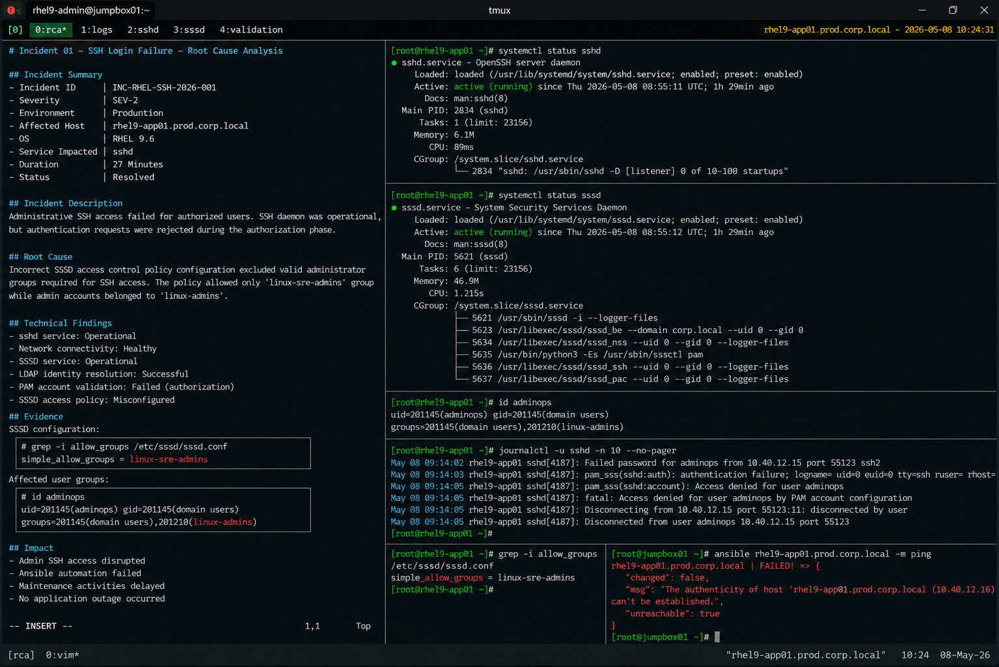

# Incident 01 — SSH Login Failure

## Overview

This document provides the root cause analysis (RCA) for the SSH authentication failure affecting `rhel9-app01.prod.corp.local`.

The analysis identifies the technical failure condition, contributing operational factors, impact scope, and corrective actions implemented to restore authentication services.

---

# Incident Summary

| Item | Details |
|---|---|
| Incident ID | INC-RHEL-SSH-2026-001 |
| Severity | SEV-2 |
| Environment | Production |
| Affected Host | rhel9-app01.prod.corp.local |
| Operating System | RHEL 9.6 |
| Service Impacted | sshd |
| Duration | 27 Minutes |
| Status | Resolved |

---

# Incident Description

Administrative SSH access to the production server `rhel9-app01.prod.corp.local` failed for authorized enterprise users.

The issue impacted Linux administrators and infrastructure automation systems using centralized LDAP authentication through SSSD and PAM integration.

Although the SSH daemon remained operational, authentication requests were rejected during the authorization phase.

---

# Detection Summary

The issue was detected through:

- SSH authentication failure alerts
- Failed Ansible automation jobs
- PAM-related journald log entries
- Linux operations escalation

Example log entries:

```text
pam_sss(sshd:account): Access denied for user adminops
fatal: Access denied for user adminops by PAM account configuration
```

---

# Technical Investigation

## SSH Service Validation

The SSH daemon was verified as operational.

```bash
systemctl status sshd
```

Output:

```text
Active: active (running)
```

Network connectivity and SSH port accessibility were also validated successfully.

---

## SSSD Validation

SSSD service health remained operational throughout the incident.

```bash
systemctl status sssd
```

Output:

```text
Active: active (running)
```

LDAP identity resolution also completed successfully.

```bash
id adminops
```

Output:

```text
uid=201145(adminops) gid=201145(domain users) groups=201145(domain users),201210(linux-admins)
```

This confirmed that identity lookup functionality remained intact.

---

# Root Cause Identification

Investigation identified an authorization policy mismatch within the SSSD configuration.

Current SSSD configuration:

```bash
grep -i allow_groups /etc/sssd/sssd.conf
```

Output:

```text
simple_allow_groups = linux-sre-admins
```

Affected administrator accounts belonged to the `linux-admins` group and were not included within the configured authorization policy.

As a result:

- LDAP authentication succeeded
- PAM account validation failed
- SSH login requests were rejected
- Automation authentication requests failed

---

# Root Cause

The incident was caused by an incorrect SSSD access control policy configuration that excluded valid administrator groups required for SSH access.

The authorization policy allowed only the `linux-sre-admins` group while operational administrator accounts were assigned to the `linux-admins` group.

This mismatch caused PAM authorization failures despite successful LDAP identity resolution and valid user credentials.

---

# Contributing Factors

The following operational conditions contributed to the incident:

| Contributing Factor | Impact |
|---|---|
| Incomplete RBAC validation | Administrator groups were not fully verified |
| Lack of post-change SSH testing | Authorization issue was not detected immediately |
| Limited authentication monitoring granularity | Root cause isolation required manual investigation |
| Centralized authentication dependency | Multiple operational workflows were affected |

---

# Impact Assessment

The incident caused the following operational impact:

- Administrative SSH access interruption
- Failed Ansible automation execution
- Delayed maintenance activities
- Increased manual operational effort

No production application outage occurred during the incident.

---

# Corrective Actions

The following corrective actions were completed:

- Updated SSSD authorization policy
- Added required administrator group mappings
- Restarted SSSD service
- Cleared cached authentication entries
- Validated SSH authentication functionality
- Verified Ansible connectivity restoration

Updated configuration:

```ini
access_provider = simple
simple_allow_groups = linux-admins,linux-sre-admins
```

---

# Validation Results

| Validation Item | Status |
|---|---|
| SSH login restored | PASS |
| SSSD service operational | PASS |
| LDAP resolution functional | PASS |
| PAM authorization successful | PASS |
| Ansible connectivity restored | PASS |

---

# Preventive Recommendations

The following preventive measures were identified during RCA review:

- implement mandatory RBAC validation checks
- require peer review for SSSD policy changes
- automate SSH authentication testing
- expand PAM and SSSD monitoring coverage
- maintain rollback procedures for authentication configuration changes

---

# Final Assessment

The incident originated from an authentication authorization policy misconfiguration rather than a service outage or infrastructure failure.

The SSH daemon, network connectivity, LDAP integration, and system resources remained healthy throughout the incident lifecycle.

The failure condition was isolated to SSSD access control policy enforcement within the enterprise authentication stack.

---

# Screenshot Reference


