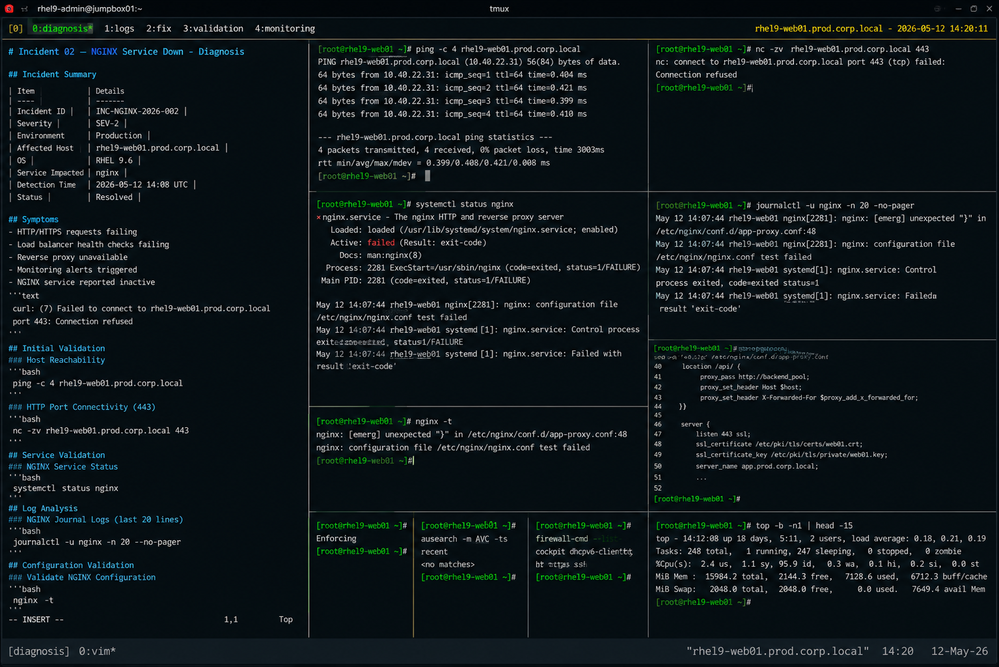

# Incident 02 — NGINX Service Down

## Overview

This document captures the diagnostic investigation performed during an NGINX service outage affecting the production web application environment on `rhel9-web01.prod.corp.local`.

The incident resulted in HTTP service unavailability for internal application endpoints hosted behind the NGINX reverse proxy layer.

---

# Incident Summary

| Item | Details |
|---|---|
| Incident ID | INC-NGINX-2026-002 |
| Severity | SEV-2 |
| Environment | Production |
| Affected Host | rhel9-web01.prod.corp.local |
| Operating System | RHEL 9.6 |
| Service Impacted | nginx |
| Detection Time | 2026-05-12 14:08 UTC |
| Status | Resolved |

---

# Symptoms

Observed symptoms during the incident:

- HTTP and HTTPS requests returning connection failures
- Load balancer health checks failing
- Reverse proxy services unavailable
- Application monitoring alerts triggered
- NGINX service reported inactive

Example client-side error:

```text
curl: (7) Failed to connect to rhel9-web01.prod.corp.local port 443: Connection refused
```

---

# Detection

The issue was identified through:

- Prometheus web availability alerts
- Load balancer health-check failures
- HTTP 5xx monitoring thresholds
- Linux operations escalation

Monitoring alert example:

```text
ALERT: NGINXServiceDown
Host: rhel9-web01.prod.corp.local
Service: nginx
Severity: critical
```

---

# Initial Validation

## Verify Host Reachability

```bash
ping -c 4 rhel9-web01.prod.corp.local
```

Output:

```text
64 bytes from 10.40.22.31: icmp_seq=1 ttl=64 time=0.404 ms
64 bytes from 10.40.22.31: icmp_seq=2 ttl=64 time=0.421 ms
64 bytes from 10.40.22.31: icmp_seq=3 ttl=64 time=0.399 ms
64 bytes from 10.40.22.31: icmp_seq=4 ttl=64 time=0.410 ms
```

Network connectivity to the server was operational.

---

## Verify HTTP Port Connectivity

```bash
nc -zv rhel9-web01.prod.corp.local 443
```

Output:

```text
nc: connect to rhel9-web01.prod.corp.local port 443 (tcp) failed: Connection refused
```

HTTPS service port was unavailable during the incident.

---

# Service Validation

## Verify NGINX Service Status

```bash
systemctl status nginx
```

Output:

```text
× nginx.service - The nginx HTTP and reverse proxy server
     Loaded: loaded (/usr/lib/systemd/system/nginx.service; enabled)
     Active: failed (Result: exit-code)
    Process: 2281 ExecStart=/usr/sbin/nginx (code=exited, status=1/FAILURE)

May 12 14:07:44 rhel9-web01 nginx[2281]: nginx: configuration file /etc/nginx/nginx.conf test failed
May 12 14:07:44 rhel9-web01 systemd[1]: nginx.service: Control process exited, code=exited, status=1/FAILURE
May 12 14:07:44 rhel9-web01 systemd[1]: nginx.service: Failed with result 'exit-code'
```

The NGINX service failed during startup validation.

---

# Log Analysis

## Review NGINX Error Logs

```bash
journalctl -u nginx -n 20 --no-pager
```

Output:

```text
May 12 14:07:44 rhel9-web01 nginx[2281]: nginx: [emerg] unexpected "}" in /etc/nginx/conf.d/app-proxy.conf:48
May 12 14:07:44 rhel9-web01 nginx[2281]: nginx: configuration file /etc/nginx/nginx.conf test failed
May 12 14:07:44 rhel9-web01 systemd[1]: nginx.service: Control process exited, code=exited status=1
```

The logs identified an NGINX configuration parsing failure.

---

# Configuration Validation

## Validate NGINX Configuration

```bash
nginx -t
```

Output:

```text
nginx: [emerg] unexpected "}" in /etc/nginx/conf.d/app-proxy.conf:48
nginx: configuration file /etc/nginx/nginx.conf test failed
```

Configuration validation confirmed a syntax issue within the reverse proxy configuration.

---

## Review Affected Configuration

```bash
sed -n '40,52p' /etc/nginx/conf.d/app-proxy.conf
```

Output:

```text
location /api/ {
    proxy_pass http://backend_pool;
    proxy_set_header Host $host;
    proxy_set_header X-Forwarded-For $proxy_add_x_forwarded_for;
}}

server {
    listen 443 ssl;
```

An unexpected closing brace caused the configuration parsing failure.

---

# SELinux Validation

## Verify SELinux Status

```bash
getenforce
```

Output:

```text
Enforcing
```

SELinux remained operational in enforcing mode.

---

## Review AVC Denials

```bash
ausearch -m AVC -ts recent
```

Output:

```text
<no matches>
```

No SELinux denials related to the NGINX failure were identified.

---

# Firewall Validation

## Verify HTTPS Service Rules

```bash
firewall-cmd --list-services
```

Output:

```text
cockpit dhcpv6-client http https ssh
```

Firewall configuration remained consistent with the production baseline.

---

# Resource Validation

## Verify System Resource Health

```bash
top -b -n1 | head -15
```

Output:

```text
top - 14:12:08 up 18 days,  5:11,  2 users,  load average: 0.18, 0.21, 0.19
Tasks: 248 total,   1 running, 247 sleeping
%Cpu(s):  2.4 us,  1.1 sy, 95.9 id
MiB Mem :  15984 total,   2144 free,   7128 used,   6712 buff/cache
```

System resource utilization remained healthy during the incident.

---

# Investigation Findings

The investigation identified the outage as an application-layer service startup failure.

Key findings:

- Network connectivity remained operational
- HTTPS service ports were unavailable
- NGINX service startup failed
- Configuration validation reported syntax errors
- Reverse proxy configuration contained invalid syntax
- SELinux and firewall configuration were healthy
- System resources remained stable

The outage was isolated to an invalid NGINX configuration deployment.

---

# Operational Impact

- Reverse proxy services unavailable
- Internal application endpoints inaccessible
- Load balancer health checks failed
- HTTP/HTTPS monitoring alerts triggered
- Application routing interrupted

No operating system instability was observed during the incident.

---

# Screenshot Reference


