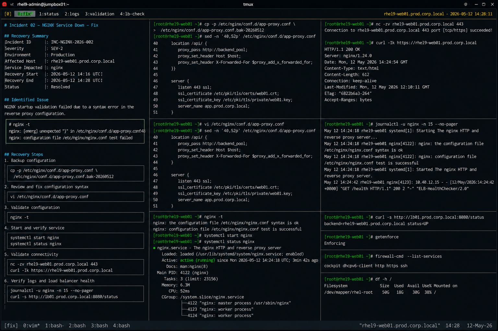

# Incident 02 — NGINX Service Down

## Overview

This document captures the recovery and remediation procedures executed during the NGINX service outage on `rhel9-web01.prod.corp.local`.

The recovery focused on restoring reverse proxy functionality and validating production web service availability.

---

# Recovery Summary

| Item | Details |
|---|---|
| Incident ID | INC-NGINX-2026-002 |
| Severity | SEV-2 |
| Environment | Production |
| Affected Host | rhel9-web01.prod.corp.local |
| Service Impacted | nginx |
| Recovery Start | 2026-05-12 14:16 UTC |
| Recovery End | 2026-05-12 14:28 UTC |
| Status | Resolved |

---

# Identified Issue

NGINX startup validation failed due to a syntax error within the reverse proxy configuration file.

Validation output:

```bash
nginx -t
```

Output:

```text
nginx: [emerg] unexpected "}" in /etc/nginx/conf.d/app-proxy.conf:48
nginx: configuration file /etc/nginx/nginx.conf test failed
```

The issue was isolated to an invalid closing brace within the application proxy configuration.

---

# Recovery Procedure

## Backup Existing Configuration

```bash
cp -p /etc/nginx/conf.d/app-proxy.conf /etc/nginx/conf.d/app-proxy.conf.bak-20260512
```

Configuration backup completed successfully.

---

## Review Affected Configuration

```bash
sed -n '40,52p' /etc/nginx/conf.d/app-proxy.conf
```

Output:

```text
location /api/ {
    proxy_pass http://backend_pool;
    proxy_set_header Host $host;
    proxy_set_header X-Forwarded-For $proxy_add_x_forwarded_for;
}}

server {
```

The configuration contained an additional closing brace.

---

## Correct Configuration Syntax

```bash
vi /etc/nginx/conf.d/app-proxy.conf
```

Corrected configuration:

```text
location /api/ {
    proxy_pass http://backend_pool;
    proxy_set_header Host $host;
    proxy_set_header X-Forwarded-For $proxy_add_x_forwarded_for;
}

server {
```

The invalid syntax was removed from the reverse proxy configuration.

---

# Configuration Validation

## Validate NGINX Configuration

```bash
nginx -t
```

Output:

```text
nginx: the configuration file /etc/nginx/nginx.conf syntax is ok
nginx: configuration file /etc/nginx/nginx.conf test is successful
```

Configuration validation completed successfully.

---

# Service Recovery

## Start NGINX Service

```bash
systemctl start nginx
```

---

## Verify NGINX Service Status

```bash
systemctl status nginx
```

Output:

```text
● nginx.service - The nginx HTTP and reverse proxy server
     Loaded: loaded (/usr/lib/systemd/system/nginx.service; enabled)
     Active: active (running)
   Main PID: 4122 (nginx)
```

NGINX service started successfully.

---

# Connectivity Validation

## Verify HTTPS Port Availability

```bash
nc -zv rhel9-web01.prod.corp.local 443
```

Output:

```text
Connection to rhel9-web01.prod.corp.local 443 port [tcp/https] succeeded!
```

HTTPS service connectivity was restored successfully.

---

## Validate HTTP Response

```bash
curl -Ik https://rhel9-web01.prod.corp.local
```

Output:

```text
HTTP/1.1 200 OK
Server: nginx/1.24.0
Content-Type: text/html
```

Web application response validation completed successfully.

---

# Log Validation

## Review NGINX Logs After Recovery

```bash
journalctl -u nginx -n 15 --no-pager
```

Output:

```text
May 12 14:24:18 rhel9-web01 systemd[1]: Started The nginx HTTP and reverse proxy server.
May 12 14:24:18 rhel9-web01 nginx[4122]: nginx: configuration file /etc/nginx/nginx.conf test is successful
```

No additional startup or configuration errors were detected.

---

# Load Balancer Validation

## Verify Backend Health Status

```bash
curl -s http://lb01.prod.corp.local:8080/status
```

Output:

```text
backend=rhel9-web01.prod.corp.local status=UP
```

Load balancer health checks returned to normal operation.

---

# SELinux Validation

## Verify SELinux Status

```bash
getenforce
```

Output:

```text
Enforcing
```

SELinux remained enabled throughout recovery activities.

---

# Validation Checklist

| Validation Item | Status |
|---|---|
| NGINX configuration validation | PASS |
| nginx service operational | PASS |
| HTTPS port accessible | PASS |
| HTTP response successful | PASS |
| Load balancer health restored | PASS |
| SELinux enforcing | PASS |

---

# Operational Notes

- Recovery actions were limited to NGINX configuration correction
- No firewall changes were required
- No operating system instability was observed
- Application backend services remained healthy during the incident

---

# Screenshot Reference


