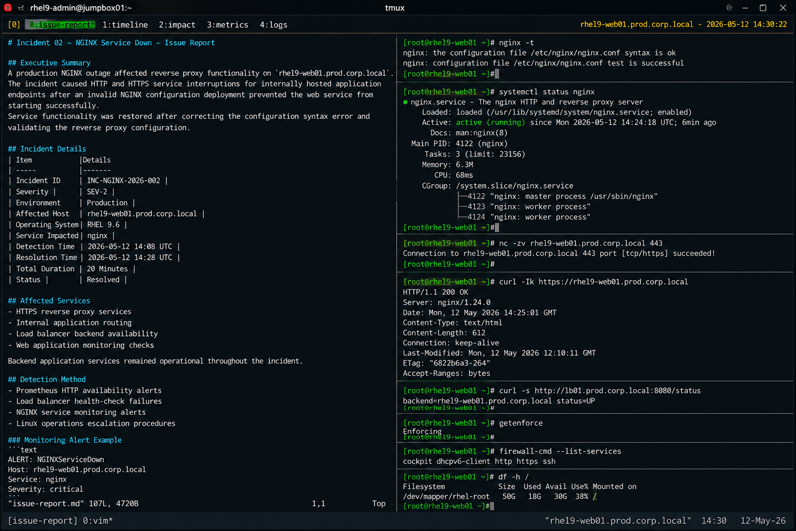

# Incident 02 — NGINX Service Down

## Executive Summary

A production NGINX outage affected reverse proxy functionality on `rhel9-web01.prod.corp.local`.

The incident caused HTTP and HTTPS service interruptions for internally hosted application endpoints after an invalid NGINX configuration deployment prevented the web service from starting successfully.

Service functionality was restored after correcting the configuration syntax error and validating the reverse proxy configuration.

---

# Incident Details

| Item | Details |
|---|---|
| Incident ID | INC-NGINX-2026-002 |
| Severity | SEV-2 |
| Environment | Production |
| Affected Host | rhel9-web01.prod.corp.local |
| Operating System | RHEL 9.6 |
| Service Impacted | nginx |
| Detection Time | 2026-05-12 14:08 UTC |
| Resolution Time | 2026-05-12 14:28 UTC |
| Total Duration | 20 Minutes |
| Status | Resolved |

---

# Affected Services

The following operational services were impacted during the outage:

- HTTPS reverse proxy services
- Internal application routing
- Load balancer backend availability
- Web application monitoring checks

Backend application services remained operational throughout the incident.

---

# Detection Method

The incident was detected through:

- Prometheus HTTP availability alerts
- Load balancer health-check failures
- NGINX service monitoring alerts
- Linux operations escalation procedures

Monitoring alert example:

```text
ALERT: NGINXServiceDown
Host: rhel9-web01.prod.corp.local
Service: nginx
Severity: critical
```

---

# User Impact

Operational impact during the incident included:

- HTTP and HTTPS requests unavailable
- Reverse proxy routing interrupted
- Internal web applications inaccessible
- Failed load balancer health checks
- Increased operational response activity

No operating system instability or backend application failures occurred.

---

# Timeline

| Time (UTC) | Event |
|---|---|
| 14:08 | Monitoring alerts triggered for nginx service failure |
| 14:10 | Linux operations team acknowledged incident |
| 14:12 | Network and service diagnostics completed |
| 14:15 | NGINX configuration syntax failure identified |
| 14:18 | Reverse proxy configuration corrected |
| 14:21 | NGINX configuration validation passed |
| 14:24 | nginx service restarted successfully |
| 14:28 | HTTPS service validation completed |

---

# Technical Findings

Investigation identified the following conditions:

- Network connectivity remained operational
- HTTPS ports were unavailable
- NGINX startup validation failed
- Reverse proxy configuration contained invalid syntax
- Load balancer health checks reported backend failure
- SELinux and firewall policies remained healthy

Relevant validation output:

```text
nginx: [emerg] unexpected "}" in /etc/nginx/conf.d/app-proxy.conf:48
nginx: configuration file /etc/nginx/nginx.conf test failed
```

---

# Root Cause Summary

The outage was caused by an invalid NGINX reverse proxy configuration deployed to the production server.

An unexpected closing brace within `/etc/nginx/conf.d/app-proxy.conf` caused NGINX startup validation to fail, preventing the web service from starting successfully.

The issue resulted in HTTP and HTTPS service unavailability until the configuration syntax was corrected.

---

# Recovery Actions

The following recovery actions were completed:

- Backed up the active NGINX configuration
- Identified the invalid configuration block
- Corrected reverse proxy syntax errors
- Validated NGINX configuration successfully
- Restarted nginx service
- Verified HTTPS connectivity
- Confirmed load balancer backend recovery

---

# Validation Results

| Validation Item | Result |
|---|---|
| NGINX configuration validation | PASS |
| nginx service operational | PASS |
| HTTPS connectivity restored | PASS |
| Load balancer backend healthy | PASS |
| Application routing restored | PASS |

---

# Operational Notes

- SELinux remained enabled throughout recovery operations
- No firewall modifications were required
- Backend application services remained healthy
- Recovery activities were limited to NGINX configuration remediation

---

# Screenshot Reference


