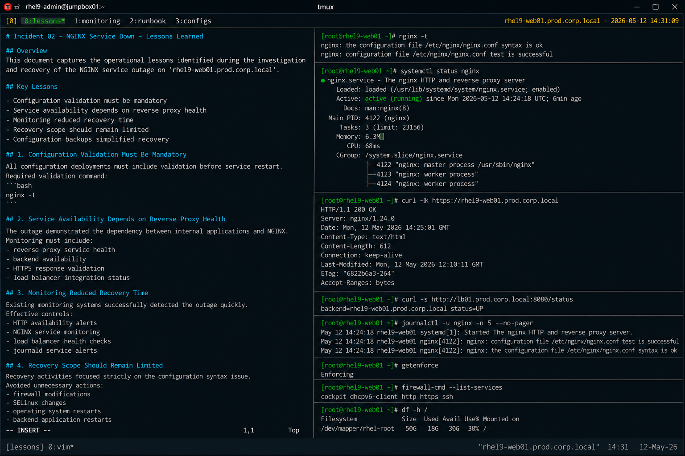

# Incident 02 — NGINX Service Down

## Overview

This document captures the operational lessons identified during the investigation and recovery of the NGINX service outage on `rhel9-web01.prod.corp.local`.

The objective is to improve configuration validation, deployment safety, and operational monitoring across the enterprise web infrastructure.

---

# Incident Summary

| Item | Details |
|---|---|
| Incident ID | INC-NGINX-2026-002 |
| Environment | Production |
| Affected Service | nginx |
| Platform | RHEL 9.6 |
| Duration | 20 Minutes |
| Status | Resolved |

---

# Key Lessons Identified

## Configuration Validation Must Be Mandatory

The incident confirmed that minor syntax errors within production NGINX configurations can immediately prevent service startup.

All configuration deployments must include validation before service restart activities.

Required validation command:

```bash
nginx -t
```

Configuration testing should be treated as a mandatory deployment requirement.

---

## Service Availability Depends on Reverse Proxy Health

The outage demonstrated the operational dependency between internal applications and the NGINX reverse proxy layer.

Although backend applications remained healthy, reverse proxy failure caused complete service unavailability for end users.

Operational monitoring must include:

- reverse proxy service health
- backend availability
- HTTPS response validation
- load balancer integration status

---

## Monitoring Reduced Recovery Time

Existing monitoring systems successfully detected the outage quickly.

The following controls proved effective:

- HTTP availability alerts
- NGINX service monitoring
- load balancer health checks
- journald service alerts

Rapid alerting reduced investigation and recovery duration.

---

## Recovery Scope Should Remain Limited

Recovery activities focused strictly on correcting the configuration syntax issue.

The following unnecessary actions were intentionally avoided:

- firewall modifications
- SELinux changes
- operating system restarts
- backend application restarts

Limiting recovery scope reduced operational risk and accelerated service restoration.

---

## Configuration Backups Simplified Recovery

Pre-change configuration backups provided rollback capability during recovery activities.

Operational teams should always preserve backup copies before modifying:

- NGINX virtual host files
- reverse proxy configurations
- SSL configuration blocks
- upstream backend definitions

---

# Operational Improvements

The following operational improvements were identified:

| Improvement Area | Action |
|---|---|
| Deployment Validation | Enforce mandatory `nginx -t` checks |
| Change Management | Require peer review for proxy configuration changes |
| Monitoring | Expand reverse proxy alert coverage |
| Automation | Add automated configuration validation |
| Documentation | Maintain standardized NGINX recovery procedures |

---

# Recommendations

## Automate Configuration Validation

All deployment pipelines should validate NGINX configuration syntax automatically before service restart operations.

Example validation workflow:

```bash
nginx -t && systemctl restart nginx
```

Automation should prevent invalid configurations from reaching production environments.

---

## Expand Service Health Monitoring

Additional monitoring controls should include:

- HTTPS endpoint testing
- reverse proxy startup failures
- configuration validation errors
- backend load balancer status

Example monitoring command:

```bash
systemctl status nginx
```

---

## Standardize Recovery Procedures

Operational runbooks should include:

- NGINX syntax validation
- journald troubleshooting procedures
- rollback validation steps
- HTTPS connectivity testing
- load balancer verification

Consistent recovery procedures improve operational response quality.

---

# Operational Takeaways

- Small syntax errors can create full service outages
- Reverse proxy layers are critical infrastructure components
- Configuration validation should always precede service restart operations
- Monitoring visibility directly improves incident response time
- Controlled recovery scope reduces operational risk

---

# Follow-Up Actions

| Action | Owner | Status |
|---|---|---|
| Add automated nginx validation checks | Platform Engineering | In Progress |
| Expand reverse proxy monitoring | Monitoring Team | Planned |
| Review deployment approval workflow | Linux Operations | Completed |
| Update NGINX recovery runbook | Infrastructure Team | Completed |

---

# Screenshot Reference


