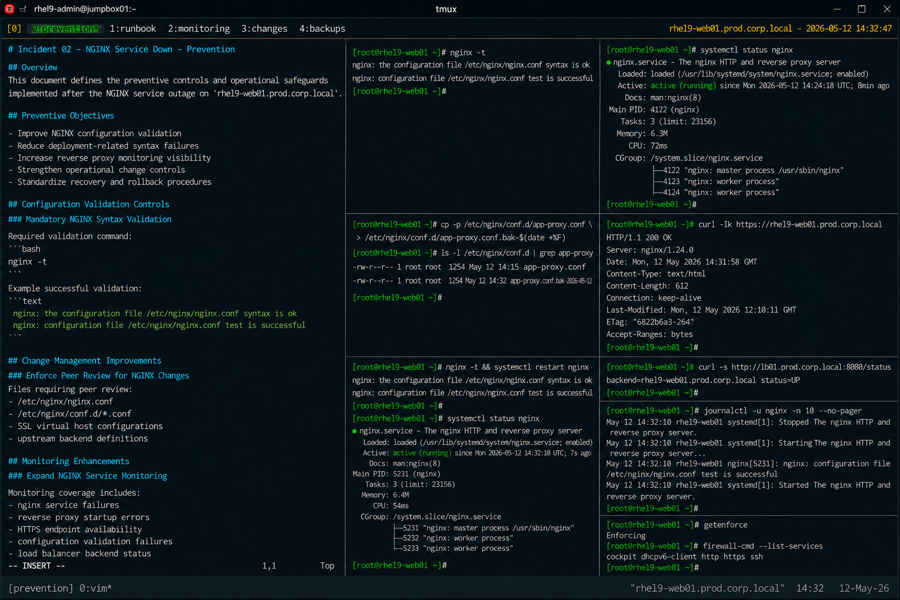

# Incident 02 — NGINX Service Down

## Overview

This document defines the preventive controls and operational safeguards implemented after the NGINX service outage on `rhel9-web01.prod.corp.local`.

The objective is to reduce the likelihood of future reverse proxy outages caused by invalid configuration deployments within the enterprise web infrastructure.

---

# Incident Summary

| Item | Details |
|---|---|
| Incident ID | INC-NGINX-2026-002 |
| Environment | Production |
| Affected Service | nginx |
| Platform | RHEL 9.6 |
| Root Cause Category | Configuration Validation Failure |
| Status | Preventive Controls Implemented |

---

# Preventive Objectives

The following preventive objectives were established after the incident:

- Improve NGINX configuration validation
- Reduce deployment-related syntax failures
- Increase reverse proxy monitoring visibility
- Strengthen operational change controls
- Standardize recovery and rollback procedures

---

# Configuration Validation Controls

## Mandatory NGINX Syntax Validation

All NGINX configuration changes must be validated before deployment or service restart operations.

Required validation command:

```bash
nginx -t
```

Example successful validation:

```text
nginx: the configuration file /etc/nginx/nginx.conf syntax is ok
nginx: configuration file /etc/nginx/nginx.conf test is successful
```

Invalid configurations must never be promoted into production environments.

---

## Validate Configuration Before Service Restart

Operational procedures now require validation before executing:

```bash
systemctl restart nginx
```

Deployment workflow:

```bash
nginx -t && systemctl restart nginx
```

This validation sequence prevents startup failures caused by syntax errors.

---

# Change Management Improvements

## Enforce Peer Review for NGINX Changes

All modifications involving the following files now require peer review approval:

- `/etc/nginx/nginx.conf`
- `/etc/nginx/conf.d/*.conf`
- SSL virtual host configurations
- upstream backend definitions

Review procedures must verify:

- configuration syntax
- reverse proxy logic
- upstream definitions
- HTTPS listener configuration

---

## Implement Configuration Backup Procedures

Configuration backups are now mandatory before modifying production web service configurations.

Example:

```bash
cp -p /etc/nginx/conf.d/app-proxy.conf \
/etc/nginx/conf.d/app-proxy.conf.bak-$(date +%F)
```

Rollback capability must remain available during all maintenance windows.

---

# Monitoring Enhancements

## Expand NGINX Service Monitoring

Monitoring coverage was expanded for:

- nginx service failures
- reverse proxy startup errors
- HTTPS endpoint availability
- configuration validation failures
- load balancer backend status

Example operational validation:

```bash
systemctl status nginx
```

---

## Implement HTTPS Health Checks

Additional health-check validation was added for production web services.

Validation example:

```bash
curl -Ik https://rhel9-web01.prod.corp.local
```

Expected result:

```text
HTTP/1.1 200 OK
```

Continuous endpoint validation improves outage detection speed.

---

# Operational Safeguards

## Restrict Emergency Service Changes

The following actions are prohibited during standard recovery procedures unless formally approved:

- disabling SELinux
- removing HTTPS security controls
- bypassing reverse proxy validation
- restarting unrelated production services

Recovery activities must remain limited to the identified service failure condition.

---

## Maintain Standardized Recovery Procedures

The Linux operations team implemented standardized runbooks for:

- NGINX startup failures
- reverse proxy troubleshooting
- configuration rollback procedures
- HTTPS validation testing
- load balancer verification

Operational documentation is maintained within the production support knowledge base.

---

# Validation Requirements

The following validation checklist must be completed after reverse proxy configuration changes:

| Validation Item | Requirement |
|---|---|
| NGINX syntax validation | Mandatory |
| nginx service verification | Mandatory |
| HTTPS endpoint validation | Mandatory |
| Load balancer health verification | Mandatory |
| Journald log review | Mandatory |
| Rollback validation | Mandatory |

---

# Preventive Measures Implemented

| Preventive Control | Status |
|---|---|
| Automated nginx validation | Implemented |
| Peer review workflow | Implemented |
| Reverse proxy monitoring expansion | Implemented |
| HTTPS health-check automation | Implemented |
| Configuration backup policy | Implemented |
| Recovery runbook standardization | Implemented |

---

# Operational Recommendations

- Validate all NGINX configurations before deployment
- Maintain rollback capability for reverse proxy changes
- Monitor HTTPS endpoints continuously
- Review journald logs after configuration updates
- Standardize reverse proxy deployment workflows

---

# Screenshot Reference


