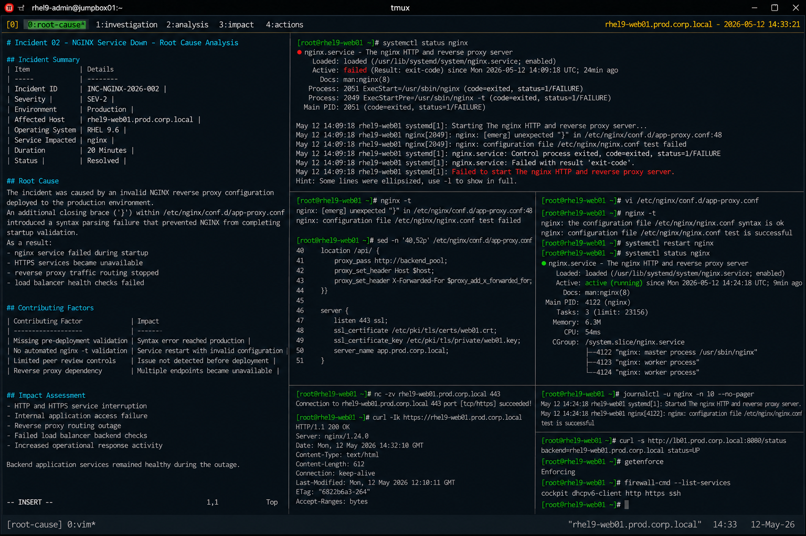

# Incident 02 — NGINX Service Down

## Overview

This document provides the root cause analysis (RCA) for the NGINX service outage affecting `rhel9-web01.prod.corp.local`.

The analysis identifies the technical failure condition, contributing operational factors, impact scope, and corrective actions implemented to restore reverse proxy functionality.

---

# Incident Summary

| Item | Details |
|---|---|
| Incident ID | INC-NGINX-2026-002 |
| Severity | SEV-2 |
| Environment | Production |
| Affected Host | rhel9-web01.prod.corp.local |
| Operating System | RHEL 9.6 |
| Service Impacted | nginx |
| Duration | 20 Minutes |
| Status | Resolved |

---

# Incident Description

Production reverse proxy services became unavailable after the NGINX service failed during startup validation.

The outage interrupted HTTP and HTTPS access to internally hosted application endpoints routed through the NGINX reverse proxy layer.

Although backend application services remained operational, traffic routing failed because the web service was unavailable.

---

# Detection Summary

The issue was detected through:

- NGINX service monitoring alerts
- HTTP availability failures
- Load balancer backend health-check failures
- Linux operations escalation

Example monitoring event:

```text
ALERT: NGINXServiceDown
Host: rhel9-web01.prod.corp.local
Severity: critical
```

---

# Technical Investigation

## Service Validation

The NGINX service was verified as failed during startup operations.

```bash
systemctl status nginx
```

Output:

```text
Active: failed (Result: exit-code)
```

Network connectivity to the server remained operational throughout the incident.

---

## Configuration Validation

NGINX configuration validation identified a syntax parsing failure.

```bash
nginx -t
```

Output:

```text
nginx: [emerg] unexpected "}" in /etc/nginx/conf.d/app-proxy.conf:48
nginx: configuration file /etc/nginx/nginx.conf test failed
```

The error confirmed a configuration syntax issue within the reverse proxy configuration file.

---

## Configuration Review

The affected configuration section was reviewed.

```bash
sed -n '40,52p' /etc/nginx/conf.d/app-proxy.conf
```

Output:

```text
location /api/ {
    proxy_pass http://backend_pool;
    proxy_set_header Host $host;
    proxy_set_header X-Forwarded-For $proxy_add_x_forwarded_for;
}}

server {
```

An unexpected closing brace caused NGINX startup validation to fail.

---

# Root Cause

The incident was caused by an invalid NGINX reverse proxy configuration deployed to the production environment.

An additional closing brace (`}`) within `/etc/nginx/conf.d/app-proxy.conf` introduced a syntax parsing failure that prevented NGINX from completing startup validation.

As a result:

- nginx service failed during startup
- HTTPS services became unavailable
- reverse proxy traffic routing stopped
- load balancer health checks failed

---

# Contributing Factors

The following operational conditions contributed to the incident:

| Contributing Factor | Impact |
|---|---|
| Missing pre-deployment validation | Syntax error reached production |
| No automated `nginx -t` validation | Service restart proceeded with invalid configuration |
| Limited peer review controls | Configuration issue was not detected before deployment |
| Reverse proxy dependency | Multiple application endpoints became unavailable |

---

# Impact Assessment

The incident caused the following operational impact:

- HTTP and HTTPS service interruption
- Internal application access failure
- Reverse proxy routing outage
- Failed load balancer backend checks
- Increased operational response activity

Backend application services remained healthy during the outage.

---

# Corrective Actions

The following corrective actions were completed:

- Backed up the existing configuration
- Corrected reverse proxy syntax errors
- Validated NGINX configuration successfully
- Restarted nginx service
- Verified HTTPS connectivity restoration
- Confirmed load balancer backend recovery

Corrected validation output:

```text
nginx: the configuration file /etc/nginx/nginx.conf syntax is ok
nginx: configuration file /etc/nginx/nginx.conf test is successful
```

---

# Validation Results

| Validation Item | Status |
|---|---|
| nginx service operational | PASS |
| HTTPS connectivity restored | PASS |
| Configuration validation successful | PASS |
| Load balancer backend healthy | PASS |
| Application routing restored | PASS |

---

# Preventive Recommendations

The following preventive measures were identified during RCA review:

- implement automated `nginx -t` validation
- require peer review for reverse proxy configuration changes
- standardize rollback procedures
- expand reverse proxy monitoring coverage
- automate HTTPS endpoint testing

---

# Final Assessment

The incident originated from a configuration validation failure rather than a platform or infrastructure outage.

The operating system, network connectivity, backend applications, SELinux policies, and firewall configuration remained healthy throughout the incident lifecycle.

The failure condition was isolated to an invalid reverse proxy configuration deployed to the NGINX service layer.

---

# Screenshot Reference


