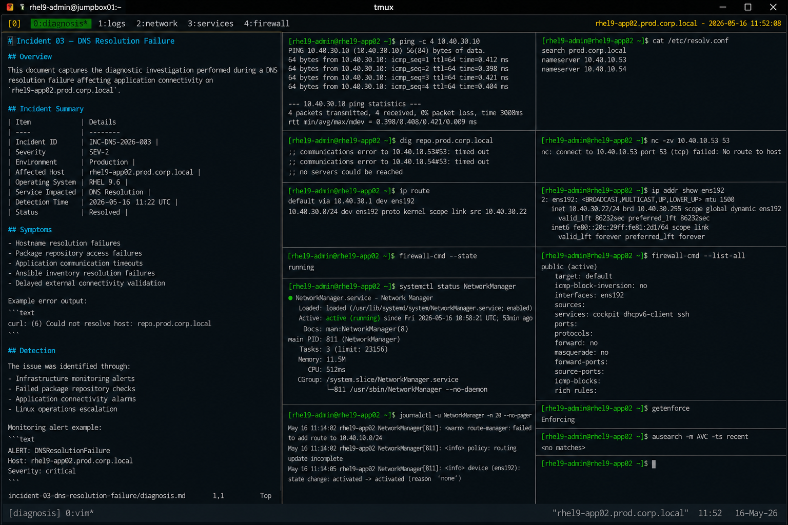

# Incident 03 — DNS Resolution Failure

## Overview

This document captures the diagnostic investigation performed during a DNS resolution failure affecting application connectivity on `rhel9-app02.prod.corp.local`.

The incident impacted internal hostname resolution required for application communication, package management operations, and infrastructure automation workflows.

---

# Incident Summary

| Item | Details |
|---|---|
| Incident ID | INC-DNS-2026-003 |
| Severity | SEV-2 |
| Environment | Production |
| Affected Host | rhel9-app02.prod.corp.local |
| Operating System | RHEL 9.6 |
| Service Impacted | DNS Resolution |
| Detection Time | 2026-05-16 11:22 UTC |
| Status | Resolved |

---

# Symptoms

Observed symptoms during the incident:

- Hostname resolution failures
- Package repository access failures
- Application communication timeouts
- Ansible inventory resolution failures
- Delayed external connectivity validation

Example error output:

```text
curl: (6) Could not resolve host: repo.prod.corp.local
```

---

# Detection

The issue was identified through:

- Infrastructure monitoring alerts
- Failed package repository checks
- Application connectivity alarms
- Linux operations escalation

Monitoring alert example:

```text
ALERT: DNSResolutionFailure
Host: rhel9-app02.prod.corp.local
Severity: critical
```

---

# Initial Validation

## Verify Network Connectivity

```bash
ping -c 4 10.40.30.10
```

Output:

```text
64 bytes from 10.40.30.10: icmp_seq=1 ttl=64 time=0.412 ms
64 bytes from 10.40.30.10: icmp_seq=2 ttl=64 time=0.398 ms
64 bytes from 10.40.30.10: icmp_seq=3 ttl=64 time=0.421 ms
64 bytes from 10.40.30.10: icmp_seq=4 ttl=64 time=0.404 ms
```

Basic network connectivity remained operational.

---

## Verify DNS Resolution

```bash
dig repo.prod.corp.local
```

Output:

```text
;; communications error to 10.40.10.53#53: timed out
;; communications error to 10.40.10.54#53: timed out

;; no servers could be reached
```

DNS resolution requests failed against configured DNS servers.

---

# Resolver Configuration Validation

## Review Resolver Configuration

```bash
cat /etc/resolv.conf
```

Output:

```text
search prod.corp.local
nameserver 10.40.10.53
nameserver 10.40.10.54
```

Configured DNS servers matched the enterprise baseline.

---

## Verify DNS Connectivity

```bash
nc -zv 10.40.10.53 53
```

Output:

```text
nc: connect to 10.40.10.53 port 53 (tcp) failed: No route to host
```

DNS service connectivity failed from the affected host.

---

# Routing Validation

## Verify Routing Table

```bash
ip route
```

Output:

```text
default via 10.40.30.1 dev ens192
10.40.30.0/24 dev ens192 proto kernel scope link src 10.40.30.22
```

No route existed for the DNS server subnet.

---

## Verify Interface Status

```bash
ip addr show ens192
```

Output:

```text
2: ens192: <BROADCAST,MULTICAST,UP,LOWER_UP> mtu 1500
    inet 10.40.30.22/24 brd 10.40.30.255 scope global dynamic ens192
```

Primary network interface remained operational.

---

# Firewall Validation

## Verify Firewall Status

```bash
firewall-cmd --state
```

Output:

```text
running
```

Firewall service remained operational.

---

## Review Active Zones

```bash
firewall-cmd --list-all
```

Output:

```text
public
  services: cockpit dhcpv6-client ssh
  ports:
```

No firewall rule changes were identified during the investigation.

---

# Service Validation

## Verify NetworkManager Status

```bash
systemctl status NetworkManager
```

Output:

```text
● NetworkManager.service - Network Manager
     Loaded: loaded (/usr/lib/systemd/system/NetworkManager.service; enabled)
     Active: active (running)
```

NetworkManager remained operational during the incident.

---

# Log Analysis

## Review Network Logs

```bash
journalctl -u NetworkManager -n 20 --no-pager
```

Output:

```text
May 16 11:14:02 rhel9-app02 NetworkManager[811]: <warn> route-manager: failed to add route to 10.40.10.0/24
May 16 11:14:02 rhel9-app02 NetworkManager[811]: <info> policy: routing update incomplete
```

The logs indicated a routing issue affecting DNS server reachability.

---

# SELinux Validation

## Verify SELinux Status

```bash
getenforce
```

Output:

```text
Enforcing
```

SELinux remained enabled and operational.

---

## Review AVC Denials

```bash
ausearch -m AVC -ts recent
```

Output:

```text
<no matches>
```

No SELinux policy denials related to DNS operations were identified.

---

# Investigation Findings

The investigation identified the outage as a network routing issue affecting DNS server accessibility.

Key findings:

- Basic network connectivity remained healthy
- DNS queries timed out
- Configured DNS servers were unreachable
- Resolver configuration remained correct
- NetworkManager reported route update failures
- No SELinux or firewall issues were identified
- DNS subnet routing information was missing

The issue was isolated to incomplete routing configuration affecting access to enterprise DNS servers.

---

# Operational Impact

- Hostname resolution failures
- Application communication disruption
- Package repository access interruption
- Failed infrastructure automation tasks
- Increased operational troubleshooting activity

No operating system instability was observed during the incident.

---

# Screenshot Reference


