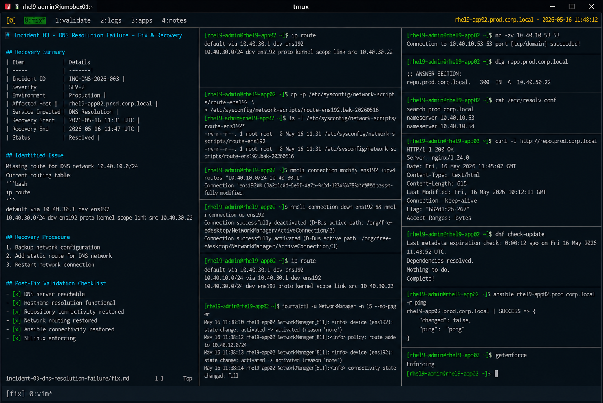

# Incident 03 — DNS Resolution Failure

## Overview

This document captures the remediation and recovery procedures executed during the DNS resolution outage on `rhel9-app02.prod.corp.local`.

The recovery focused on restoring enterprise DNS connectivity and validating hostname resolution functionality for production application services.

---

# Recovery Summary

| Item | Details |
|---|---|
| Incident ID | INC-DNS-2026-003 |
| Severity | SEV-2 |
| Environment | Production |
| Affected Host | rhel9-app02.prod.corp.local |
| Service Impacted | DNS Resolution |
| Recovery Start | 2026-05-16 11:31 UTC |
| Recovery End | 2026-05-16 11:47 UTC |
| Status | Resolved |

---

# Identified Issue

Investigation confirmed that the affected server was missing routing information required to reach the enterprise DNS subnet.

Current routing table:

```bash
ip route
```

Output:

```text
default via 10.40.30.1 dev ens192
10.40.30.0/24 dev ens192 proto kernel scope link src 10.40.30.22
```

No route existed for the DNS server network `10.40.10.0/24`.

---

# Recovery Procedure

## Backup Network Configuration

```bash
cp -p /etc/sysconfig/network-scripts/route-ens192 \
/etc/sysconfig/network-scripts/route-ens192.bak-20260516
```

Existing network configuration was backed up successfully.

---

## Add Static Route for DNS Network

```bash
nmcli connection modify ens192 +ipv4.routes "10.40.10.0/24 10.40.30.1"
```

The required route for enterprise DNS servers was added successfully.

---

## Restart Network Connection

```bash
nmcli connection down ens192 && nmcli connection up ens192
```

Network connection restart completed successfully.

---

# Routing Validation

## Verify Updated Routing Table

```bash
ip route
```

Output:

```text
default via 10.40.30.1 dev ens192
10.40.10.0/24 via 10.40.30.1 dev ens192
10.40.30.0/24 dev ens192 proto kernel scope link src 10.40.30.22
```

Required DNS subnet routing was restored successfully.

---

## Verify DNS Port Connectivity

```bash
nc -zv 10.40.10.53 53
```

Output:

```text
Connection to 10.40.10.53 53 port [tcp/domain] succeeded!
```

DNS server connectivity was restored successfully.

---

# DNS Validation

## Verify DNS Resolution

```bash
dig repo.prod.corp.local
```

Output:

```text
;; ANSWER SECTION:
repo.prod.corp.local. 300 IN A 10.40.50.22
```

Hostname resolution completed successfully.

---

## Validate Resolver Configuration

```bash
cat /etc/resolv.conf
```

Output:

```text
search prod.corp.local
nameserver 10.40.10.53
nameserver 10.40.10.54
```

Resolver configuration remained consistent with the enterprise standard.

---

# Application Validation

## Verify Repository Connectivity

```bash
curl -I http://repo.prod.corp.local
```

Output:

```text
HTTP/1.1 200 OK
Server: nginx/1.24.0
```

Repository connectivity validation completed successfully.

---

## Verify Package Manager Functionality

```bash
dnf check-update
```

Output:

```text
Last metadata expiration check: 0:00:12 ago on Fri 16 May 2026 11:43:52 UTC.
```

Package repository communication was restored successfully.

---

# Automation Validation

## Verify Ansible Connectivity

```bash
ansible rhel9-app02.prod.corp.local -m ping
```

Output:

```text
rhel9-app02.prod.corp.local | SUCCESS => {
    "changed": false,
    "ping": "pong"
}
```

Infrastructure automation functionality returned to normal operation.

---

# Log Validation

## Review NetworkManager Logs

```bash
journalctl -u NetworkManager -n 15 --no-pager
```

Output:

```text
May 16 11:38:12 rhel9-app02 NetworkManager[811]: <info> policy: route added to 10.40.10.0/24
May 16 11:38:14 rhel9-app02 NetworkManager[811]: <info> connectivity state changed: full
```

No additional routing failures were detected after recovery.

---

# SELinux Validation

## Verify SELinux Status

```bash
getenforce
```

Output:

```text
Enforcing
```

SELinux remained enabled throughout recovery activities.

---

# Validation Checklist

| Validation Item | Status |
|---|---|
| DNS server reachable | PASS |
| Hostname resolution functional | PASS |
| Repository connectivity restored | PASS |
| Network routing restored | PASS |
| Ansible connectivity restored | PASS |
| SELinux enforcing | PASS |

---

# Operational Notes

- Recovery activities were limited to routing configuration correction
- No firewall modifications were required
- Resolver configuration remained unchanged
- Network connectivity remained stable during recovery operations

---

# Screenshot Reference


