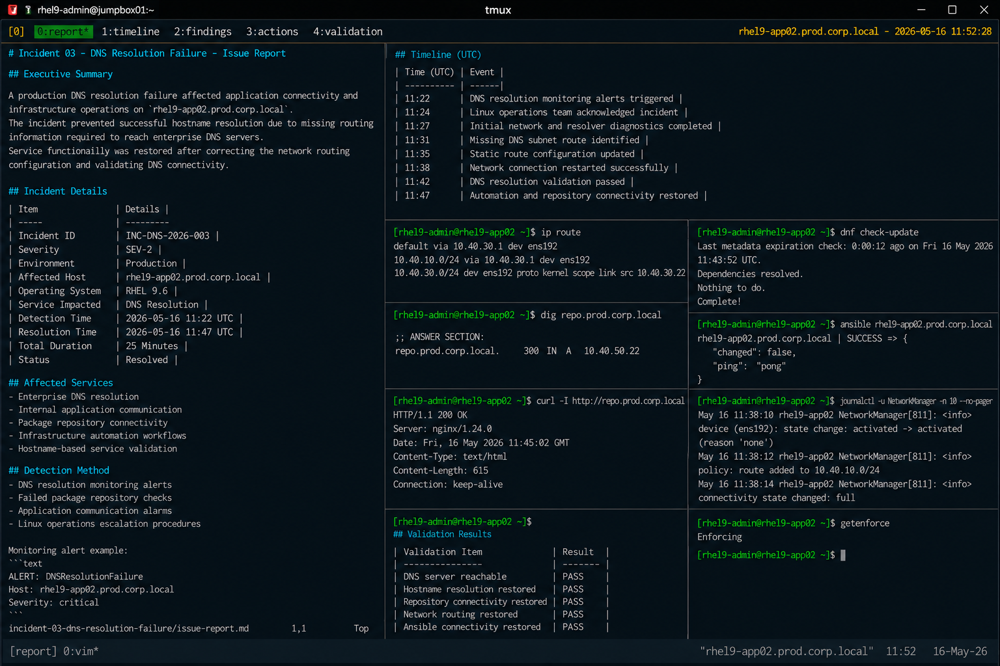

# Incident 03 — DNS Resolution Failure

## Executive Summary

A production DNS resolution failure affected application connectivity and infrastructure operations on `rhel9-app02.prod.corp.local`.

The incident prevented successful hostname resolution due to missing routing information required to reach enterprise DNS servers. The issue impacted application communication, package management operations, and automation workflows.

Service functionality was restored after correcting the network routing configuration and validating DNS connectivity.

---

# Incident Details

| Item | Details |
|---|---|
| Incident ID | INC-DNS-2026-003 |
| Severity | SEV-2 |
| Environment | Production |
| Affected Host | rhel9-app02.prod.corp.local |
| Operating System | RHEL 9.6 |
| Service Impacted | DNS Resolution |
| Detection Time | 2026-05-16 11:22 UTC |
| Resolution Time | 2026-05-16 11:47 UTC |
| Total Duration | 25 Minutes |
| Status | Resolved |

---

# Affected Services

The following operational services were impacted during the incident:

- Enterprise DNS resolution
- Internal application communication
- Package repository connectivity
- Infrastructure automation workflows
- Hostname-based service validation

No operating system instability occurred during the outage.

---

# Detection Method

The incident was detected through:

- DNS resolution monitoring alerts
- Failed package repository checks
- Application communication alarms
- Linux operations escalation procedures

Monitoring alert example:

```text
ALERT: DNSResolutionFailure
Host: rhel9-app02.prod.corp.local
Severity: critical
```

---

# User Impact

Operational impact during the incident included:

- Failed hostname resolution requests
- Application communication timeouts
- Package management failures
- Interrupted automation workflows
- Increased operational troubleshooting activity

IP-based connectivity remained operational throughout the incident.

---

# Timeline

| Time (UTC) | Event |
|---|---|
| 11:22 | DNS resolution monitoring alerts triggered |
| 11:24 | Linux operations team acknowledged incident |
| 11:27 | Initial network and resolver diagnostics completed |
| 11:31 | Missing DNS subnet route identified |
| 11:35 | Static route configuration updated |
| 11:38 | Network connection restarted successfully |
| 11:42 | DNS resolution validation passed |
| 11:47 | Automation and repository connectivity restored |

---

# Technical Findings

Investigation identified the following conditions:

- Basic network connectivity remained operational
- DNS servers were unreachable from the affected host
- Resolver configuration remained correct
- DNS queries timed out
- NetworkManager reported routing update failures
- No SELinux or firewall issues were identified

Relevant validation output:

```text
;; communications error to 10.40.10.53#53: timed out
;; no servers could be reached
```

---

# Root Cause Summary

The outage was caused by missing routing information for the enterprise DNS server subnet.

The affected system lacked a valid route to `10.40.10.0/24`, preventing communication with configured DNS servers.

As a result:

- DNS queries failed
- hostname resolution became unavailable
- application communication was interrupted
- infrastructure automation workflows failed

---

# Recovery Actions

The following recovery actions were completed:

- Backed up network routing configuration
- Added static route for the DNS subnet
- Restarted the network connection
- Validated DNS server connectivity
- Verified hostname resolution functionality
- Confirmed package repository access
- Restored automation connectivity

---

# Validation Results

| Validation Item | Result |
|---|---|
| DNS server reachable | PASS |
| Hostname resolution restored | PASS |
| Repository connectivity restored | PASS |
| Network routing restored | PASS |
| Ansible connectivity restored | PASS |

---

# Operational Notes

- Resolver configuration remained unchanged during recovery
- SELinux remained enabled throughout remediation activities
- No firewall modifications were required
- Recovery activities were limited to routing configuration correction

---

# Screenshot Reference


