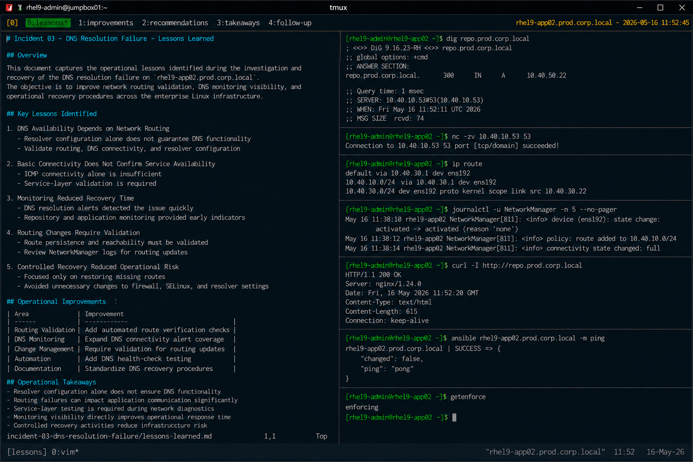

# Incident 03 — DNS Resolution Failure

## Overview

This document captures the operational lessons identified during the investigation and recovery of the DNS resolution failure on `rhel9-app02.prod.corp.local`.

The objective is to improve network routing validation, DNS monitoring visibility, and operational recovery procedures across the enterprise Linux infrastructure.

---

# Incident Summary

| Item | Details |
|---|---|
| Incident ID | INC-DNS-2026-003 |
| Environment | Production |
| Affected Service | DNS Resolution |
| Platform | RHEL 9.6 |
| Duration | 25 Minutes |
| Status | Resolved |

---

# Key Lessons Identified

## DNS Availability Depends on Network Routing

The incident confirmed that correct resolver configuration alone does not guarantee DNS functionality.

Although `/etc/resolv.conf` contained valid enterprise DNS servers, missing network routes prevented communication with the DNS subnet.

Operational validation must include:

- DNS server reachability
- routing table verification
- resolver configuration review
- DNS query testing

---

## Basic Connectivity Does Not Confirm Service Availability

The affected host maintained successful IP connectivity while DNS operations remained unavailable.

This demonstrated that:

- ICMP connectivity alone is insufficient
- service-layer validation is required
- DNS communication testing must be included in diagnostics

Required validation commands:

```bash
dig repo.prod.corp.local
```

```bash
nc -zv 10.40.10.53 53
```

---

## Monitoring Reduced Recovery Time

Existing monitoring systems successfully detected the DNS outage quickly.

The following controls proved effective:

- DNS resolution monitoring alerts
- package repository validation checks
- application connectivity monitoring
- NetworkManager journald logging

Rapid detection reduced operational impact and recovery duration.

---

## Network Routing Changes Require Validation

The incident highlighted operational risks associated with incomplete routing configuration updates.

Routing modifications must include:

- route persistence validation
- DNS subnet reachability testing
- NetworkManager log review
- post-change connectivity verification

Example validation:

```bash
ip route
```

---

## Controlled Recovery Reduced Operational Risk

Recovery activities focused strictly on restoring missing network routes.

The following unnecessary actions were intentionally avoided:

- firewall modifications
- resolver configuration changes
- SELinux changes
- operating system restarts

Maintaining a narrow recovery scope reduced operational risk and accelerated restoration efforts.

---

# Operational Improvements

The following operational improvements were identified:

| Improvement Area | Action |
|---|---|
| Routing Validation | Add automated route verification checks |
| DNS Monitoring | Expand DNS connectivity alert coverage |
| Change Management | Require validation for routing updates |
| Automation | Add DNS health-check testing |
| Documentation | Standardize DNS recovery procedures |

---

# Recommendations

## Standardize DNS Validation Procedures

All network troubleshooting procedures should include:

```bash
dig <hostname>
```

```bash
ip route
```

```bash
journalctl -u NetworkManager
```

Operational validation should confirm both routing and DNS server accessibility.

---

## Expand Monitoring Coverage

Additional monitoring controls should include:

- DNS query latency
- DNS server connectivity
- routing failures
- package repository resolution failures
- NetworkManager route update errors

Expanded monitoring visibility improves outage detection speed.

---

## Automate Network Validation

Infrastructure automation should validate:

- DNS resolution functionality
- route persistence
- enterprise subnet reachability
- repository connectivity

Automation-based validation reduces operational exposure to routing-related failures.

---

# Operational Takeaways

- Resolver configuration alone does not ensure DNS functionality
- Routing failures can impact application communication significantly
- Service-layer testing is required during network diagnostics
- Monitoring visibility directly improves operational response time
- Controlled recovery activities reduce infrastructure risk

---

# Follow-Up Actions

| Action | Owner | Status |
|---|---|---|
| Implement route validation automation | Platform Engineering | In Progress |
| Expand DNS monitoring coverage | Monitoring Team | Planned |
| Review routing change procedures | Linux Operations | Completed |
| Update DNS recovery runbook | Infrastructure Team | Completed |

---

# Screenshot Reference


