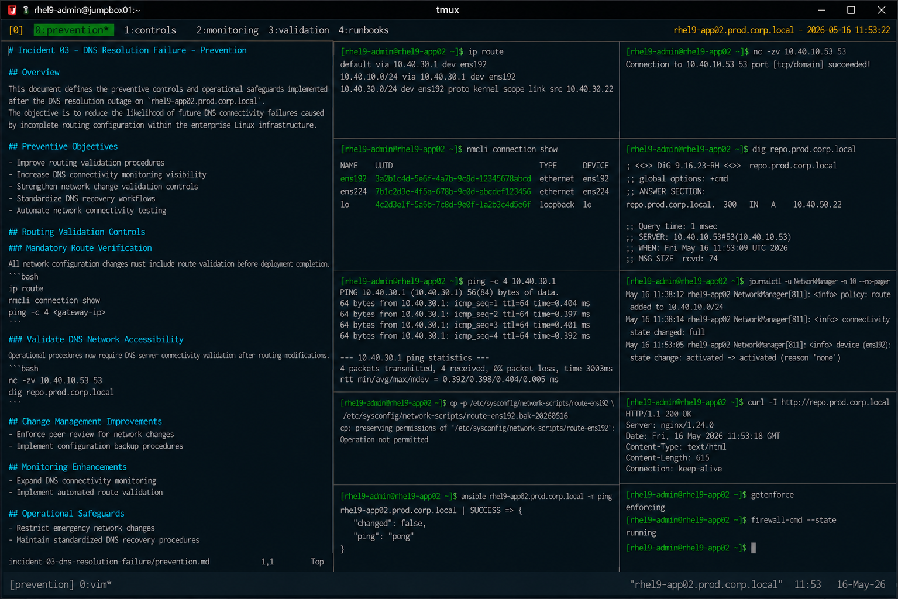

# Incident 03 — DNS Resolution Failure

## Overview

This document defines the preventive controls and operational safeguards implemented after the DNS resolution outage on `rhel9-app02.prod.corp.local`.

The objective is to reduce the likelihood of future DNS connectivity failures caused by incomplete routing configuration within the enterprise Linux infrastructure.

---

# Incident Summary

| Item | Details |
|---|---|
| Incident ID | INC-DNS-2026-003 |
| Environment | Production |
| Affected Service | DNS Resolution |
| Platform | RHEL 9.6 |
| Root Cause Category | Network Routing Misconfiguration |
| Status | Preventive Controls Implemented |

---

# Preventive Objectives

The following preventive objectives were established after the incident:

- Improve routing validation procedures
- Increase DNS connectivity monitoring visibility
- Strengthen network change validation controls
- Standardize DNS recovery workflows
- Automate network connectivity testing

---

# Routing Validation Controls

## Mandatory Route Verification

All network configuration changes must include route validation before deployment completion.

Required validation commands:

```bash
ip route
```

```bash
nmcli connection show
```

```bash
ping -c 4 <gateway-ip>
```

Routing validation must confirm reachability for all required enterprise subnets.

---

## Validate DNS Network Accessibility

Operational procedures now require DNS server connectivity validation after routing modifications.

Required validation:

```bash
nc -zv 10.40.10.53 53
```

```bash
dig repo.prod.corp.local
```

Example successful output:

```text
Connection to 10.40.10.53 53 port [tcp/domain] succeeded!
```

DNS communication testing must be completed before closing maintenance activities.

---

# Change Management Improvements

## Enforce Peer Review for Network Changes

All modifications involving the following components now require peer review approval:

- static routing configuration
- NetworkManager connection profiles
- DNS-related network updates
- enterprise subnet routing policies

Review procedures must verify:

- route persistence
- subnet accessibility
- DNS reachability
- rollback capability

---

## Implement Network Configuration Backup Procedures

Configuration backups are now mandatory before network-related modifications.

Example:

```bash
cp -p /etc/sysconfig/network-scripts/route-ens192 \
/etc/sysconfig/network-scripts/route-ens192.bak-$(date +%F)
```

Rollback procedures must remain available throughout maintenance windows.

---

# Monitoring Enhancements

## Expand DNS Connectivity Monitoring

Monitoring coverage was expanded for:

- DNS query failures
- unreachable DNS servers
- routing update failures
- package repository resolution failures
- NetworkManager connectivity errors

Example monitoring validation:

```bash
dig repo.prod.corp.local
```

---

## Implement Automated Route Validation

Infrastructure automation now validates:

- enterprise route availability
- DNS subnet reachability
- resolver functionality
- package repository access

Example automation workflow:

```bash
ansible all -m ping
```

Automated validation reduces operational exposure to routing-related failures.

---

# Operational Safeguards

## Restrict Emergency Network Changes

The following actions are prohibited during standard incident recovery unless formally approved:

- disabling firewalld
- modifying resolver configuration unnecessarily
- disabling SELinux
- restarting unrelated network services

Recovery activities must remain limited to the identified failure condition.

---

## Maintain Standardized DNS Recovery Procedures

The Linux operations team implemented standardized runbooks for:

- DNS resolution failures
- routing troubleshooting
- NetworkManager recovery
- enterprise subnet validation
- repository connectivity testing

Operational procedures are maintained within the enterprise support knowledge base.

---

# Validation Requirements

The following validation checklist must be completed after network routing changes:

| Validation Item | Requirement |
|---|---|
| Route validation | Mandatory |
| DNS server reachability | Mandatory |
| DNS resolution testing | Mandatory |
| Repository connectivity validation | Mandatory |
| NetworkManager log review | Mandatory |
| Automation connectivity test | Mandatory |

---

# Preventive Measures Implemented

| Preventive Control | Status |
|---|---|
| Route validation automation | Implemented |
| DNS monitoring expansion | Implemented |
| Network peer review workflow | Implemented |
| DNS connectivity testing | Implemented |
| Configuration backup policy | Implemented |
| Recovery runbook standardization | Implemented |

---

# Operational Recommendations

- Validate enterprise routes after all network changes
- Test DNS communication directly during troubleshooting
- Maintain rollback capability for routing modifications
- Review NetworkManager logs after configuration updates
- Automate DNS and route validation workflows

---

# Screenshot Reference


