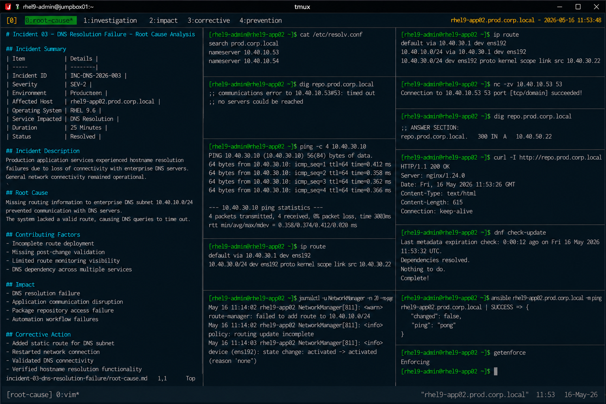

# Incident 03 — DNS Resolution Failure

## Overview

This document provides the root cause analysis (RCA) for the DNS resolution failure affecting `rhel9-app02.prod.corp.local`.

The analysis identifies the technical failure condition, contributing operational factors, impact scope, and corrective actions implemented to restore enterprise DNS connectivity.

---

# Incident Summary

| Item | Details |
|---|---|
| Incident ID | INC-DNS-2026-003 |
| Severity | SEV-2 |
| Environment | Production |
| Affected Host | rhel9-app02.prod.corp.local |
| Operating System | RHEL 9.6 |
| Service Impacted | DNS Resolution |
| Duration | 25 Minutes |
| Status | Resolved |

---

# Incident Description

Production application services experienced hostname resolution failures due to loss of connectivity with enterprise DNS servers.

The issue disrupted:

- internal application communication
- package repository access
- automation workflows
- hostname-based service validation

Although general network connectivity remained operational, DNS communication requests consistently failed.

---

# Detection Summary

The issue was detected through:

- DNS resolution monitoring alerts
- package repository access failures
- application communication alarms
- Linux operations escalation procedures

Example monitoring event:

```text
ALERT: DNSResolutionFailure
Host: rhel9-app02.prod.corp.local
Severity: critical
```

---

# Technical Investigation

## Resolver Validation

Resolver configuration was reviewed and matched enterprise standards.

```bash
cat /etc/resolv.conf
```

Output:

```text
search prod.corp.local
nameserver 10.40.10.53
nameserver 10.40.10.54
```

No resolver configuration issues were identified.

---

## DNS Connectivity Validation

DNS communication tests failed against configured enterprise DNS servers.

```bash
dig repo.prod.corp.local
```

Output:

```text
;; communications error to 10.40.10.53#53: timed out
;; no servers could be reached
```

---

## Network Connectivity Validation

Basic network communication remained operational.

```bash
ping -c 4 10.40.30.10
```

Output:

```text
64 bytes from 10.40.30.10: icmp_seq=1 ttl=64 time=0.412 ms
```

This confirmed that the issue was isolated to DNS communication rather than general network failure.

---

## Route Validation

Routing configuration review identified missing DNS subnet routes.

```bash
ip route
```

Output:

```text
default via 10.40.30.1 dev ens192
10.40.30.0/24 dev ens192 proto kernel scope link src 10.40.30.22
```

The required route for `10.40.10.0/24` was absent.

---

## NetworkManager Log Review

NetworkManager logs confirmed routing update failures.

```bash
journalctl -u NetworkManager -n 20 --no-pager
```

Output:

```text
May 16 11:14:02 rhel9-app02 NetworkManager[811]: <warn> route-manager: failed to add route to 10.40.10.0/24
May 16 11:14:02 rhel9-app02 NetworkManager[811]: <info> policy: routing update incomplete
```

The logs validated incomplete routing configuration during network initialization.

---

# Root Cause

The incident was caused by missing routing information required to reach the enterprise DNS server subnet.

The affected system lacked a valid route to the `10.40.10.0/24` network, preventing successful communication with configured DNS servers.

As a result:

- DNS queries timed out
- hostname resolution failed
- package repository communication stopped
- application communication degraded
- automation workflows failed

---

# Contributing Factors

The following operational conditions contributed to the incident:

| Contributing Factor | Impact |
|---|---|
| Incomplete route deployment | DNS subnet became unreachable |
| Missing post-change validation | Routing issue was not detected immediately |
| Limited route monitoring visibility | Recovery required manual investigation |
| DNS dependency across services | Multiple operational systems were impacted |

---

# Impact Assessment

The incident caused the following operational impact:

- DNS resolution failure
- interrupted application communication
- package repository access disruption
- automation connectivity failures
- increased operational response activity

No operating system instability occurred during the incident.

---

# Corrective Actions

The following corrective actions were completed:

- Added static route for the DNS subnet
- Restarted the network connection
- Validated DNS server connectivity
- Verified hostname resolution functionality
- Confirmed repository connectivity restoration
- Restored automation communication

Updated routing table:

```text
default via 10.40.30.1 dev ens192
10.40.10.0/24 via 10.40.30.1 dev ens192
10.40.30.0/24 dev ens192 proto kernel scope link src 10.40.30.22
```

---

# Validation Results

| Validation Item | Status |
|---|---|
| DNS server reachable | PASS |
| Hostname resolution restored | PASS |
| Package repository access restored | PASS |
| Network routing restored | PASS |
| Automation connectivity restored | PASS |

---

# Preventive Recommendations

The following preventive measures were identified during RCA review:

- automate route validation checks
- expand DNS connectivity monitoring
- require peer review for routing changes
- standardize network recovery procedures
- automate DNS health-check validation

---

# Final Assessment

The incident originated from incomplete routing configuration rather than DNS server failure or resolver misconfiguration.

The operating system, firewall configuration, SELinux policies, and general network connectivity remained healthy throughout the incident lifecycle.

The failure condition was isolated to missing network routing information affecting enterprise DNS server communication.

---

# Screenshot Reference


