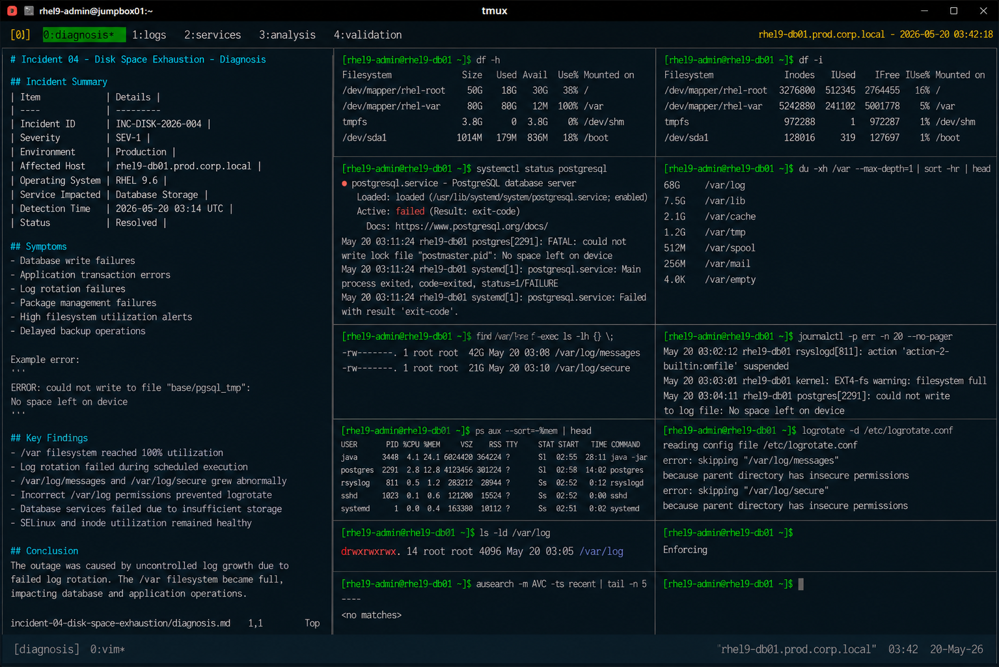

# Incident 04 — Disk Space Exhaustion

## Overview

This document captures the diagnostic investigation performed during a disk space exhaustion incident affecting `rhel9-db01.prod.corp.local`.

The incident resulted in application instability, failed write operations, and service degradation caused by filesystem utilization reaching critical thresholds on the production database server.

---

# Incident Summary

| Item | Details |
|---|---|
| Incident ID | INC-DISK-2026-004 |
| Severity | SEV-1 |
| Environment | Production |
| Affected Host | rhel9-db01.prod.corp.local |
| Operating System | RHEL 9.6 |
| Service Impacted | Database Storage |
| Detection Time | 2026-05-20 03:14 UTC |
| Status | Resolved |

---

# Symptoms

Observed symptoms during the incident:

- Database write failures
- Application transaction errors
- Log rotation failures
- Package management failures
- High filesystem utilization alerts
- Delayed backup operations

Example application error:

```text
ERROR: could not write to file "base/pgsql_tmp": No space left on device
```

---

# Detection

The issue was identified through:

- filesystem utilization monitoring alerts
- database service alarms
- failed backup notifications
- Linux operations escalation

Monitoring alert example:

```text
ALERT: FilesystemUsageCritical
Host: rhel9-db01.prod.corp.local
MountPoint: /var
Usage: 100%
Severity: critical
```

---

# Initial Validation

## Verify Filesystem Utilization

```bash
df -h
```

Output:

```text
Filesystem               Size  Used Avail Use% Mounted on
/dev/mapper/rhel-var      80G   80G   12M 100% /var
/dev/mapper/rhel-root     50G   18G   30G  38% /
```

The `/var` filesystem reached full capacity.

---

## Verify Inode Utilization

```bash
df -i
```

Output:

```text
Filesystem                Inodes  IUsed   IFree IUse% Mounted on
/dev/mapper/rhel-var     5242880 241102 5001778    5% /var
```

Inode exhaustion was not identified.

---

# Service Validation

## Verify PostgreSQL Service Status

```bash
systemctl status postgresql
```

Output:

```text
● postgresql.service - PostgreSQL database server
     Loaded: loaded (/usr/lib/systemd/system/postgresql.service; enabled)
     Active: failed (Result: exit-code)

May 20 03:11:24 rhel9-db01 postgres[2291]: FATAL: could not write lock file "postmaster.pid": No space left on device
```

The database service failed due to insufficient storage capacity.

---

# Disk Usage Analysis

## Identify Large Directories

```bash
du -xh /var --max-depth=1 | sort -hr | head
```

Output:

```text
68G     /var/log
7.5G    /var/lib
2.1G    /var/cache
```

Excessive log growth was identified under `/var/log`.

---

## Identify Large Log Files

```bash
find /var/log -type f -size +1G -exec ls -lh {} \;
```

Output:

```text
-rw-------. 1 root root 42G May 20 03:08 /var/log/messages
-rw-------. 1 root root 21G May 20 03:10 /var/log/secure
```

System log files consumed the majority of filesystem capacity.

---

# Log Analysis

## Review System Logging Activity

```bash
journalctl -p err -n 20 --no-pager
```

Output:

```text
May 20 03:02:12 rhel9-db01 rsyslogd[811]: action 'action-2-builtin:omfile' suspended
May 20 03:03:01 rhel9-db01 kernel: EXT4-fs warning: filesystem full
May 20 03:04:11 rhel9-db01 postgres[2291]: could not write to log file: No space left on device
```

Logging activity confirmed filesystem exhaustion.

---

# Process Validation

## Identify High Log Generation Processes

```bash
ps aux --sort=-%mem | head
```

Output:

```text
postgres  2291 12.8 18.4 4123456 301224 ? Sl  02:58  14:02 /usr/bin/postgres
java      3448 24.1 22.2 6024420 364224 ? Sl  02:55  28:11 /usr/bin/java -jar app-service.jar
```

Application services generated elevated logging activity during the incident window.

---

# Log Rotation Validation

## Verify Logrotate Status

```bash
logrotate -d /etc/logrotate.conf
```

Output:

```text
error: skipping "/var/log/messages" because parent directory has insecure permissions
```

Log rotation failed due to invalid directory permission configuration.

---

# Filesystem Permission Validation

## Review Log Directory Permissions

```bash
ls -ld /var/log
```

Output:

```text
drwxrwxrwx. 14 root root 4096 May 20 03:05 /var/log
```

The `/var/log` directory permissions deviated from enterprise security standards.

---

# SELinux Validation

## Verify SELinux Status

```bash
getenforce
```

Output:

```text
Enforcing
```

SELinux remained enabled throughout the incident.

---

## Review AVC Denials

```bash
ausearch -m AVC -ts recent
```

Output:

```text
<no matches>
```

No SELinux denials related to filesystem operations were identified.

---

# Investigation Findings

The investigation identified uncontrolled log growth as the primary contributor to filesystem exhaustion.

Key findings:

- `/var` filesystem reached 100% utilization
- log rotation failed during scheduled execution
- `/var/log/messages` and `/var/log/secure` grew abnormally
- incorrect `/var/log` permissions prevented logrotate execution
- database services failed due to insufficient storage
- SELinux and inode utilization remained healthy

The outage was isolated to uncontrolled log accumulation caused by failed log rotation procedures.

---

# Operational Impact

- Database write failures
- Application transaction instability
- Logging subsystem degradation
- Backup operation delays
- Increased operational response activity

No operating system kernel instability occurred during the incident.

---

# Screenshot Reference


