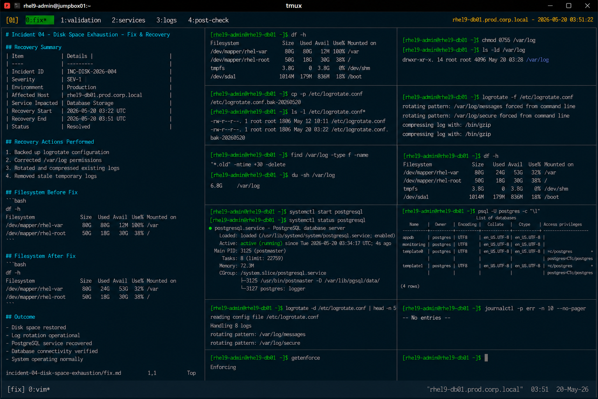

# Incident 04 — Disk Space Exhaustion

## Overview

This document captures the remediation and recovery procedures executed during the disk space exhaustion incident on `rhel9-db01.prod.corp.local`.

The recovery focused on restoring filesystem capacity, stabilizing database operations, and correcting failed log rotation configuration.

---

# Recovery Summary

| Item | Details |
|---|---|
| Incident ID | INC-DISK-2026-004 |
| Severity | SEV-1 |
| Environment | Production |
| Affected Host | rhel9-db01.prod.corp.local |
| Service Impacted | Database Storage |
| Recovery Start | 2026-05-20 03:22 UTC |
| Recovery End | 2026-05-20 03:51 UTC |
| Status | Resolved |

---

# Identified Issue

The `/var` filesystem reached 100% utilization due to uncontrolled log growth caused by failed log rotation.

Filesystem validation:

```bash
df -h
```

Output:

```text
Filesystem               Size  Used Avail Use% Mounted on
/dev/mapper/rhel-var      80G   80G   12M 100% /var
```

Large log files identified:

```bash
find /var/log -type f -size +1G -exec ls -lh {} \;
```

Output:

```text
-rw-------. 1 root root 42G May 20 03:08 /var/log/messages
-rw-------. 1 root root 21G May 20 03:10 /var/log/secure
```

---

# Recovery Procedure

## Backup Existing Logrotate Configuration

```bash
cp -p /etc/logrotate.conf /etc/logrotate.conf.bak-20260520
```

Configuration backup completed successfully.

---

## Correct Log Directory Permissions

```bash
chmod 0755 /var/log
```

Updated directory permissions:

```bash
ls -ld /var/log
```

Output:

```text
drwxr-xr-x. 14 root root 4096 May 20 03:28 /var/log
```

Directory permissions were restored to enterprise baseline standards.

---

## Rotate and Compress Existing Logs

```bash
logrotate -f /etc/logrotate.conf
```

Output:

```text
rotating pattern: /var/log/messages forced from command line
compressing log with: /bin/gzip
```

Log rotation completed successfully.

---

## Remove Stale Temporary Logs

```bash
find /var/log -type f -name "*.old" -mtime +30 -delete
```

Temporary archived logs were removed successfully.

---

# Filesystem Validation

## Verify Available Disk Space

```bash
df -h
```

Output:

```text
Filesystem               Size  Used Avail Use% Mounted on
/dev/mapper/rhel-var      80G   24G   53G  32% /var
```

Filesystem capacity returned to healthy operational levels.

---

## Verify Log Directory Usage

```bash
du -sh /var/log
```

Output:

```text
6.8G    /var/log
```

Log storage utilization normalized successfully.

---

# Service Recovery

## Start PostgreSQL Service

```bash
systemctl start postgresql
```

---

## Verify PostgreSQL Service Status

```bash
systemctl status postgresql
```

Output:

```text
● postgresql.service - PostgreSQL database server
     Loaded: loaded (/usr/lib/systemd/system/postgresql.service; enabled)
     Active: active (running)
```

Database services recovered successfully.

---

# Database Validation

## Verify Database Connectivity

```bash
psql -U postgres -c "\l"
```

Output:

```text
 List of databases
 Name      | Owner
-----------+----------
 appdb     | postgres
 monitoring| postgres
```

Database operations returned to normal functionality.

---

# Logrotate Validation

## Verify Logrotate Execution

```bash
logrotate -d /etc/logrotate.conf
```

Output:

```text
Handling 8 logs
rotating pattern: /var/log/messages
```

Logrotate validation completed successfully.

---

# Log Validation

## Review System Logs After Recovery

```bash
journalctl -p err -n 10 --no-pager
```

Output:

```text
-- No entries --
```

No additional filesystem or logging errors were detected.

---

# SELinux Validation

## Verify SELinux Status

```bash
getenforce
```

Output:

```text
Enforcing
```

SELinux remained enabled throughout recovery operations.

---

# Validation Checklist

| Validation Item | Status |
|---|---|
| Filesystem space restored | PASS |
| Log rotation functional | PASS |
| PostgreSQL service operational | PASS |
| Database connectivity restored | PASS |
| Log directory permissions corrected | PASS |
| SELinux enforcing | PASS |

---

# Operational Notes

- Recovery activities were limited to filesystem cleanup and log management correction
- No LVM expansion was required
- No firewall or SELinux modifications were necessary
- Database recovery completed without data corruption

---

# Screenshot Reference


