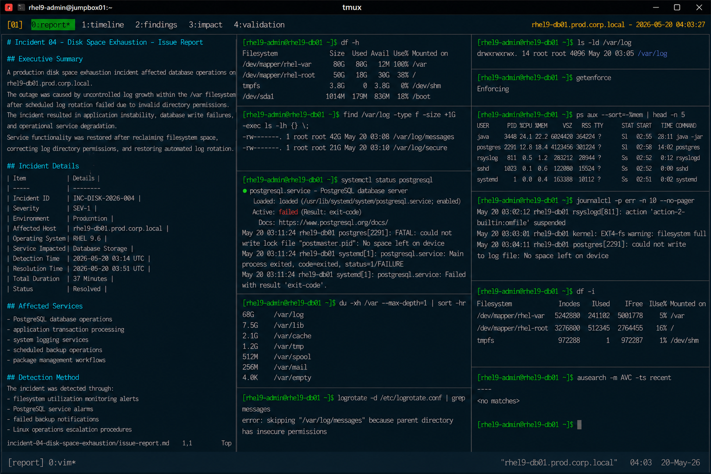

# Incident 04 — Disk Space Exhaustion

## Executive Summary

A production disk space exhaustion incident affected database operations on `rhel9-db01.prod.corp.local`.

The outage was caused by uncontrolled log growth within the `/var` filesystem after scheduled log rotation failed due to invalid directory permissions. The incident resulted in application instability, database write failures, and operational service degradation.

Service functionality was restored after reclaiming filesystem space, correcting log directory permissions, and restoring automated log rotation operations.

---

# Incident Details

| Item | Details |
|---|---|
| Incident ID | INC-DISK-2026-004 |
| Severity | SEV-1 |
| Environment | Production |
| Affected Host | rhel9-db01.prod.corp.local |
| Operating System | RHEL 9.6 |
| Service Impacted | Database Storage |
| Detection Time | 2026-05-20 03:14 UTC |
| Resolution Time | 2026-05-20 03:51 UTC |
| Total Duration | 37 Minutes |
| Status | Resolved |

---

# Affected Services

The following operational services were impacted during the incident:

- PostgreSQL database operations
- application transaction processing
- system logging services
- scheduled backup operations
- package management workflows

Core operating system services remained operational during the outage.

---

# Detection Method

The incident was detected through:

- filesystem utilization monitoring alerts
- PostgreSQL service alarms
- failed backup notifications
- Linux operations escalation procedures

Monitoring alert example:

```text
ALERT: FilesystemUsageCritical
Host: rhel9-db01.prod.corp.local
MountPoint: /var
Usage: 100%
Severity: critical
```

---

# User Impact

Operational impact during the incident included:

- database write failures
- delayed application transactions
- failed logging operations
- interrupted backup processing
- increased operational troubleshooting activity

Example application error:

```text
ERROR: could not write to file "base/pgsql_tmp": No space left on device
```

---

# Timeline

| Time (UTC) | Event |
|---|---|
| 03:14 | Filesystem utilization alerts triggered |
| 03:16 | Linux operations team acknowledged incident |
| 03:19 | Initial filesystem diagnostics completed |
| 03:23 | Excessive log growth identified |
| 03:28 | Invalid `/var/log` permissions discovered |
| 03:34 | Log rotation executed successfully |
| 03:41 | PostgreSQL service restored |
| 03:51 | Filesystem and database validation completed |

---

# Technical Findings

Investigation identified the following conditions:

- `/var` filesystem reached 100% utilization
- inode utilization remained healthy
- PostgreSQL service failed due to insufficient storage
- `/var/log/messages` and `/var/log/secure` grew abnormally
- logrotate execution failed because of insecure directory permissions
- SELinux and firewall configuration remained healthy

Relevant validation output:

```text
error: skipping "/var/log/messages" because parent directory has insecure permissions
```

---

# Root Cause Summary

The outage was caused by uncontrolled filesystem growth resulting from failed log rotation execution.

The `/var/log` directory permissions deviated from enterprise standards, preventing logrotate from rotating and compressing system log files.

As a result:

- log files expanded uncontrollably
- `/var` filesystem reached full utilization
- PostgreSQL database operations failed
- application write operations became unstable

---

# Recovery Actions

The following recovery actions were completed:

- corrected `/var/log` directory permissions
- forced manual log rotation
- removed stale archived logs
- reclaimed filesystem capacity
- restored PostgreSQL services
- validated database functionality
- confirmed logrotate operation

---

# Validation Results

| Validation Item | Result |
|---|---|
| Filesystem capacity restored | PASS |
| PostgreSQL operational | PASS |
| Database connectivity restored | PASS |
| Logrotate functional | PASS |
| Log directory permissions corrected | PASS |

---

# Operational Notes

- Recovery activities were limited to filesystem cleanup and log management correction
- No LVM expansion was required
- SELinux remained enabled throughout recovery activities
- Database recovery completed without data corruption

---

# Screenshot Reference


