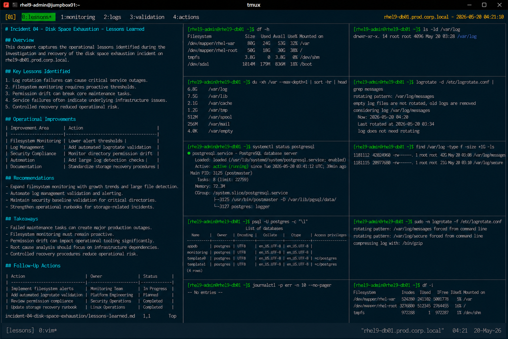

# Incident 04 — Disk Space Exhaustion

## Overview

This document captures the operational lessons identified during the investigation and recovery of the disk space exhaustion incident on `rhel9-db01.prod.corp.local`.

The objective is to improve filesystem monitoring, log management controls, and operational recovery procedures across the enterprise Linux infrastructure.

---

# Incident Summary

| Item | Details |
|---|---|
| Incident ID | INC-DISK-2026-004 |
| Environment | Production |
| Affected Service | Database Storage |
| Platform | RHEL 9.6 |
| Duration | 37 Minutes |
| Status | Resolved |

---

# Key Lessons Identified

## Log Rotation Failures Can Cause Critical Service Outages

The incident confirmed that failed log rotation can rapidly consume production filesystem capacity.

Although application services remained operational initially, uncontrolled log growth eventually exhausted available storage and interrupted database operations.

Operational validation must include:

- logrotate execution verification
- filesystem capacity monitoring
- large log file detection
- scheduled log rotation validation

Required validation command:

```bash
logrotate -d /etc/logrotate.conf
```

---

## Filesystem Monitoring Requires Proactive Thresholds

The outage demonstrated that filesystem alerts must trigger before utilization reaches critical levels.

The existing alert threshold detected the issue at 100% utilization, reducing available recovery time.

Recommended operational thresholds:

| Utilization Level | Operational Action |
|---|---|
| 75% | Warning Alert |
| 85% | Critical Review |
| 90% | Immediate Escalation |

---

## Permission Drift Can Break Core Maintenance Tasks

The incident highlighted the operational risk associated with unauthorized permission changes on system directories.

The following invalid permission state prevented logrotate execution:

```text
drwxrwxrwx. 14 root root /var/log
```

Operational teams must continuously validate:

- system directory permissions
- ownership consistency
- security baseline compliance
- scheduled maintenance execution

---

## Service Failures Often Indicate Underlying Infrastructure Issues

The PostgreSQL service failure was a secondary symptom rather than the primary outage source.

The root issue originated from filesystem exhaustion caused by uncontrolled logging.

This reinforced the importance of:

- infrastructure-layer diagnostics
- storage validation procedures
- service dependency awareness
- root cause isolation

---

## Controlled Recovery Reduced Operational Risk

Recovery activities focused strictly on restoring filesystem health and correcting log management configuration.

The following unnecessary actions were intentionally avoided:

- LVM expansion
- database restoration
- SELinux modifications
- operating system reboot

Maintaining a narrow recovery scope reduced operational exposure and accelerated restoration.

---

# Operational Improvements

The following operational improvements were identified:

| Improvement Area | Action |
|---|---|
| Filesystem Monitoring | Lower alert thresholds |
| Log Management | Add automated logrotate validation |
| Security Compliance | Monitor directory permission drift |
| Automation | Add large log detection checks |
| Documentation | Standardize storage recovery procedures |

---

# Recommendations

## Expand Filesystem Monitoring

Monitoring controls should include:

- filesystem growth trends
- large file detection
- log directory utilization
- failed logrotate execution alerts

Example validation:

```bash
df -h
```

```bash
du -xh /var --max-depth=1
```

---

## Automate Log Management Validation

Infrastructure automation should validate:

- logrotate execution success
- directory permission consistency
- compressed archive cleanup
- log retention policy enforcement

Automation-based validation reduces exposure to uncontrolled log growth.

---

## Maintain Security Baseline Validation

Operational compliance checks should continuously monitor:

- `/var/log` permissions
- ownership integrity
- scheduled task execution
- filesystem security baselines

Example validation:

```bash
ls -ld /var/log
```

---

# Operational Takeaways

- Failed maintenance tasks can create major production outages
- Filesystem monitoring must remain proactive
- Permission drift can impact operational tooling significantly
- Root cause analysis should focus on infrastructure dependencies
- Controlled recovery procedures reduce operational risk

---

# Follow-Up Actions

| Action | Owner | Status |
|---|---|---|
| Implement filesystem growth alerts | Monitoring Team | In Progress |
| Add automated logrotate validation | Platform Engineering | Planned |
| Review directory permission compliance | Security Operations | Completed |
| Update storage recovery runbook | Linux Operations | Completed |

---

# Screenshot Reference


