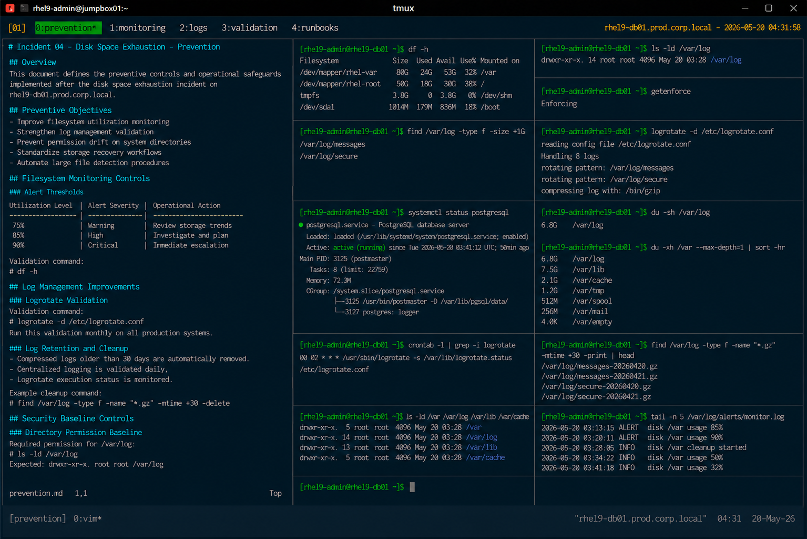

# Incident 04 — Disk Space Exhaustion

## Overview

This document defines the preventive controls and operational safeguards implemented after the disk space exhaustion incident on `rhel9-db01.prod.corp.local`.

The objective is to reduce the likelihood of future filesystem exhaustion events caused by uncontrolled log growth and failed maintenance operations within the enterprise Linux infrastructure.

---

# Incident Summary

| Item | Details |
|---|---|
| Incident ID | INC-DISK-2026-004 |
| Environment | Production |
| Affected Service | Database Storage |
| Platform | RHEL 9.6 |
| Root Cause Category | Failed Log Rotation |
| Status | Preventive Controls Implemented |

---

# Preventive Objectives

The following preventive objectives were established after the incident:

- Improve filesystem utilization monitoring
- Strengthen log management validation
- Prevent permission drift on system directories
- Standardize storage recovery workflows
- Automate large file detection procedures

---

# Filesystem Monitoring Controls

## Implement Proactive Filesystem Alerts

Monitoring thresholds were updated to provide earlier operational visibility.

Configured thresholds:

| Utilization Level | Alert Severity |
|---|---|
| 75% | Warning |
| 85% | High |
| 90% | Critical |

Required validation command:

```bash
df -h
```

Monitoring systems must continuously validate filesystem growth trends.

---

## Automate Large File Detection

Automated checks were implemented to identify abnormal log growth.

Example validation:

```bash
find /var/log -type f -size +1G
```

Monitoring alerts now trigger when log files exceed approved operational thresholds.

---

# Log Management Improvements

## Enforce Logrotate Validation

All production systems must validate logrotate execution regularly.

Validation command:

```bash
logrotate -d /etc/logrotate.conf
```

Example successful output:

```text
Handling 8 logs
rotating pattern: /var/log/messages
```

Operational procedures now require monthly validation of log rotation status.

---

## Standardize Log Retention Policies

The following controls were implemented:

- compressed archive retention limits
- automated stale log cleanup
- centralized log forwarding validation
- scheduled log rotation verification

Example cleanup procedure:

```bash
find /var/log -type f -name "*.gz" -mtime +30 -delete
```

---

# Security Baseline Controls

## Prevent Permission Drift

Operational compliance checks now validate critical directory permissions.

Required validation:

```bash
ls -ld /var/log
```

Approved permission baseline:

```text
drwxr-xr-x. root root /var/log
```

Unauthorized permission modifications generate compliance alerts automatically.

---

## Maintain SELinux Enforcement

SELinux enforcement remains mandatory for all production systems.

Validation command:

```bash
getenforce
```

Expected result:

```text
Enforcing
```

SELinux must not be disabled during storage-related recovery procedures unless formally approved.

---

# Operational Safeguards

## Restrict Emergency Storage Modifications

The following actions are prohibited during standard incident recovery unless formally approved:

- uncontrolled log deletion
- disabling logging services
- disabling SELinux
- unauthorized filesystem expansion
- database file manipulation

Recovery activities must remain limited to validated operational procedures.

---

## Maintain Standardized Storage Recovery Procedures

The Linux operations team implemented standardized runbooks for:

- filesystem exhaustion incidents
- log growth investigations
- logrotate troubleshooting
- database storage recovery
- filesystem cleanup validation

Operational procedures are maintained within the enterprise support knowledge base.

---

# Validation Requirements

The following validation checklist must be completed after filesystem maintenance activities:

| Validation Item | Requirement |
|---|---|
| Filesystem utilization validation | Mandatory |
| Logrotate execution validation | Mandatory |
| Directory permission verification | Mandatory |
| Database service validation | Mandatory |
| Large log file inspection | Mandatory |
| SELinux validation | Mandatory |

---

# Preventive Measures Implemented

| Preventive Control | Status |
|---|---|
| Proactive filesystem monitoring | Implemented |
| Automated large file detection | Implemented |
| Logrotate validation checks | Implemented |
| Permission compliance monitoring | Implemented |
| Storage recovery runbooks | Implemented |
| Log retention cleanup automation | Implemented |

---

# Operational Recommendations

- Monitor filesystem growth trends continuously
- Validate logrotate execution regularly
- Review critical directory permissions routinely
- Maintain centralized logging visibility
- Automate storage health validation workflows

---

# Screenshot Reference


