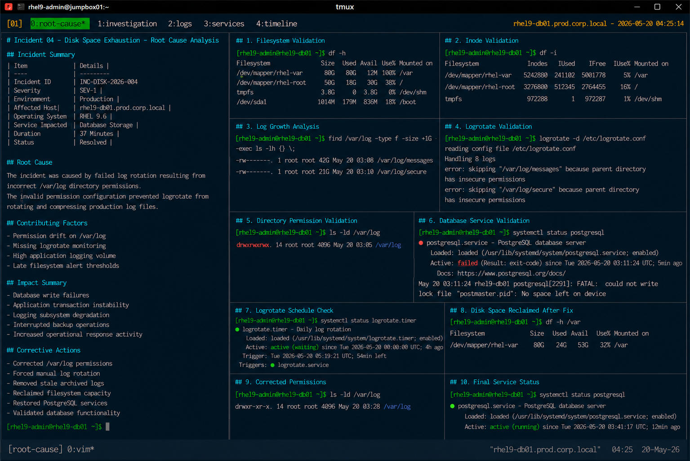

# Incident 04 — Disk Space Exhaustion

## Overview

This document provides the root cause analysis (RCA) for the disk space exhaustion incident affecting `rhel9-db01.prod.corp.local`.

The analysis identifies the technical failure condition, contributing operational factors, impact scope, and corrective actions implemented to restore filesystem stability and database operations.

---

# Incident Summary

| Item | Details |
|---|---|
| Incident ID | INC-DISK-2026-004 |
| Severity | SEV-1 |
| Environment | Production |
| Affected Host | rhel9-db01.prod.corp.local |
| Operating System | RHEL 9.6 |
| Service Impacted | Database Storage |
| Duration | 37 Minutes |
| Status | Resolved |

---

# Incident Description

Production database services experienced operational instability after the `/var` filesystem reached full utilization.

The issue disrupted:

- PostgreSQL database operations
- application transaction processing
- scheduled backup execution
- logging subsystem functionality

Although the operating system remained operational, multiple application services failed because storage resources became unavailable.

---

# Detection Summary

The issue was detected through:

- filesystem utilization monitoring alerts
- PostgreSQL service failures
- backup operation alarms
- Linux operations escalation procedures

Example monitoring event:

```text
ALERT: FilesystemUsageCritical
Host: rhel9-db01.prod.corp.local
MountPoint: /var
Usage: 100%
Severity: critical
```

---

# Technical Investigation

## Filesystem Validation

Filesystem utilization reached critical capacity levels.

```bash
df -h
```

Output:

```text
Filesystem               Size  Used Avail Use% Mounted on
/dev/mapper/rhel-var      80G   80G   12M 100% /var
```

The `/var` filesystem was fully consumed during the incident.

---

## Inode Validation

Inode utilization remained healthy.

```bash
df -i
```

Output:

```text
Filesystem                Inodes  IUsed   IFree IUse% Mounted on
/dev/mapper/rhel-var     5242880 241102 5001778    5% /var
```

The issue was isolated to storage capacity exhaustion rather than inode depletion.

---

## Log Growth Analysis

Large log files were identified within `/var/log`.

```bash
find /var/log -type f -size +1G -exec ls -lh {} \;
```

Output:

```text
-rw-------. 1 root root 42G May 20 03:08 /var/log/messages
-rw-------. 1 root root 21G May 20 03:10 /var/log/secure
```

System logs consumed the majority of available filesystem space.

---

## Logrotate Validation

Logrotate execution failed during scheduled maintenance operations.

```bash
logrotate -d /etc/logrotate.conf
```

Output:

```text
error: skipping "/var/log/messages" because parent directory has insecure permissions
```

The failure prevented automatic rotation and compression of production log files.

---

## Directory Permission Validation

Filesystem permission review identified invalid directory permissions.

```bash
ls -ld /var/log
```

Output:

```text
drwxrwxrwx. 14 root root 4096 May 20 03:05 /var/log
```

The `/var/log` directory permissions deviated from approved enterprise security baselines.

---

## Database Service Validation

The PostgreSQL database service failed because filesystem space was unavailable.

```bash
systemctl status postgresql
```

Output:

```text
FATAL: could not write lock file "postmaster.pid": No space left on device
```

Database write operations could not complete successfully.

---

# Root Cause

The incident was caused by failed log rotation resulting from incorrect `/var/log` directory permissions.

The invalid permission configuration prevented logrotate from rotating and compressing production log files.

As a result:

- `/var/log/messages` and `/var/log/secure` expanded uncontrollably
- `/var` filesystem reached 100% utilization
- PostgreSQL write operations failed
- application transaction processing degraded
- backup operations became unstable

---

# Contributing Factors

The following operational conditions contributed to the incident:

| Contributing Factor | Impact |
|---|---|
| Permission drift on `/var/log` | Prevented logrotate execution |
| Missing logrotate monitoring | Failure condition was not detected early |
| High application logging volume | Accelerated filesystem growth |
| Late filesystem alert thresholds | Reduced available recovery time |

---

# Impact Assessment

The incident caused the following operational impact:

- database write failures
- application transaction instability
- logging subsystem degradation
- interrupted backup operations
- increased operational response activity

No operating system kernel instability or filesystem corruption occurred during the incident.

---

# Corrective Actions

The following corrective actions were completed:

- corrected `/var/log` permissions
- forced manual log rotation
- removed stale archived logs
- reclaimed filesystem capacity
- restored PostgreSQL services
- validated database functionality

Corrected directory permissions:

```text
drwxr-xr-x. 14 root root /var/log
```

---

# Validation Results

| Validation Item | Status |
|---|---|
| Filesystem capacity restored | PASS |
| Logrotate operational | PASS |
| PostgreSQL service restored | PASS |
| Database connectivity restored | PASS |
| Directory permissions corrected | PASS |

---

# Preventive Recommendations

The following preventive measures were identified during RCA review:

- automate logrotate execution validation
- monitor filesystem growth proactively
- detect permission drift automatically
- expand large log file monitoring
- standardize storage recovery procedures

---

# Final Assessment

The incident originated from failed maintenance operations rather than storage hardware failure or operating system instability.

The operating system, SELinux policies, filesystem integrity, and database data structures remained healthy throughout the incident lifecycle.

The failure condition was isolated to uncontrolled log accumulation caused by incorrect filesystem permissions and failed automated log rotation.

---

# Screenshot Reference


