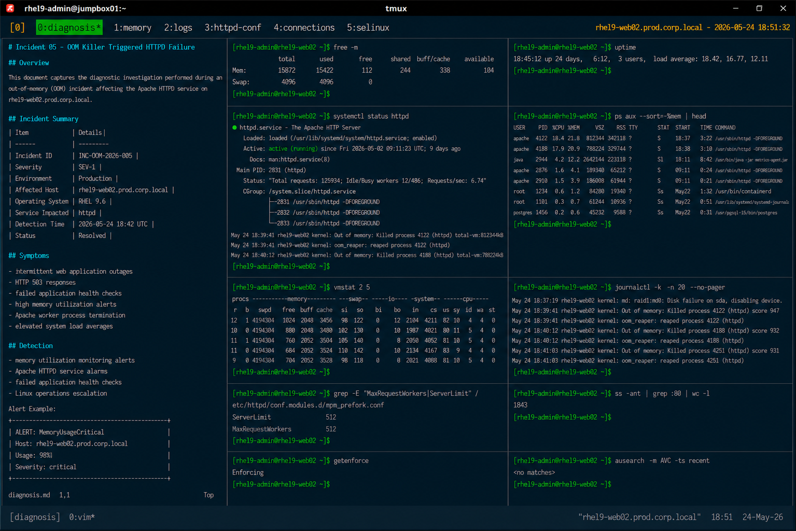

# Incident 05 — OOM Killer Triggered HTTPD Failure

## Overview

This document captures the diagnostic investigation performed during an out-of-memory (OOM) incident affecting the Apache HTTPD service on `rhel9-web02.prod.corp.local`.

The incident resulted in intermittent web application outages after the Linux kernel OOM killer terminated HTTPD worker processes due to excessive memory consumption.

---

# Incident Summary

| Item | Details |
|---|---|
| Incident ID | INC-OOM-2026-005 |
| Severity | SEV-1 |
| Environment | Production |
| Affected Host | rhel9-web02.prod.corp.local |
| Operating System | RHEL 9.6 |
| Service Impacted | httpd |
| Detection Time | 2026-05-24 18:42 UTC |
| Status | Resolved |

---

# Symptoms

Observed symptoms during the incident:

- intermittent web application outages
- HTTP 503 responses
- failed application health checks
- high memory utilization alerts
- Apache worker process termination
- elevated system load averages

Example client-side error:

```text
HTTP/1.1 503 Service Unavailable
```

---

# Detection

The issue was identified through:

- memory utilization monitoring alerts
- Apache HTTPD service alarms
- failed application health checks
- Linux operations escalation

Monitoring alert example:

```text
ALERT: MemoryUsageCritical
Host: rhel9-web02.prod.corp.local
Usage: 98%
Severity: critical
```

---

# Initial Validation

## Verify Memory Utilization

```bash
free -m
```

Output:

```text
               total        used        free      shared  buff/cache   available
Mem:           15872       15422         112         244         338         104
Swap:           4096        4096           0
```

System memory and swap utilization reached critical levels.

---

## Verify System Load

```bash
uptime
```

Output:

```text
18:45:12 up 24 days,  6:12,  3 users,  load average: 18.42, 16.77, 12.11
```

System load increased significantly during the incident window.

---

# Service Validation

## Verify HTTPD Service Status

```bash
systemctl status httpd
```

Output:

```text
● httpd.service - The Apache HTTP Server
     Loaded: loaded (/usr/lib/systemd/system/httpd.service; enabled)
     Active: active (running)

May 24 18:39:41 rhel9-web02 kernel: Out of memory: Killed process 4122 (httpd) total-vm:812344kB
```

The service remained active, but worker processes were terminated by the kernel OOM killer.

---

# Memory Analysis

## Identify High Memory Consumption Processes

```bash
ps aux --sort=-%mem | head
```

Output:

```text
apache    4122 18.4 21.8 812344 342118 ? S 18:37 3:22 /usr/sbin/httpd -DFOREGROUND
apache    4188 17.9 20.9 788224 329744 ? S 18:38 3:10 /usr/sbin/httpd -DFOREGROUND
java      2944 12.2 14.1 2642144 223118 ? Sl 18:11 8:42 /usr/bin/java -jar metrics-agent.jar
```

HTTPD worker processes consumed excessive memory resources.

---

## Verify Memory Pressure

```bash
vmstat 2 5
```

Output:

```text
procs -----------memory---------- ---swap-- -----io---- -system-- ------cpu-----
 r  b swpd   free buff cache si so bi bo in cs us sy id wa st
12  1 4194304 1024 2048 3456 98 122 0 12 2104 4211 82 10 4 4 0
```

The system experienced sustained memory pressure and swap exhaustion.

---

# Kernel Log Analysis

## Review OOM Killer Events

```bash
journalctl -k -n 20 --no-pager
```

Output:

```text
May 24 18:39:41 rhel9-web02 kernel: Out of memory: Killed process 4122 (httpd) score 947
May 24 18:39:41 rhel9-web02 kernel: oom_reaper: reaped process 4122 (httpd)
May 24 18:40:12 rhel9-web02 kernel: Out of memory: Killed process 4188 (httpd) score 932
```

Kernel logs confirmed repeated OOM killer activity targeting Apache worker processes.

---

# HTTPD Configuration Validation

## Review Apache Worker Configuration

```bash
grep -E "MaxRequestWorkers|ServerLimit" /etc/httpd/conf.modules.d/mpm_prefork.conf
```

Output:

```text
ServerLimit             512
MaxRequestWorkers       512
```

Configured worker limits exceeded recommended operational baselines for the available system memory.

---

# Connection Analysis

## Verify Active HTTP Connections

```bash
ss -ant | grep :80 | wc -l
```

Output:

```text
1843
```

The server experienced elevated HTTP connection volume during the incident.

---

# SELinux Validation

## Verify SELinux Status

```bash
getenforce
```

Output:

```text
Enforcing
```

SELinux remained enabled throughout the incident.

---

## Review AVC Denials

```bash
ausearch -m AVC -ts recent
```

Output:

```text
<no matches>
```

No SELinux denials related to HTTPD operations were identified.

---

# Investigation Findings

The investigation identified excessive Apache worker memory consumption as the primary contributor to the outage.

Key findings:

- system memory utilization exceeded 98%
- swap space became fully exhausted
- kernel OOM killer terminated HTTPD worker processes
- Apache worker limits exceeded recommended capacity baselines
- elevated HTTP connection volume increased memory pressure
- SELinux and filesystem resources remained healthy

The outage was isolated to memory exhaustion caused by aggressive HTTPD worker configuration under sustained application load.

---

# Operational Impact

- intermittent web application outages
- HTTP 503 responses
- degraded application performance
- elevated system load averages
- increased operational response activity

No operating system kernel panic or filesystem corruption occurred during the incident.

---

# Screenshot Reference


